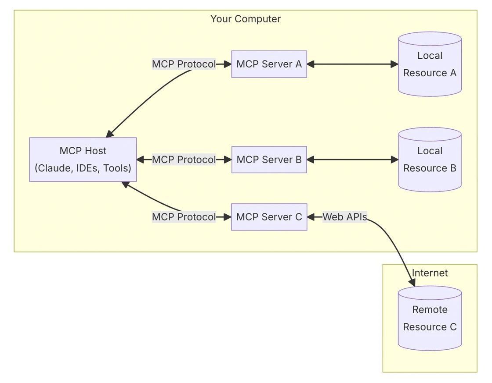
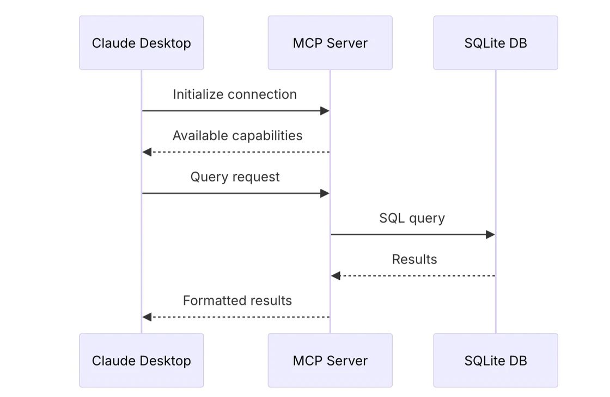

# 👨🏼‍💻 MCP：解决数据孤岛，AI的“TYPE C”

# Put it Short
Model Context Protocol (MCP) 是一种标准化的通信协议，旨在连接大型语言模型（LLM）与外部数据源、工具和服务。可以把它看作是AI世界中的“万能适配器”，帮助LLM与不同系统之间实现无缝对接。通过MCP，LLM能够通过统一的接口与各种资源进行交互，查询数据或执行操作，同时确保安全性和授权管理。这使得AI能够更加灵活地适应不同的应用场景，提供更强大的功能和服务。

# **Intro：开放标准——技术世界的通用语言**
在今天的科技世界，开放标准就像是不同设备、系统和服务之间的“通用语言”。它是一种统一的规则或协议，能够让各种技术设备和服务相互理解，顺利协作。
想象一下，你和你的朋友使用的是两款完全不同的手机：你用的是安卓手机，他用的是苹果手机。某一天，你拍了一张照片，并通过微信或电子邮件发送给你的朋友。尽管你们的设备和操作系统完全不同，这张照片依然能顺利传输，对方可以正常查看。这背后依赖的正是像 JPEG 或 PNG 这样的开放标准格式，使得照片能够在不同设备间无缝流通。
再举一个例子，假设你有一台安卓手机，而你的朋友有一台最新款的笔记本电脑。你们都使用Type-C接口来充电和传输数据。无论是安卓手机还是笔记本电脑，插入同一个Type-C充电线后，它们都能顺利连接，进行充电或数据交换。这个背后也依赖于Type-C作为一种开放标准接口，能够被广泛接受和应用，跨越不同品牌和设备之间的技术壁垒，让不同设备之间无缝协作。

# **Why：AI 面临的挑战：数据孤岛与信息隔离**
随着 AI 助手逐渐成为我们日常生活的一部分，行业也在不断加大投入，提升 AI 模型的推理能力和质量。我们可以看到，AI 技术正在快速发展，并取得了许多令人瞩目的成果。但即便是最强大的 AI 模型，也面临着一个重大挑战：**数据孤岛**。
什么是数据孤岛呢？简而言之，它指的是不同系统和平台之间的数据无法轻松流通或共享。想象一下，当你想让一个 AI 助手从多个数据源获取信息时，却发现每个数据源都有自己独特的访问方式，导致你每次都需要重新配置系统连接。这不仅增加了开发的复杂性，还让 AI 系统的扩展变得非常困难。每新增一个数据源，就需要为它进行单独的集成和配置，这使得真正的跨平台协作变得很难实现。
想象一下：
没有MCP，简直是程序员的噩梦。每当产品经理开口：“我要一个AI助手，能查GitHub、连数据库、搜Slack，还能读Google文档！”我就知道，周末要加班了。每个数据源都得重新对接，GitHub的API怎么搞？Slack的认证怎么做？数据库连接写哪？文档解析谁来负责？每个功能改动都得修改好几处，重复的代码、繁琐的认证、无穷的安全问题，一堆堆的工作压得我喘不过气。头发掉得越来越快，效率却越来越低。

为了打破这些数据孤岛，**MCP模型上下文协议（Model Context Protocol）应运而生。**

# **What：MCP——为 AI 与数据源之间架起桥梁**
那么，MCP 到底是什么呢？简单来说，MCP（模型上下文协议）是一个开放的标准，它为 AI 系统和数据源之间的连接提供了一个通用协议。这就像是为不同的数据源和 AI 工具之间架起了一座桥梁，使得它们能够顺畅地交换信息。
通过使用 MCP，开发者可以用同一个标准去连接各种不同的数据源，无论这些数据源是本地的数据库，还是云端的远程服务。这样，不同平台的系统不再孤立，而是能够相互协作，共同支持 AI 系统的运行。
MCP 的工作方式是通过**主机-客户端-服务器架构**来实现的：
- **主机**例如像Claude Desktop、IDE或AI工具等主机应用程序，它们希望通过MCP访问资源。
- **服务器**轻量级程序，通过MCP协议公开特定功能，访问本地资源或远程资源
- **客户端**则是 AI 应用，它向服务器请求数据，以便完成具体的任务或服务。
通过这个架构，AI 应用无需关心底层的数据来源如何工作，只需要按照标准化的协议来与数据源进行交互，极大地提高了数据接入的效率和可靠性。

# **How：MCP 如何打破信息隔离**
MCP 如何解决数据孤岛和信息隔离的问题呢？我们可以从以下几个方面来理解：
1.	**统一的标准化协议**
MCP 提供了一套标准化的协议，让所有的数据源和 AI 工具都能在同一规则下协同工作。开发者无需为每一个数据源单独编写不同的连接程序，MCP 通过统一的标准化协议，使得各种系统能够快速接入和互相配合。
2.	**简化的数据接入方式**
传统的做法是每个数据源都需要开发专门的接入方式，开发者要花费大量时间去解决这些不同系统之间的兼容问题。而 MCP 让这一切变得简单：只要遵循这个开放协议，开发者就能轻松实现跨系统的数据共享，省去了大量繁琐的工作。
3.	**保障数据安全**
数据安全问题是现代技术不可忽视的关键问题之一。MCP 在设计上考虑到了这一点，确保数据在传输过程中不会遭到非法访问或泄露。通过加密和身份验证等手段，MCP 能够保证数据的安全性和隐私性。
4.	**灵活的扩展性**
MCP 的架构非常灵活，可以适应不同规模的应用和数据源。无论是小型企业的数据系统，还是大型云端平台，MCP 都能够提供兼容的接入和支持。
通过以上几个方面的设计，MCP 不仅打破了数据孤岛和信息隔离，也为 AI 系统提供了一个更加高效、安全、灵活的工作环境，从而推动了 AI 技术的进一步发展和普及。

MCP工作原理：
1. **初始化連接**：
- Claude Desktop 應用程序與 MCP 服務器建立連接，進行初始通信。
1. **能力協商**：
- MCP 服務器回應可用的功能與操作（Available capabilities），這一過程確保 Claude Desktop 知道 MCP 服務器支持哪些查詢或操作。
1. **請求查詢**：
- Claude Desktop 發送一個查詢請求（Query request）給 MCP 服務器，請求訪問或操作特定數據。
1. **數據操作**：
- MCP 服務器根據請求生成一個 SQL 查詢，並將該查詢發送至 SQLite 數據庫執行。
1. **結果返回**：
- SQLite 數據庫執行 SQL 查詢後，將結果返回給 MCP 服務器。
1. **格式化結果**：
- MCP 服務器對收到的數據結果進行格式化處理，將其整理為 Claude Desktop 可以理解的形式。
1. **結果傳遞**：
- 格式化後的結果最終返回給 Claude Desktop，供用戶查看或進一步使用。
-
MCP 充當中介，負責協調應用程序（Claude Desktop）與後端數據源（SQLite DB）之間的通信。它通過標準化的協議和流程，實現能力協商、查詢執行與數據安全傳遞，保證應用程序只能通過授權接口進行操作。這樣的架構提高了系統的靈活性、可擴展性以及數據訪問的安全性。
