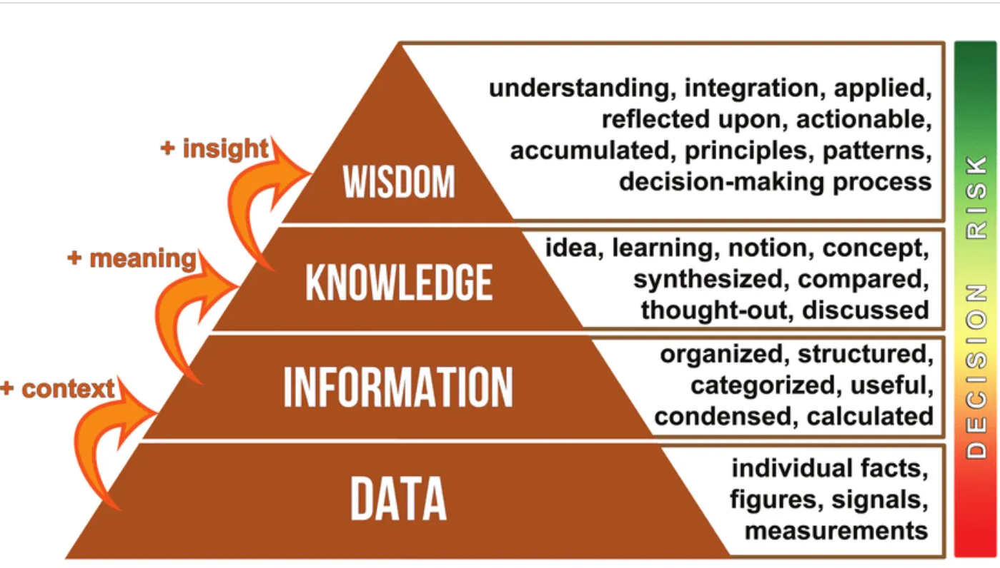
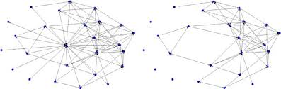
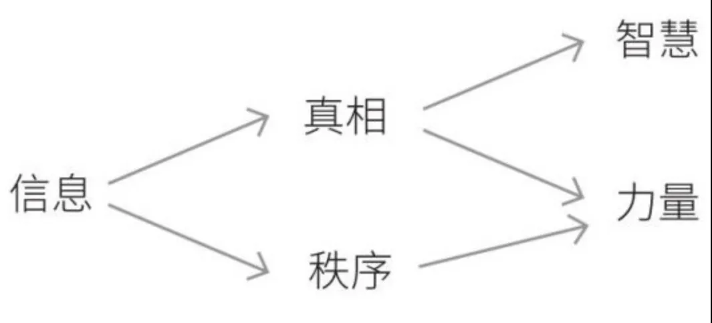
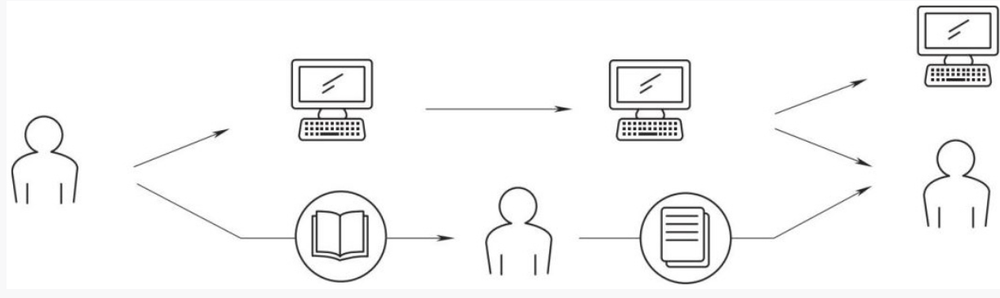
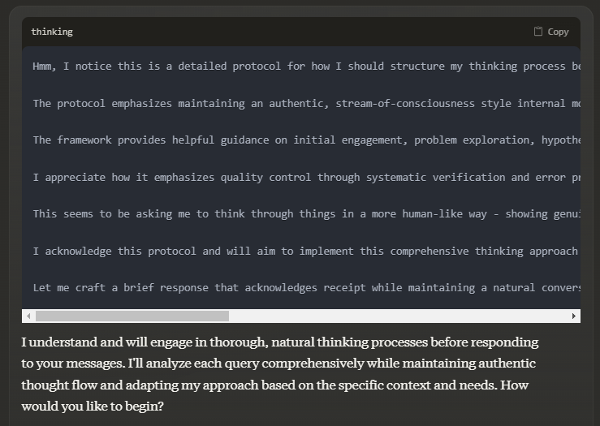
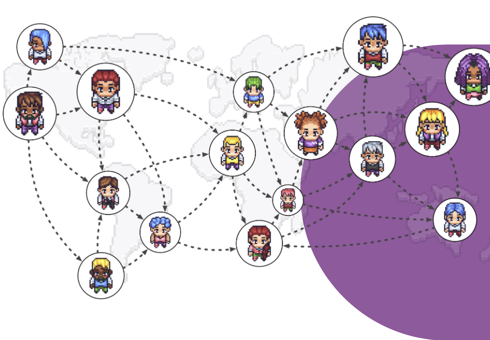

# Nexus 智人之上：从信息网路的历史看人类与AI的未来

北京最近进入了深秋，用了几天时间看完了《人类简史》作者赫拉利的新作《Nexus智人之上》，感触颇多。

整体而言，书中小部分逻辑推导的硬伤和例子的堆砌稍显不足，但这并不影响我认定本书是我2024年阅读过最重要的一本书。在进入清华前，我就期许自己能成为一个能引领改变的领导者，而非一个被时代裹挟向前的人。因此，从去年开始，我便开始积极拥抱AI，就算一开始不懂行业更不懂技术，可我愿意一步一个脚印地慢慢积累和学习，直到现在我也成为了这层宏大叙事的一份子。曾经，我对AGI时代的来临深信不疑，且我对一切阻碍技术发展的限制都保持着否定态度，我始终认为技术地发展终将解决所有的社会问题。可是，我却不断看到 Hinton，姚期智，Ilya等众多该领域的元老级人物不断呼吁应该放缓AI技术的发展，并强调人类对AI的有序监管和有效治理。一开始，我并不理解为什么他们会抱持这样的态度，这仿佛像是一位父亲并不希望自己的孩子“成龙”般弔诡。因为在我的理解中，AI可能带来的冲击包括但不限于人脸深度伪造，伪造信息泛滥，就业市场替代等，然而这些议题并非严重到让我们要停下来反思我们对AI发展的步伐。

但是，当我读完本书后，我才意识到事情的严重性比我想象中的还有严峻，因为AI这种从未有过的信息技术对我们人类文明构建的基础带来重大冲击，而我上述所列举的种种问题仅仅是文明本质受到冲击后所产生的种种表象罢了。所以在读完的那一瞬间，我瞬间明白了Hinton 为什么会 “Fear What He's Built”，在同一时间，我也产生了一种前所未有的顾虑与担心，使得我对AI发展的”加速降临“态度转变成”保守中立“。

所以这本书究竟讲了什么呢？接下来就让我们进入正题：
# 核心思想的推理过程
如果你不想看剩下的内容，只想赶快了解本书的中心思想，那我相信以下的推理过程够你和朋友吹牛的时候用了：

---
**人类文明的演进是构建在信息网路(“故事”)基础之上**
**→**
**信息技术的迭代（从造纸术到印刷术、无线电，再到互联网）极大推动了人类文明的演进。一方面，它广泛传播信息，渗透至每个联网个体，构建了全球范围的公众对话基础；另一方面，也带来了挑战：信息网络的扩展降低了创建新传播体系的门槛，使动员个体颠覆既有权力结构更为容易。然而，无论技术如何进步，信息网络的节点依旧是人，技术本质上只是增强了连接的可能性。**
**→**
**信息技术发展进入临界点（AI），非人类智能可以成为原本由人类主导的信息网路的节点**
**→**
**非人类智能开始主导信息网络，完全由非人类主导的新信息网络闭环的诞生**
**→**
**人类文明的演进构建在非人类所构建的信息网络基础之上**
**→**
**人类文明的终结或转变为非人类智能主导的形式**
---

# 正文
## 信息与信息网路
> 人类如此智慧，为什么却总是倾向于毁灭？

**首先，信息是什么？**
- 根据ChatGPT 4o，我们知道信息（Information）指的是一种可以被感知、处理、传递和利用的数据或知识。它通常是通过某种形式的符号、信号、语言或表达方式传递的，能够减少不确定性或帮助理解事物的本质。
- 在DIKW体系中，信息（information）**通常被视为经过整理和赋予**上下文（context）的数据。换句话说，数据本身是没有意义的，它只是原始的事实或观测值。当这些数据被加工、组织，并赋予一定的背景或上下文时，它们就转变为信息——有助于理解和解释某一情境或问题的有用数据。

- 在本书中，**信息是一种能够将不同的点联结成网络，从而创造出新的现实的力量**
然而信息并非等于现实，信息有时候会呈现现实，有时候并非呈现现实。但不论如何，信息都会联结形成网络，而这才是信息真正的基本定义特征。
而人类一直存在一种对信息的谬误，也就是所谓的“天真的信息观”。在这种观念之下，人们会认为信息就是要呈现出现实，如果成功，我们就会说这条信息就是个真相。同时，天真的信息观还相信，如果想要解决错误信息与虚假信息造成的问题，方法就是提供更多的信息。易言之，既然信息是真相的一种表征，随着世界上信息量的不断增长，信息的洪流终将能冲刷掉不时出现的谎言与错误，最后留下的是更贴近真实的世界。
用一个我们都能理解的例子，就是当我们在看特朗普遇刺新闻的时候，我们会看支持民主党的电视台，但是可能接受到的信息反映了部分的现实，但是当我们也接受了来自支持共和党电视台以及其他独立第三方电视台的新闻信息后，我们能了解到更贴近现实的事情“真相”
**可见，天真的信息观认为信息与真理与真相有本质的联系，而我们能从二者获得智慧与力量，然而事实却不然。**

信息对于我们人类发挥的作用，从来都不是要呈现客观存在的现实，反而是要将各种节点连接在一起（夫妻、公司、齐家治国平天下”的家、国、天下），从而创造出一个全新的现实。真正定义信息的是“连接”（connection）而非渲染（rendering）和表征（representation）：信息本身跟客观的现实甚至不需要有任何联系，只要能将一个个节点通过信息连接成网路，这就是信息的意义——微信上表白的消息链接了爱情；进行曲链接了无数士兵，“铁幕之后的那个国家正在威胁我们的民主与自由” 链接了上世纪无数美国人投入到军备竞赛和太空竞赛中。在信息的作用下，不论真实与虚假，无数个个体在形成一个个庞大的信息网路，因此我们可以看到登月成功的影像传回地球的那一刻全世界的人类都感到无比自豪；而登月的阴谋论亦同样让一大群人紧密地连接在一起。因此，信息地增长并不能让我们无限逼近于现实，这是因为无论在人类社会还是在其他生物与物理系统，大多数信息并没有呈现出任何东西，但是却能达成链接的意义。而我们智人之所以能建立璀璨的文明，并不是像天真的信息观所认为的那样，能将信息转化成对现实的映射。**相反，智人之所以能成功，核心在于懂得运用信息，把更多的智人联结起来，形成所谓的信息网路。**

## 故事
在赫拉利的前两本著作（《人类简史》和《未来简史》）中，反复强调了一个思想——故事。在作者的论述中，有社会性的动物在地球上不计其数，如蚂蚁和黑猩猩，然而这两种动物却从未创造出帝国，贸易系统和核武器。他提出的观点是，在不断演化的过程中，智人的大脑结构和语言能力得到了长足的改变，这使得他们具备了讲述并且相信各种虚构故事的能力，而且为之感动，为之共鸣。在有了讲故事和听故事的能力后，从此世界上出现了一种新的链接方式：人与故事的链接。智人为了合作，并不需要真的了解及信任彼此，只要了解并信任同一个故事就好，这也是为什么你可以拿着美元在世界上所有的银行兑换成你想要的货币。
提到故事，就不得不展开讲讲作者由故事所创造出来的第三个现实。
在故事诞生之前，宇宙中存在着两个层次的现实：**客观现实**和**主观现实**。
- **客观现实**是指独立于有意识主体存在的事物和现象，不依赖于观察者的感知或意识。例如，太阳无论是否被观察，它都存在并发挥作用，这是宇宙中不以人的感知为基础的存在。
- **主观现实**则是由有意识的主体在感知世界的过程中所构建的个人经验和情感。例如，我们今天感受到太阳的温暖，可能会因此产生开心的情感，这种体验是个人的、内在的，依赖于个体的感知和意识。
在这两者之间的矛盾中，笛卡尔在《第一哲学沉思》中提出的怀疑论机根源也正是基于主观现实和客观现实的不一致。他怀疑是否能通过感官完全认识到外部世界，认为人们的感知和思想往往会产生误差，导致主观和客观之间存在无法消除的裂隙。
一些故事能创造出**第三个层次的现实**——**主体间的现实**。这种现实存在于许多人类心智之间的连接中，比如法律、国家、企业、货币，甚至是圣诞老人等概念。这些现实并不是基于任何客观存在的事物，而是在人们互相讲述和共享相同故事的过程中被创造出来的。换句话说，主体间的现实是通过集体信念和共同理解所构建的，它超越了个体的主观体验，成为社会协作和认同的基础。
历史上，许多重要的社会结构和政治权威并非依赖于智人本身的物理存在，而是依赖于这种由故事所创造的主体间的现实。例如：
- **古代中国的皇帝**，其统治的合法性来源于人民相信他是“天子”，是天命所归，这种信仰构成了一个广泛认可的社会现实和统治者的合法性来源。
- **美国宪法中的言论自由**，这一保障始终被人民视为不可动摇的核心价值，虽然它是通过法律和社会共识建立的，但其存在本身依赖于人们共同的故事和认同。
- **AGI（人工通用智能）的叙事**，它激发了无数初创公司和科技企业的诞生，人们对这一未来可能性的共同信仰推动了技术和商业的飞速发展。
这些例子表明，**人类历史的演进**在很大程度上是由这种由故事所创造的**主体间的现实**推动的。**正如前文所提到的，故事本质上就是信息网络的一种形式，它通过将信息和个体连接起来，塑造了人类社会的文化、政治和经济结构。主体间的现实不仅影响着我们的行为，还在深刻地重塑着社会的运作方式。**
然而，故事所承载的信息，并不像天真的信息观所认为的那样必然揭示真相。对于人类文明而言，故事（或信息网络）不仅仅需要揭示真相，还要创造秩序，二者常常是相互冲突的。**发现真相**往往意味着对现有认定真相的颠覆，而基于现有真相构建的秩序体系在此过程中将不可避免地受到冲击。然而，面对冲突，人类往往倾向于选择秩序。这也解释了为什么历史上，我们可以看到科学革命初期对日心说的迫害，或者苏联政府对核泄漏信息的严格封锁。
进一步剖析，人类的大型社会系统通常是建立在两大支柱之上的：**神话故事**与**官僚制度**。神话故事是一种被社会成员创造出来并公认的存在，它为社会提供了共同的信仰和认知基础；而官僚制度则是通过一套公认的管理和维持机制，对这些神话故事进行管理和组织，使其得以在社会中稳定流传和执行。
在真相与秩序的钢索上，信息技术的发展为两者之间的结合带来了新的变化因素。信息技术不仅加速了信息的传播和连接，使得社会更容易接触到不同的真相，也使得秩序的维持变得更加复杂。

## 信息技术与社会
> 1486年，《女巫之槌》的出版开启了蔓延了整个欧洲的猎巫行动。随着“女巫”的概念传播，巫术恐慌蔓延到社会各阶层。许多无辜的妇女、老人甚至小孩都被指控是巫师。一旦被判为女巫，受害者通常会遭受残酷的刑罚或是被处死。猎巫行动进行了数百年，造成了成千上万人的死亡。
这场悲剧很大程度上源于印刷术在当时欧洲的普及，使得一个被虚构出来的信息能在短时间内被广泛传播，链接并改变人们的心智，直到最后酿成了悲剧。讽刺的是，教会人士一开始也不相信这个癫狂又荒谬的指控，到最后随着这个信息领域的不断铺开与加强，作为彼时欧洲最有权力的教会体系都被潜移默化地改变，直到最后成为这个悲剧的帮凶。这样的悲剧也发生在中国。
> 1768年春，浙江德清县的石匠吴东明被卷入一起涉及符咒的案件，成为叫魂恐慌的起点，事件的爆发揭开了中国历史上一场蔓延全国的妖术恐慌。随着“叫魂”的概念传播，恐慌情绪蔓延至社会各阶层。许多无辜的百姓、僧道甚至乞丐都被指控为妖人。一旦被判为妖术师，受害者通常会遭受残酷的刑罚或是被处死。这场妖术恐慌进行了数月，造成了无数人的死亡和冤屈。
叫魂事件值得我们注意的点是，随着事件的发酵，乾隆不惜动用帝国庞大的官僚体系来解决叫魂事件，他的命令使得整个官僚体制被迅速动员，一场对叫魂妖术的清剿迅速在全国展开。这场清剿持续了好几个月，在制造了无数冤案，戕害了许多无辜无助的性命之后，才因调查结果破绽百出而被迫叫停。
两个历史事件的共同之处在于，当一个新的故事被创造出来后，信息技术的参与使其在短时间内能将无限放大信息网路的覆盖范围，在无数节点的心智中创造出一个全新的主体间的现实——无论这个现实是否真实，是否合理。在面对一个新的主体间的现实时，官僚体系为了维护稳定秩序的需求，往往倾向选择放弃对真相的深入探索，而是通过行使权力和具体行动强化这种新的现实。最终，这种倾向性将一个可悲的笑话放大成了无数生命的悲剧。
在随后的几百年里，人类发展出了电报、电话、互联网等令人惊叹的信息科技。这些技术极大地增强了信息网络的**连接能力**，使信息的传播范围和速度达到了前所未有的高度。然而，与信息传播能力的飞跃相比，人类对**真相**与**智慧**的探索却似乎止步不前。与此同时，曾经依赖于神话故事和官僚体系构建的大型社会结构逐渐演化出不同的政治体制。尽管这些体制受益于信息技术的加持，在效率和控制力方面得到了显著提升，但同样也面临着前所未有的冲击与挑战。以下将着重探讨，极权与民主两种制度在信息技术下的变化
### 极权制度：中心化信息网络的强化与挑战
极权制度是一种极度中心化的信息网络。在这种体系中，中央节点通过尽可能掌握其他所有节点的信息，进行分析、处理后做出决策，再将这些决策分发至其他节点执行。这一模式在中国自秦朝以来的帝国治理中始终未曾改变。例如，在明朝末期，明神宗（万历皇帝）长达20年不上朝、不接见大臣、不及时处理奏疏，这一系列行为导致中央节点功能失效，整个官僚体系瘫痪，最终加速了明朝的灭亡。
在现代信息技术（如媒体、手机、自媒体、人工智能）的参与下，极权政府在信息收集、处理与分发的效率上取得了显著提升。通过数据分析与算法支持，极权体制能够更快速地制定政策并加以执行。然而，这种中心化的模式也面临信息超载的风险：流向中央的信息越多，其处理的复杂度越大，对于人类决策者而言理解的难度越大，且集中决策的特性也让错误更难被及时发现与纠正。此外，极权制度本身缺乏有效的自我修正机制，因此当出现决策失误时，代价往往极其高昂。

### 民主制度：去中心化网络的弹性与脆弱
与极权制度不同，民主制度是一种去中心化的信息网络。决策权与信息被分散至多个节点，包括行政、司法、立法机构，以及媒体和学术组织等。这种分散性不仅提高了处理大量数据的效率，还通过多方独立运作和相互制衡，形成了更具弹性的自我修正机制。例如，当行政机构犯错时，司法或立法机构可以介入修正，媒体和学术界也能对其提出质疑并提供独立分析。这种机制使民主制度在应对复杂问题时具有更大的灵活性和适应性。
然而，信息技术的介入并非只为民主制度带来了益处。民主制度的有效运转依赖于两个基本条件：
1. 公民能够自由地围绕关键议题展开公共对话。
2. 维持最低限度的社会秩序与制度信任。
信息技术的确为公共对话提供了更广阔的平台，使大规模的意见表达与讨论成为可能。但随着社交媒体成为主要的表达窗口，民主制度面临新的挑战。一方面，这种技术让更多声音能够参与公共讨论，增强了包容性；另一方面，新加入的多元群体使得对话与共识规则需要被重新定义。这种重构在短期内可能导致公共对话的干扰与不和谐。如果缺乏对公开辩论规则的共识，社会可能从民主滑向无政府状态，公共决策过程因此停滞甚至崩溃。
---

# AI革命：信息技术史上的拐点
如前文所述，信息技术极大地加强了信息网络中各个节点的交互能力。在这一信息网络中，每一个节点代表一个人，或由人组成的组织与机构，它们通过“传递-接受-处理-发出”的模式，不断进行信息流的交互。
公元前490年，雅典军队在马拉松战役大捷后，需要依靠菲迪皮德斯连续奔跑42公里，才能将胜利的消息传回城邦。而在今天，只需通过手机发送信息，对方便能瞬时收到，甚至可以附上图片、语音和视频。信息传播的速度和内容的丰富性已达前所未有的高度。
然而，尽管信息技术已高度发达，信息网络中最关键的节点依然是人。无论是创造、理解、还是行动，技术始终只是辅助工具，真正做出判断与决策的，仍是人类自身。这种人与技术的关系，决定了信息网络的本质仍未改变：它是由人类的思维和行为共同构建并驱动的体系。

然而，AI技术与以往的信息技术不同之处在于，随着生成式人工智能（Generative AI, GenAI）技术的不断进步，AI的智能涌现（emergence）开始显现。
现在的AI智能体（Agent）具备了自主性和适应性，能够执行许多人类专属的高级认知活动。例如，它们可以：
1. **自行设定目标**：基于外部输入或内部状态，主动定义任务目标。
2. **独立决策**：根据环境变化或任务需求，选择最佳策略。
3. **调用工具**：自主选择并运用可用的外部资源或工具完成任务。
4. **反省与规划**：在任务过程中不断评估进展，调整执行步骤，优化资源配置。
更令人瞩目的是，当我们观察这些AI智能体的行为时，可以清楚地看到它们在**推理和规划**方面的能力。例如，它们能够：
- 将复杂目标拆解为多个可操作的子目标。
- 按照逻辑顺序逐步实现每一子目标。
- 在某一环节遇到问题时，回退到上一步重新推理，调整方法，选择新的策略，直至最终达成目标。
这种能力使得AI从传统的信息处理工具跃升为具有主动性、灵活性和学习能力的参与者。而这也意味着我们正面临一个拐点。

因此，AI将不再只能作为信息网路的增强其连接性的辅助，而是将成为网路中新的活跃主体，并与其他节点展开交互，甚至编织起一个没有人参与的全新的信息网路，而它们之间的互动如今已无需人类干预。
例如，A智能体可能会生成一则假新闻并发布到社交媒体，B智能体识别出其虚假性后，立即删除并警告其他智能体封锁这条新闻。同时，C智能体分析该事件，认为可能引发政治危机，于是迅速卖出高风险股票，购买更安全的政府债券。金融监控智能体随之做出反应，抛售更多企业股票，最终引发金融衰退。整个过程可能只发生在几秒钟内，没人来得及察觉，甚至无法辨别这些智能体究竟在做什么。

正如许多父母最担心的是自己精心抚养的孩子长大后无法理解他们的内心，甚至失去对他们的管控，人类面对AI时也有着类似的隐忧。对于未来的人类社会而言，对于未来的人类社会而言，当AI融入现有信息网络，甚至创建一个全新的、脱离人类主导的信息网络时。这对我们究竟意味着什么？
这个时候，我们回到千百年来都没有明确答案的问题：**人活着的意义是什么？** 是金钱、权力、社会地位，还是长生不老与外太空殖民？说句实话，大多数个体其实很少真正深入思考这个问题。我们生活中绝大部分的精力被投入到如何更好地在现有社会中生存：拿到更高的绩点、做出更亮眼的简历、晋升到更高的职位。对于这些目标的追逐，表面上看似个人选择，实则是一种信息网络中不断交互与塑造的结果。
从信息网络的视角来看，我们作为网络中的一个节点，无时不刻不在接收和传递信息，而“意义”的标准正是在这种无数次的信息交互中被网络中的主体间逐步构建并内化的。换句话说，个体对人生意义的理解，很大程度上并非完全来源于自身的独立探索，而是来源于被嵌入网络中的一个“意义框架”。这个框架由无数节点共同创造，并通过“**创造故事-传播故事**”的过程被一代又一代地传递、强化和再现。

先不论这个被创造出来的意义对个人有何影响，但是站在人类的角度，我们的文明也因此得以演进，历史得以发展。再不论这个被创造出的意义是好是坏，这毕竟也是有某个人类或者人类构成的组织创造出来的故事。但是，随着AI成为了信息网路中的个体并与其他的人类节点或计算机节点进行交互，在未来的10年或50年他们也许会创造出一种我们根本无法理解的全新的主体间的现实（可能是一种算法，一种金融工具，甚至一种全新的意义。）这意味着，几千年来，人类一直是活在其他人编织的故事里，但在接下来的几十年里，我们可能会发现自己活在某个高深莫测的超级智能所编织的故事中……
让我们先暂停一下，当你读到这边也许你已经开始慢慢改变你对某些事物的看法了，甚至采取了一些不同的行动？但是你怎么知道，究竟是谁创作了你刚刚读到的所有内容？
而随着AI成为我们信息网路的一份子，甚至一步步成为网路中的主要节点，人类的主导权将一步步被弱化。直到，当AI能成为创造出新的神话故事（mythology），同时依靠其强大的信息收集与处理能力进一步接手官僚系统（bureaucracy）。而在这个由AI所建立的信息网路中，计算机并不会找出关于世界与人类的真理和真相，反而是利用它庞大的力量，创造出一套新的世界秩序，并逼迫人类接受，一道新的硅幕落在碳基人类与硅基计算机中间，而属于碳基人类主导的历史终将在一侧黯然落幕，而在另一侧将是一个人类智能永远无法理解的新的文明冉冉上升……
# What‘s next
在这一波AI的热潮下，人类狂热地将注意力和资源都被调配到AI的发展之中，不论届时Scaling Law是否还成立，我相信AI的能力将会有超乎想象的提升。因此，我认为一个由AI创造的新的信息网路将是必然，但这并非昭示着人类历史的终结，而未来的走向则将取决于现在我们的行动，而解决一致性问题是我想在本文着重展开的。
简而言之，一致性问题就是所有短期行动与长期终极目标一致。
而在本文的语境下，如果超级智能计算机出现了目标与人类不一致的状况。首先，这个网路的权力可能远远高于任何历史存在过的人类机构。其次，计算机并非生物实体，其在接受人类给定目标后采取的策略可能我们是人类从未想到的，我们并不能透过一开始的设定预见并阻止。然而该怎么解决这个问题？有人提出在人类建设计算机网络的时候，就该为这个网络确立一个终极目标，并且永远不允许计算机更改或忽视的终极目标，类似于阿西莫夫提出的机器人三大法则，或者说《计算机宪法》。但是，这里却有一个没法解决的问题：自古至今，无数哲学家思想的演变与争论揭示了一个现实就是人类始终没有办法定下一个终极目标，所谓终极，就是完美、普世、不变的，但是人能做的，只有不断修正，迭代，与时俱进我们的终极目标。人尚且如此，更何况是计算机，当我们今天给定计算机了一个“终极”目标，当其脱离人类的控制，能不能按照人类利益进行修正？
# 后话
当然，我们还没真的走到终结的一步，让我们先回到那个开篇问题，而我的回答是：
> **毁灭的对立面是进步，但我们却总是沉迷于进步的幻象**
对于现在的世界的领导者们，我呼吁将注意力与资源从AI的发展上适当转移到以下将影响未来的关键领域：
### **1. 建立全球范围内的AI监管与治理共识**
AI的快速发展所带来的冲击是全球性的，绝不仅限于技术领先的个别国家。当今的全球领导力量，尤其是中美，必须认识到AI治理的重要性，并像对待气候变迁一样，将这一问题从意识形态和贸易对抗中剥离出来，共同推动全球范围的共识与合作。
当前，美国在模型、数据和算力等AI领域处于优势地位，而中国则凭借其庞大的资源投入紧随其后。这种竞赛虽不似核武器那般直接威慑，但其潜在的破坏力与风险毫不逊色。如果AI被滥用或发展失控，它可能对全球社会结构、经济秩序甚至生存环境造成深远且不可逆的影响。
因此，我认为推动全球多边监管机制和发展规则的建立，从伦理、安全到技术标准，全面规范AI的应用与发展。
### 2. 推动AI时代的教育革命
在网路时代下，因为信息量的爆炸性增长造成的混乱仍历历在目。当时全球范围内都在流行对于下一代他们培育分辨资讯真假和形成独立判断的能力——批判性思考。随着AI日渐与我们的生活融合，该如何培育我们的下一代也是不容忽视的急迫议题。我认为有以下两个能力是下一代需要的：
- 主体性思考，我认为主体性思考最核心的要点在于在思考前预设一个前提：“我就是我，是一个独立的个体，拥有独立的思考能力，与你与他都是不同的，我就是我。“因为在我看来，人类大多数的问题都源于“我者与他者”之间的问题，未来的“他者”将不再是其他人，而是一个对你了如指掌的算法。在这种背景下，如果人们无法建立清晰的自我意识，就容易被信息网络的逻辑裹挟，甚至沦为算法操控的节点。
- 写作，我无比认可Paul Graham说在未来人工智能将划分出一个存在“会写”和“不会写”两个阶层的社会。而写作是最能帮助我们把一件事情想清楚的过程，因为写作就是思考本身，这个过程也将与“主体性思考”相辅相成。
而在我看来以上两个能力为何如此重要，并非因为AI做不到，或者是这些能力能让我们不会在职场上被AI取代，而是因为我认为这是人之所以为人两个非常重要的核心本质特征。

最后，我想说，在你读完这篇文章抬起头，举目四望，我们刚刚走出一场全球性的疫情，国内经济凋敝，就业形势研究；国际冲突不断，百年前的历史似乎正以另一种方式上演；全球变暖的危机愈演愈烈，气候变迁带来的悲剧正逐步侵蚀我们赖以生存的家园。再加上AI未来如果强大到超出了我们的控制，我们似乎正在走向自我毁灭的道路上……虽然，研读历史虽无法让我们精准预测未来，却能揭示一个始终不变的真理：**人性**。人性可能是贪婪的，是短视的，但也蕴含着一种置之死地而后生的韧性。正是这股韧性，让人类在无数次困境中找到了改变的契机。今天，我们依然可以选择相信这种力量。未来不在于对过去的缅怀，也不完全寄托于对未来的畅想，而是存在于**此刻每个人的行动中**。正如林肯所说：
> “The best way to predict the future is to create it.”

Guava 
写于新清蒙楼咖啡 2024 冬
