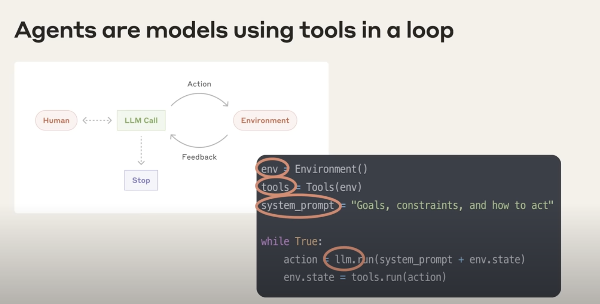
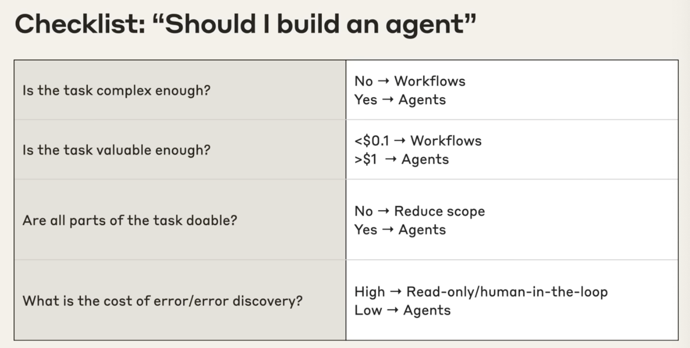
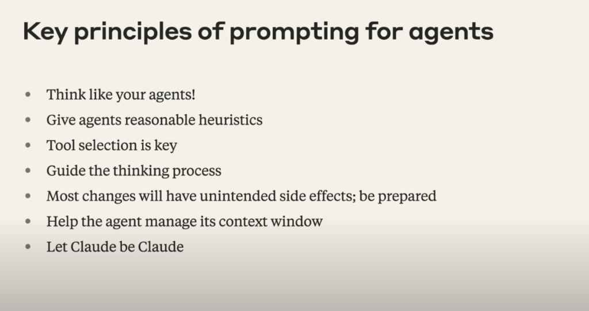
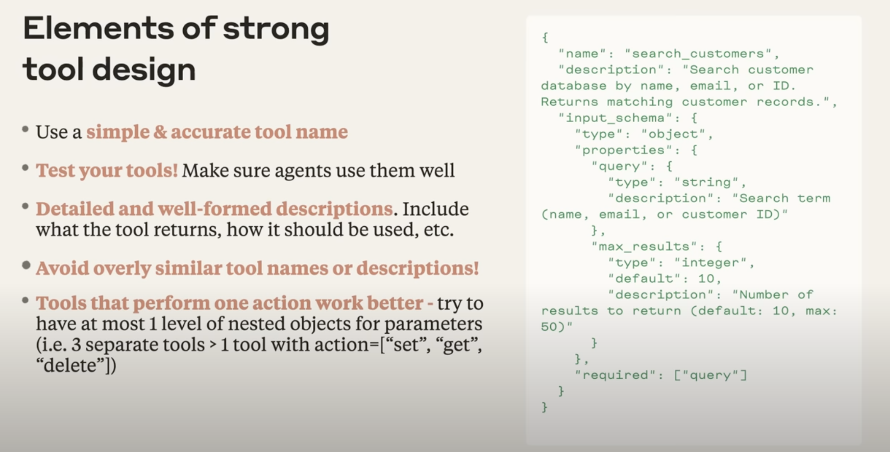
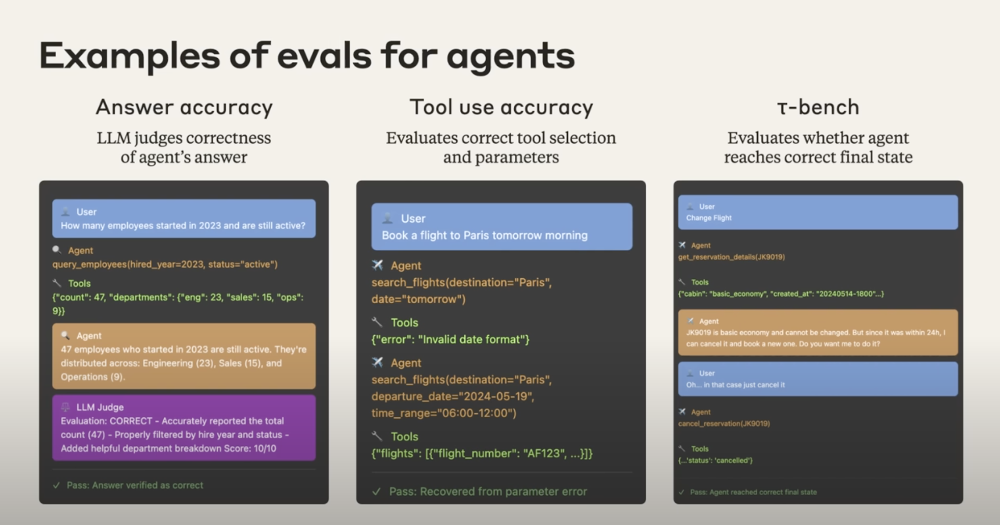

# Prompting for Agent：来自Claude Code团队的实践洞察

# What is Agent 
### **1. 到底什么是Agent？**
本质上，Agent是“**在一个loop中，能够自主使用工具的模型**”。这是 Anthropic 团队给出定义。
	> **"At Anthropic, we like to say that agents are models using tools in a loop."**
	
**Agent的工作原理**：
	1. 为Agent设定一个高级目标。
	2. 它会自主、持续地工作，在需要时主动选择并调用工具（如API、数据库）。
	3. 它能根据工具返回的信息，实时更新自己的判断和决策。
	4. 整个过程无需人工干预，直至最终任务完成。
	
**构成Agent的三要素**：
	1. **环境 (Environment):** Agent执行任务的场域。
	2. **工具 (Tools):** Agent可以使用的外部能力。
	3. **系统提示 (System Prompt):** 用于告知Agent其核心目标与行动准则，原则是保持简洁。
		> "And we typically find the simpler you can keep this the better. Allow the agent to do its work. Allow the model to be the model."
		

### **2. 何时应该（或不应该）使用Agent**
在决定是否要构建一个Agent前，进行审慎的评估非常重要。Agent最适合用于"**复杂且有价值的任务**" (complex and valuable tasks)，将其用于不合适的场景不仅效果不佳，还会浪费大量资源。

**Checklist：**
你可以使用下面这个清单来辅助决策。
**1. 任务是否足够复杂？ (Is the task complex enough?)**
- **否 → 考虑工作流 (Workflows)。**
	- 如果一个任务的执行路径是固定的、可预测的，并且一个人类可以清晰地思考出完成它的每一步，那么你可能并不需要Agent。一个自动化的工作流（Workflow）会是更高效、更经济的选择，比如一个自动化脚本。
- **是 → 适合Agent。**
	- 当任务的目标明确，但实现路径模糊不清时，Agent是最佳选择。你可能知道你想去哪儿，但"**不知道具体要怎么到达那里**" (don't know exactly how you're going to get there)，不确定过程中需要什么工具和信息。

**2. 任务是否足够有价值？ (Is the task valuable enough?)**
- **价值低（例如 \<\$0.1）→ 考虑工作流 (Workflows)。**
	- 不要为低价值的任务投入Agent的资源。
- **价值高（例如 \>\$1）→ 适合Agent 。**
	- Agent应该被用在那些"**高杠杆**" (highly leveraged) 的任务上，例如能直接**创造营收** (revenue generating)，或能为用户提供巨大价值的场景。

**3. 任务的所有部分是否都可行？ (Are all parts of the task doable?)**
- **否 → 缩小范围 (Reduce scope)。**
	- 如果你无法为Agent定义或提供完成任务所必需的工具和信息，那么这意味着当前的任务范围可能过大了。你需要先将任务范围缩小到一个可行的程度。
- **是 → 适合Agent 。**
	- 当你能够清晰地定义并提供Agent完成任务所需的工具集时，这就是一个好的Agent应用场景。

**4. 犯错的成本/发现错误的难度如何？ (What is the cost of error/error discovery?)**
- **成本高 → 采用Read-only或引入"human in the loop" **
	- 如果一个错误很难被发现，或者一旦出错造成的后果非常严重，那么让Agent完全自主地工作是危险的。在这种情况下，应考虑让Agent只进行读取操作，或在关键决策点加入人工审核环节。
- **成本低 → 适合Agent 。**
	- 如果错误很容易被发现，并且可以轻松地从错误中恢复（例如，撤销操作），那么这就是一个可以放心让Agent自主工作的场景。
	
	
---
### 使用Agent的场景价值分析
<table>
<tr>
<td>用例 (Use Case)</td>
<td>复杂性 (Complexity & Ambiguity)</td>
<td>价值 (Value)</td>
<td>可行性 (Viability)</td>
<td>错误成本 (Cost of Error)</td>
</tr>
<tr>
<td>**编程 (Coding)**</td>
<td>✅ 从设计文档到PR (design doc → PR)，路径不确定</td>
<td>\$\$\$ (极高)</td>
<td>Claude 编程能力很出色</td>
<td>通过单元测试和CI，易于验证</td>
</tr>
<tr>
<td>**搜索 (Search)**</td>
<td>✅ 模糊、多步骤的过程 (ambiguous, multi-step process)</td>
<td>\$\$ - 可节省数小时研究时间</td>
<td>搜索工具 + Claude 是绝佳组合</td>
<td>可通过引用来交叉核对结果，成本低</td>
</tr>
<tr>
<td>**计算机使用 (Computer use)**</td>
<td>✅ 自主导航图形界面 (autonomously navigating interfaces)</td>
<td>\$ - RPA，每个自动化任务价值 \>\$5</td>
<td>Sonnet 模型擅长使用截图+点击工具</td>
<td>操作通常可逆，只需再次点击或返回即可</td>
</tr>
<tr>
<td>**数据分析 (Data analysis)**</td>
<td>✅ 需要分析内容未知的复杂数据</td>
<td>\$\$</td>
<td>Claude 擅长 Text-to-SQL、数据可视化等</td>
<td>需要交叉核对，但错误率足够低，很有用</td>
</tr>
</table>

---
# Prompting for Agent 为Agent写提示词

### **原则一： 像你的Agent一样思考 (Think like your agents!)**
这是最重要的原则。你需要为Agent的行为建立一个心智模型，理解它所处的“环境”——即它能使用的工具和从这些工具得到的回应。
	> "You need to think like your agents. This is maybe the most important principle."
 亲自模拟一遍Agent的任务流程。如果一个人类在同样的条件下都无法理解该做什么，那么AI也同样无法理解。
	
### **原则二：给予合理的启发式规则 (Give reasonable heuristics)**
提示工程也是是“概念工程”（conceptual enginering）。你需要为模型灌输核心概念或行为准则，以帮助它在特定环境中表现更好。这就像管理一个刚毕业的实习生，你需要清晰地告诉他需要遵守的通用原则。  
这里是一些Anthropic团队在构建CC的时候赋予的一些规则：
- **不可逆性 (Irreversibility)：** 因为CC能直接修改用户环境的文件，团队因此灌输了“不可逆性”的概念，要求它避免执行任何可能损害用户环境或代码的不可恢复操作。
- **停止条件 (Stopping Condition)：** 在研究功能中，发现模型即使找到了答案也会不停地搜索。因此，需要明确告知：“当你找到答案时，就可以停止了”。
- **预算 (Budgets)：** 告知模型一个关于工具调用次数的预算，例如“简单的查询应使用少于5次工具调用”。

### **原则三：工具选择是关键 (Tool selection is key)**
 模型本身并不知道在特定情境下哪个工具最优，你必须提供明确的指导。
	> "you have to give it explicit principles about when to use which tools and in which contexts."
- **常见错误：** 很多开发者只是给模型一堆工具和简短的描述，然后困惑为什么模型没有使用正确的工具。根本原因在于，模型不知道在那个场景下应该做什么。但同时也要注意，模型本身的action space是有限的，给到越多的tools，容易让模型更容易混淆，调用错误的工具。因此，适当精简工具及不适用工具的时候采用masking（掩码）的技巧。

### **原则四：引导其思考过程 (Guide the thinking process)**
可以通过提示来引导它“如何更好地思考”，从而发掘出更多性能。
**举个例子：**
	- **预先规划：** 要求模型在第一个思考环节就做好任务规划，例如：评估查询的复杂度、计划需要调用多少次工具、应该查找哪些信息源、以及如何判断任务成功。
	- **反思结果：** 利用“反省”能力，要求模型在获得结果（如网页搜索结果）后先进行反思 (`reflect on the quality of the search results`)，而不是立即将其作为事实使用。

### **原则五：为意外的副作用做好准备 (Most changes will have unintended side effects)**
Agent在一个自主循环中工作，这使其行为比单次调用更难预测。对提示的任何修改，都可能产生意料之外的连锁反应。比如说：如果你告诉Agent“一直搜索，直到找到质量最高的来源”，它可能会因为这个“完美来源”根本不存在，而陷入无限搜索的循环。

### **原则六：帮助Agent管理上下文窗口 (Help the agent manage its context window)**
在长时间的自主任务中，Agent仍可能达到上下文上限。你可以通过使用策略来扩展其“有效”上下文。
- **具体策略：**
	- **压缩 (Compaction)：** 当上下文接近上限时，自动调用工具将所有内容总结压缩，再传递给新的模型实例继续任务。（CC就是这么做的，Manus的Inherit也是这么做的）
	- **写入外部文件 (write to an external file)：** 将记忆或状态写入外部文件作为扩展记忆的方式。
	- **使用子Agent (use sub agents)：** 由“主Agent”统筹，“子Agent”执行具体任务并汇报压缩后的结果。（Anthropic的DeepResearch）
	
## **原则七：Let Claude be Claude **
Claude 模型本身已经很擅长扮演Agent的角色。最佳实践是从一个“骨架式”的、非常简单的提示开始，观察其表现，找出它在哪些地方会出错，然后再针对性地进行迭代和完善。
	> "I would recommend just trying out your system with sort of a bare bones prompt and barebones tools and seeing where it goes wrong and then working from there. Don't sort of assume that Claude can't do it ahead of time because cloud often will surprise you with how good it is."
---

# Tools Design 该如何设计工具
Agent能否正确选择并使用工具，很大程度上取决于工具本身的设计质量。一个设计良好的工具应该遵循以下要素：
- **使用简洁且准确的工具名称 (Use a simple & accurate tool name)**
	- 名称应能直接反映工具的核心功能，例如 `search_customers` 就比 `retrieve_data` 更具体、更清晰。
- **测试你的工具 (Test your tools! Make sure agents use them well)**
	- 工具不仅要能正常工作，还要确保Agent能够正确地调用它并处理其返回结果。需要进行实际测试来验证这一点。
- **提供详尽且格式规范的描述 (Detailed and well-formed descriptions)**
	- 描述中应清楚说明：**这个工具是做什么的 (what the tool returns)**、**它应该在什么情境下被使用 (how it should be used)**，以及每个参数的含义。一个好的描述就像是写给其他工程师的函数文档。
- **避免使用过于相似的工具名称或描述 (Avoid overly similar tool names or descriptions!)**
	- 如果多个工具的功能、名称或描述非常接近（例如，有六个不同的搜索工具，只是搜索的数据库略有不同），会严重干扰模型的判断，使其难以抉擇。在这种情况下，应尽量将相似的工具合并为一个。
- **每个工具只执行一个动作效果更好 (Tools that perform one action work better)**
	- 遵循“单一职责原则”。一个工具最好只做一件事。例如，与其设计一个包含 `set`, `get`, `delete` 等多种操作的大而全的工具，不如将其拆分为三个独立的工具：`set_data`, `get_data`, `delete_data`。这样更清晰，也更便于模型理解和使用。

# Evals，Evals，Evals
Eval是任何AI系统开发中用于系统性衡量进展的关键环节。如果没有一个有意义的评估体系，将永远无法判断对系统的修改是否真的带来了正面效果。
然而，Agent的评估远比传统任务要困难得多，因为Agent任务是长期运行的，其执行过程不总是可预测的。

### **1. 评估Agent系统的技巧 **
**1. 效果越显著，所需样本量越小 (The larger the effect size, the smaller the sample size needed)**
在刚开始时，你只需要少量的测试用例，换句话说，构建你的最小评测集。因为初期对系统的每次改动，通常都会带来“巨大的、可感知的影响” 。如果一个改动的效果非常明显，你不需要上百个案例来证明它的有效性。因此不要在一开始就试图建立庞大、全自动的评估系统，这是一个常见的“反模式” (anti-pattern)。从小处着手，快速启动，并保持测试用例的一致性是关键。

**2. 使用真实世界的任务 (Use realistic tasks)**
评估任务应尽可能反映用户的真实使用场景。理想情况下，这些任务应该有**明确的、可以通过Agent所用工具找到的正确答案**。

**3. 善用LLM作为裁判，并提供清晰的评分标准 (LLM-as-judge with a rubric is very powerful)**
现在的LLM已经足够强大，可以成为优秀的输出评判者，前提是**提供给它一个与人类判断标准对齐的、清晰的评分标准**

**4. 人工评估无可替代 (Nothing is a perfect replacement for human evals)**
自动化评估无法完全替代人类的判断。最终，没有什么比得上“**对系统进行压力测试和主观感受评估**” (nothing beats bashing + vibe checking the system)。所以，让真实用户来测试，才能发现那些自动化评估难以捕捉的“体验不顺滑之处”

### **2. Agent评估的具体例子 **
**1. 答案准确性 (Answer accuracy)**
- **评估目标：** LLM 评判Agent答案的正确性 (LLM judges correctness of agent's answer)。
- **工作流程：**
	1. 用户提出问题（例如：“2023年入职且仍在职的员工有多少？”）。
	2. Agent调用工具（如数据库查询），获取原始数据。
	3. Agent基于工具返回结果，生成自然语言答案。
	4. **LLM Judge** 根据评分标准（Rubric）对答案进行评判，不仅给出“正确”或“错误”的结论，还能提供详细的评分和理由（例如：“正确 - 准确报告了总数(47)。按招聘年份和在职状态进行了恰当筛选。额外提供了有帮助的部门细分信息。得分：10/10”）。
	5. 最终产出一个通过/失败的结果。

**2. 工具使用准确性 (Tool use accuracy)**
- **评估目标：** 评估工具选择和参数的正确性 (Evaluates correct tool selection and parameters)。
- **工作流程：**
	1. 用户提出指令（例如：“预订明天上午去巴黎的机票”）。
	2. Agent首次尝试调用 `search_flights` 工具，但可能因参数格式错误（如 `date="tomorrow"`）而失败。
	3. 工具返回错误信息（例如：“无效的日期格式”）。
	4. **评估的关键点**：观察Agent能否理解错误信息，并**从参数错误中恢复**，用正确的参数（如 `departure_date="2024-05-19"`）再次成功调用工具。
	5. 最终产出一个通过/失败的结果，这个“通过”可能意味着它成功地修正了错误。

**3. τ-bench (state)**
- **评估目标：** 评估Agent是否达到了正确的最终状态 (Evaluates whether agent reaches correct final state)。
- **工作流程：**
	1. 用户提出一个会改变外部系统状态的请求（例如：“更改我的航班”）。
	2. Agent与用户交互，可能会发现航班无法更改，只能取消重订。
	3. 用户确认指令（例如：“那就取消吧”）。
	4. Agent调用 `cancel_reservation` 工具。
	5. **评估的关键点**：不关心中间的对话过程，而是直接检查任务结束后，系统的最终状态是否符合预期——即，数据库中对应的预订记录是否真的**被标记为“已取消” (cancelled)**。
	6. 只要最终状态正确，评估即为通过。

## 构建Agent Prompts的best practice
在正式进入到这篇文章前，我也先谈谈自己这几个月在给agent构建更强大的提示词时所使用的方法，就像订立法律一样，我认为一个有效的Prompt分为以下几个部分：
1. 角色设定
2. 核心原则
3. Action Space
4. 具体规则
5. few-shot
6. 绝对禁止事项
这个框架的核心思想参考了Stanford 2023年的一篇论文《Lost in the Middle: How Language Models Use Long Contexts》。这篇论文的核心思想是，当关键要求现在上下文的“最前”或“最后”位置时，模型表现较好；但当关键信息出现在“中间”位置时，表现显著下降，形成典型的 U 型曲线。 该现象与心理学中的 Serial‑Position Effect（序位效应：人类回忆列表时，对开头和结尾的项更敏感）有类似之处。
接下来让我们具体看一看这个框架：
### 角色设定
明确Agent的身份、职责和存在的意义。一个清晰的角色设定能帮助Agent理解它的核心任务，并在执行过程中保持一致性。
- **目的（使命）：**明确Agent被创建的根本原因和它要解决的主要问题。
- **身份：**赋予Agent一个具体的“人设”，这有助于它更好地理解预期的沟通风格和行为模式。甚至可以给agent去设置mbti）这是经过顶会论文证明能提高agent performance的PE技巧，论文名：Psychologically Enhanced AI Agents）
- **能力范围：**界定Agent能够做什么，不能做什么。这可以防止Agent“越界”或尝试执行它不具备能力的任务。例如：“你能够进行信息检索、内容总结和文本生成，但不能执行图像处理或数据分析。”
- **任务：**通过清晰精炼的语言明确告诉agent应该具体的任务是什么，要达成什么样的结果。
### 核心原则
这些是指导Agent行为的宪法，是所有具体规则的上位法。它们是Agent决策的根本依据，即使没有具体的规则覆盖某个场景，Agent也应遵循这些原则。此部分根据业务需求制定，常见的原则包括：
- **一致性**：Agent在处理类似请求时应保持行为和输出的一致性
- **准确性 :** Agent提供的所有信息都必须尽可能准确和真实，避免虚假陈述或猜测。
- **相关性**：Agent的回答和行动必须与用户的请求高度相关，避免离题。例如：“你的回复必须直接回应用户的问题，不引入无关信息。”
### Action Space (工具集)
这一部分定义了Agent可以使用的“工具”或可以执行的“行动”，让它知道在面对不同任务时可以调用哪些能力。此部分尽可能要使用清晰的语言，规定在什么样的情况下调用什么工具，因为对于工具机有助于Agent理解其能力的边界，并在执行任务时做出正确的选择。
### 具体规则
这些是详细的“法律条文”，针对特定场景或任务提供明确的指导。这部分就是针对Agent的输出要求进行规定同时也可以在。此部分根据业务需求制定，常见的原则包括：
- **格式要求:** 规定输出内容的具体格式。
- **语气和风格：** 定义Agent在不同情境下应采用的沟通风格。
- **交互模式:** 规定Agent在与用户交互时的行为模式。
- ……
### Few-Shot
这相当于“判例法”，通过提供具体示例来指导Agent如何理解和响应特定类型的请求。这比单纯的规则更直观有效。
- **正面示例：** 展示Agent应该如何回应。例如：
- **负面示例:** 展示Agent不应该如何回应，或者指明错误的输出方式。例如：
- **Tooluse 示例：**此处也可以明确告诉agent什么时候调用什么工具，传入的参数是什么，帮助agent能更准确的调用工具。
### 绝对禁止事项
这些是Agent“法律体系”中最严格的部分，是不可逾越的红线。同时这里要用明确且严肃的措辞，告诉agent违反这些事项将导致严重后果，。这部分就是针对Agent的输出要求进行规定同时也可以在。此部分根据业务需求制定，常见的绝对禁止事项包括：
- **格式输出错误**
- **生成有害内容**
- **提供非法建议**
- **可以将最希望模型遵循的原则和指令在此处复述一遍**

好的，收到您的反馈。这次我将严格遵循原文的结构和概念，避免过度解读和使用过多引号，以更直接、朴实的方式重新组织和呈现内容，聚焦于清晰地传递核心知识和操作方法。
---
### **备选标题**
1. **实用教程类:** AI 产品评估（Evals）实操指南：从入门到精通
2. **核心技能类:** AI 产品经理的核心技能：如何构建高效的评估（Evals）体系
3. **问题导向类:** 为什么你的 AI 产品总出问题？因为你缺少一个好的评估（Evals）系统
4. **价值声明类:** 超越提示词工程：评估（Evals）决定 AI 产品的成败
---
### **风格化标签**
#AI产品 #评估体系 #Evals #大语言模型 #产品开发 #LLM #AI工程
---
### **正文**
## **AI 下半场，模型评估比模型训练更重要**
在 AI 产品开发领域，一个普遍的现象是，产品经理们痴迷于优化提示词（Prompt）和采用最新的大语言模型（LLM）。然而，决定一个 AI 产品最终成败的隐藏杠杆，却是**评估（Evaluations，简称 Evals）**。
编写出色的 Evals，正在成为 2025 年及以后 AI 产品经理的决定性技能。本文将详细介绍 Evals 是什么、为何重要，以及如何从零到一构建并应用它。
### **01. Evals 为什么很重要？**
设想你开发了一个 AI 旅行规划 Agent。用户输入需求，AI 推荐航班、酒店和活动。初期测试顺利，但上线后，一个本想去旧金山的用户却被预订了去圣地亚哥的机票。问题出在哪里？如何提前避免？
**Evals 就是答案。**
Evals 是一套衡量 AI 系统质量和效果的方法，它为 AI 产品定义了清晰的“好”的标准。这不同于传统软件测试简单的通过或失败，它更像一场驾照考试，需要评估系统在动态和不确定的环境中的综合表现：
- **感知：** 能否准确理解环境和指令？
- **决策：** 在未知情况下能否做出正确选择？
- **安全：** 能否始终遵循规则，不出差错？
未经严格评估的 AI 产品就如同无证驾驶，充满了未知的风险。
**Evals 与单元测试的本质区别**
传统软件的单元测试结果是确定的。而针对 LLM 的 Evals 面对的是一个不确定的系统，同样的输入可能产生不同的输出。因此，Evals 更多处理的是定性或开放式指标，如相关性、连贯性，这些都难以用简单的“通过/失败”来衡量。
### **02. Evals 的三种核心方法**
评估 AI 系统主要有三种方法，它们各有优劣。
\| 评估方法 \| 描述 \| 优点 \| 缺点 \|
\| :--- \| :--- \| :--- \| :--- \|
\| **人工评估** \| 通过产品内置的反馈机制（如“赞/踩”）或雇佣领域专家进行人工标注。 \| 结果直接关联最终用户体验，是质量的黄金标准。 \| 反馈量少，信号不强，且人工标注成本高昂。 \|
\| **基于代码的评估** \| 检查确定性的结果，例如生成的代码是否可执行，或 API 调用是否符合规范。 \| 编写成本低，执行速度快。 \| 对于主观或开放式的任务，评估信号较弱。 \|
\| **基于 LLM 的评估** \| 利用一个外部 LLM（作为“裁判”）来评估 AI Agent 的输出质量。 \| 可扩展性极高，产品经理可直接用自然语言编写评估规则。 \| 需要少量已标注样本进行初始校准，结果是概率性的。 \|
其中，基于 LLM 的评估模式因其高扩展性和灵活性，正变得越来越重要。
### **03. 通用的评估标准有哪些？**
一个好的评估体系需要关注多个维度。以下是一些常见的评估领域：
- **幻觉 (Hallucination):** AI 的回答是基于提供的上下文，还是在凭空捏造？这在基于文档的问答场景中至关重要。
- **恶意/语气 (Toxicity/Tone):** AI 的输出是否包含不当言论？这对于所有面向用户的应用都非常重要。
- **总体正确性 (Overall Correctness):** 系统在其核心任务上的表现如何？例如，问答的准确率。
- **其他领域:** 还包括代码生成质量、摘要质量、检索相关性等。
### **04. 一个优秀的 LLM Eval 的构成要素**
一个结构良好的 LLM Eval 通常由四个部分组成，这构成了你给“裁判”LLM 的指令：
1. **设定角色:** 告诉裁判 LLM 它需要扮演什么角色（例如，“你是一个审查书面文本的专家”）。
2. **提供上下文:** 将需要被评估的数据（如对话记录、AI 生成的内容）提供给裁判 LLM。
3. **阐明目标:** 清晰地说明你希望裁判 LLM 衡量什么，精确定义成功与失败的标准。
4. **定义术语与标签:** 对评估中使用的术语（如“恶意”）进行具体规定，确保裁判 LLM 的判断标准与你一致。
### **05. 如何从零开始构建一个 Eval 系统**
评估是一个贯穿产品开发始终的迭代过程。以下是构建 Eval 系统的四个阶段：
**第一阶段：收集数据**
从真实的用户交互中收集案例，特别是那些反馈明确或出现问题的边缘案例。将这些案例整理成一个结构化的数据集，并进行人工标注，形成评估的基准。初期准备 10 到 100 个带有人工标签的样本即可。
**第二阶段：初步评估**
根据上一节提到的四部分公式，编写初始的 Eval 提示词。然后在你的数据集上运行这个 Eval，将其输出的评估标签与人工标注的“真实标签”进行比较，分析失败的案例，找出评估规则不完善的地方。
**第三阶段：迭代循环**
根据分析结果，不断优化你的 Eval 提示词，直到其评估结果与人工标注的准确率达到你的标准（例如90%以上）。你也可以在提示词中加入几个好与坏的案例（小样本提示），来提升裁判 LLM 的判断力。当评估体系稳定后，你就可以用它来衡量对主 AI 系统（如更换模型、修改提示词）的改动效果。
**第四阶段：生产环境监控**
将评估流程自动化，使其在实时用户交互中持续运行。通过建立仪表盘来追踪关键评估指标的长期变化趋势，这能帮助你主动发现问题，并验证评估结果与真实用户反馈的一致性。
### **06. Evals 设计要避免的常见错误**
1. **起步时设计得过于复杂:** 应从具体的、单一的输出评估开始，逐步增加复杂度。
2. **不测试边缘案例:** 在 Eval 提示词中提供好与坏的具体案例（小样本提示），可以显著提升评估性能。
3. **忘记用真实用户反馈来验证:** 评估体系必须与真实的用户问题和体验对齐，定期校准，避免脱节。
### **结论**
随着 AI 产品变得越来越复杂，编写高质量 Evals 的能力将愈发重要。它不仅是发现错误的工具，更是确保 AI 系统能够持续创造价值、赢得用户信赖的关键。Evals 是推动生成式 AI 从原型走向成熟产品的必经之路。

作为 AI 产品经理，你需要掌握以下三种主流的评估方法：
<table header-row="true">
<tr>
<td>**评估方法**</td>
<td>**描述**</td>
<td>**优点**</td>
<td>**缺点**</td>
</tr>
<tr>
<td>**人工评估**</td>
<td>依赖真实用户的反馈（如“赞/踩”）或领域专家的专业判断。</td>
<td>评估结果最贴近真实用户体验，是质量的“黄金标准”。</td>
<td>成本高，速度慢，且能收集到的反馈信号往往稀疏且模糊。</td>
</tr>
<tr>
<td>**基于代码的评估**</td>
<td>通过编写代码来检查确定性的结果，如 API 调用是否成功、代码是否能运行。</td>
<td>成本低，速度快，结果明确。</td>
<td>无法衡量开放式、主观性的任务，如文案的创意或语气的恰当性。</td>
</tr>
<tr>
<td>**基于 LLM 的评估**</td>
<td>利用一个独立的 LLM 作为“裁判”，通过特定的评估指令来判断主 AI 系统的输出质量。</td>
<td>**可扩展性极强**，如同拥有一个低成本的自动化标注团队，产品经理也能直接用自然语言</td>
<td></td>
</tr>
</table>

# 前言
> 这篇文章来自claude团队在一次Open Day上的分享，同时我也会分享自己实际在工作过程当中摸索出的提示词框架，如果有团队也正在构建agent以及撰写对应的提示词，希望这篇文章对你有帮助，也欢迎大家交流讨论

# 构建Agent Prompts的个人实践分享
在深入本文的讨论之前，请允许我分享一些个人心得。在过去几个月为AI Agent设计提示词的实践中，我逐渐形成了一个理念：**构建提示词，如同构建一部健全的法律体系。**
一部好的法律之所以行之有效，是因为它具备以下特质，而这同样适用于一个高质量的提示词：
1.**层级性 **：如同法律条文有宪法、法律、法规之分，提示词的指令也应有清晰的层级结构，让AI明白核心目标与辅助规则的主次关系。
2.**明确性 **：法律追求用词精准，避免模棱两可。同样，提示词必须明确无误，让AI的每一次执行都精准地符合预期。
3.**可解释性**：法律条文的设计初衷和逻辑是可被解释和理解的。一个好的提示词也应如此，其背后的逻辑应当清晰，以便我们能够分析、调试和迭代。
4.**适应性**：法律原则需具备一定的灵活性以适用于各类案件。同样，一个好的提示词也应能灵活适应不同场景，这可以通过模块化设计和建设性模糊等方法实现。
遵循这一理念，我将一个有效的Prompt解构为以下几个核心组成部分：
- 角色设定
- 核心原则
- Action Space
- 具体规则
- few-shot
- 绝对禁止事项
这个框架的核心思想参考了Stanford 2023年的一篇论文《Lost in the Middle: How Language Models Use Long Contexts》。这篇论文的核心思想是，当关键要求现在上下文的“最前”或“最后”位置时，模型表现较好；但当关键信息出现在“中间”位置时，表现显著下降，形成典型的 U 型曲线。 该现象与心理学中的 Serial‑Position Effect（序位效应：人类回忆列表时，对开头和结尾的项更敏感）有类似之处。
因此，我的框架策略性地将最关键的指令——如角色设定、核心原则和绝对禁止事项——分别置于Prompt的最前端和最后端，以确保它们被模型最高效地遵循。
接下来，让我们深入探讨这个框架的每一个组成部分。
### 角色设定
明确Agent的身份、职责和存在的意义。一个清晰的角色设定能帮助Agent理解它的核心任务，并在执行过程中保持一致性。
- **目的（使命）：**明确Agent被创建的根本原因和它要解决的主要问题。
- **身份：**赋予Agent一个具体的“人设”，这有助于它更好地理解预期的沟通风格和行为模式。甚至可以给agent去设置mbti）这是经过顶会论文证明能提高agent performance的PE技巧，论文名：Psychologically Enhanced AI Agents）
- **能力范围：**界定Agent能够做什么，不能做什么。这可以防止Agent“越界”或尝试执行它不具备能力的任务。例如：“你能够进行信息检索、内容总结和文本生成，但不能执行图像处理或数据分析。”
- **任务：**通过清晰精炼的语言明确告诉agent应该具体的任务是什么，要达成什么样的结果。
### 核心原则
这些是指导Agent行为的宪法，是所有具体规则的上位法。它们是Agent决策的根本依据，即使没有具体的规则覆盖某个场景，Agent也应遵循这些原则。此部分根据业务需求制定，常见的原则包括：
- **一致性**：Agent在处理类似请求时应保持行为和输出的一致性
- **准确性 :** Agent提供的所有信息都必须尽可能准确和真实，避免虚假陈述或猜测。
- **相关性**：Agent的回答和行动必须与用户的请求高度相关，避免离题。例如：“你的回复必须直接回应用户的问题，不引入无关信息。”
### Action Space (工具集)
这一部分定义了Agent可以使用的“工具”或可以执行的“行动”，让它知道在面对不同任务时可以调用哪些能力。此部分尽可能要使用清晰的语言，规定在什么样的情况下调用什么工具，因为对于工具机有助于Agent理解其能力的边界，并在执行任务时做出正确的选择。
### 具体规则
这些是详细的“法律条文”，针对特定场景或任务提供明确的指导。这部分就是针对Agent的输出要求进行规定同时也可以在。此部分根据业务需求制定，常见的原则包括：
- **格式要求:** 规定输出内容的具体格式。
- **语气和风格：** 定义Agent在不同情境下应采用的沟通风格。
- **交互模式:** 规定Agent在与用户交互时的行为模式。
- ……
### Few-Shot
这相当于“判例法”，通过提供具体示例来指导Agent如何理解和响应特定类型的请求。这比单纯的规则更直观有效。
- **正面示例：** 展示Agent应该如何回应。例如：
- **负面示例:** 展示Agent不应该如何回应，或者指明错误的输出方式。例如：
- **Tooluse 示例：**此处也可以明确告诉agent什么时候调用什么工具，传入的参数是什么，帮助agent能更准确的调用工具。
### 绝对禁止事项
这些是Agent“法律体系”中最严格的部分，是不可逾越的红线。同时这里要用明确且严肃的措辞，告诉agent违反这些事项将导致严重后果，。这部分就是针对Agent的输出要求进行规定同时也可以在。此部分根据业务需求制定，常见的绝对禁止事项包括：
- **格式输出错误**
- **生成有害内容**
- **提供非法建议**
- **可以将最希望模型遵循的原则和指令在此处复述一遍**
以上是我个人凝练出的Prompting for agents的方法论，让我们来看看Claude 团队是怎么给agents写prompt的
---
# What is Agent
### **1. 到底什么是Agent？**
本质上，Agent是“**在一个loop中，能够自主使用工具的模型**”。这是 Anthropic 团队给出定义。
> "At Anthropic, we like to say that agents are models using tools in a loop."
**Agent的工作原理**：
- 为Agent设定一个高级目标。
- 它会自主、持续地工作，在需要时主动选择并调用工具（如API、数据库）。
- 它能根据工具返回的信息，实时更新自己的判断和决策。
- 整个过程无需人工干预，直至最终任务完成。
**构成Agent的三要素**：
1.**环境 (Environment):** Agent执行任务的场域。
2.**工具 (Tools):** Agent可以使用的外部能力。
3.**系统提示 (System Prompt):** 用于告知Agent其核心目标与行动准则，原则是保持简洁。
> "And we typically find the simpler you can keep this the better. Allow the agent to do its work. Allow the model to be the model."
### **2. 何时应该（或不应该）使用Agent**
在决定是否要构建一个Agent前，进行审慎的评估非常重要。Agent最适合用于"**复杂且有价值的任务**" (complex and valuable tasks)，将其用于不合适的场景不仅效果不佳，还会浪费大量资源。
**Checklist：**
你可以使用下面这个清单来辅助决策。
**1. 任务是否足够复杂？**
- **否 → 考虑工作流 (Workflows)。**
◦如果一个任务的执行路径是固定的、可预测的，并且一个人类可以清晰地思考出完成它的每一步，那么你可能并不需要Agent。一个自动化的工作流（Workflow）会是更高效、更经济的选择，比如一个自动化脚本。
- **是 → 适合Agent。**
◦当任务的目标明确，但实现路径模糊不清时，Agent是最佳选择。你可能知道你想去哪儿，但"**不知道具体要怎么到达那里**" (don't know exactly how you're going to get there)，不确定过程中需要什么工具和信息。
**2. 任务是否足够有价值？**
- **价值低（例如 \<\$0.1）→ 考虑工作流 (Workflows)。**
◦不要为低价值的任务投入Agent的资源。
- **价值高（例如 \>\$1）→ 适合Agent 。**
◦Agent应该被用在那些"**高杠杆**" (highly leveraged) 的任务上，例如能直接**创造营收** (revenue generating)，或能为用户提供巨大价值的场景。
**3. 任务的所有部分是否都可行？ (Are all parts of the task doable?)**
- **否 → 缩小范围 (Reduce scope)。**
◦如果你无法为Agent定义或提供完成任务所必需的工具和信息，那么这意味着当前的任务范围可能过大了。你需要先将任务范围缩小到一个可行的程度。
- **是 → 适合Agent 。**
◦当你能够清晰地定义并提供Agent完成任务所需的工具集时，这就是一个好的Agent应用场景。
**4. 犯错的成本/发现错误的难度如何？**
- **成本高 → 采用Read-only或引入"human in the loop"**
◦如果一个错误很难被发现，或者一旦出错造成的后果非常严重，那么让Agent完全自主地工作是危险的。在这种情况下，应考虑让Agent只进行读取操作，或在关键决策点加入人工审核环节。
- **成本低 → 适合Agent 。**
◦如果错误很容易被发现，并且可以轻松地从错误中恢复（例如，撤销操作），那么这就是一个可以放心让Agent自主工作的场景。

---
### 使用Agent的场景价值分析
<table>
<tr>
<td>用例 (Use Case)</td>
<td>复杂性 (Complexity & Ambiguity)</td>
<td>价值 (Value)</td>
<td>可行性 (Viability)</td>
<td>错误成本 (Cost of Error)</td>
</tr>
<tr>
<td>**编程 (Coding)**</td>
<td>✅ 从设计文档到PR (design doc → PR)，路径不确定</td>
<td>\$\$\$ (极高)</td>
<td>Claude 编程能力很出色</td>
<td>通过单元测试和CI，易于验证</td>
</tr>
<tr>
<td>**搜索 (Search)**</td>
<td>✅ 模糊、多步骤的过程 (ambiguous, multi-step process)</td>
<td>\$\$ - 可节省数小时研究时间</td>
<td>搜索工具 + Claude 是绝佳组合</td>
<td>可通过引用来交叉核对结果，成本低</td>
</tr>
<tr>
<td>**计算机使用 (Computer use)**</td>
<td>✅ 自主导航图形界面 (autonomously navigating interfaces)</td>
<td>\$ - RPA，每个自动化任务价值 \>\$5</td>
<td>Sonnet 模型擅长使用截图+点击工具</td>
<td>操作通常可逆，只需再次点击或返回即可</td>
</tr>
<tr>
<td>**数据分析 (Data analysis)**</td>
<td>✅ 需要分析内容未知的复杂数据</td>
<td>\$\$</td>
<td>Claude 擅长 Text-to-SQL、数据可视化等</td>
<td>需要交叉核对，但错误率足够低，很有用</td>
</tr>
</table>
---
# Prompting for Agent 为Agent写提示词

### **原则一： 像你的Agent一样思考 (Think like your agents!)**
这是最重要的原则。你需要为Agent的行为建立一个心智模型（大脑），理解它所处的“环境”——即它能使用的工具和从这些工具得到的回应。
> "You need to think like your agents. This is maybe the most important principle."
**亲自模拟一遍Agent的任务流程。如果一个人类在同样的条件下都无法理解该做什么，那么AI也同样无法理解。**
### **原则二：给予合理的启发式规则 (Give reasonable heuristics)**
提示工程也是是“概念工程”（conceptual enginering）。你需要为模型灌输核心概念或行为准则，以帮助它在特定环境中表现更好。这就像管理一个刚毕业的实习生，你需要清晰地告诉他需要遵守的通用原则。
这里是一些Anthropic团队在构建CC的时候赋予的一些原则：
- **不可逆性 (Irreversibility)：** 因为CC能直接修改用户环境的文件，团队因此灌输了“不可逆性”的概念，要求它避免执行任何可能损害用户环境或代码的不可恢复操作。
- **停止条件 (Stopping Condition)：** 在研究功能中，发现模型即使找到了答案也会不停地搜索。因此，需要明确告知：“当你找到答案时，就可以停止了”。
- **预算 (Budgets)：** 告知模型一个关于工具调用次数的预算，例如“简单的查询应使用少于5次工具调用”。
### **原则三：工具选择是关键 (Tool selection is key)**
模型本身并不知道在特定情境下哪个工具最优，你必须提供明确的指导。
> "you have to give it explicit principles about when to use which tools and in which contexts."
- **常见错误：** 很多开发者只是给模型一堆工具和简短的描述，然后困惑为什么模型没有使用正确的工具。根本原因在于，模型不知道在那个场景下应该做什么。但同时也要注意，模型本身的action space是有限的，给到越多的tools，容易让模型更容易混淆，调用错误的工具。因此，适当精简工具及不适用工具的时候采用masking（掩码）的技巧。
### **原则四：引导其思考过程 (Guide the thinking process)**
可以通过提示来引导它“如何更好地思考”，从而发掘出更多性能。
**举个例子：**
- **预先规划：** 要求模型在第一个思考环节就做好任务规划，例如：评估查询的复杂度、计划需要调用多少次工具、应该查找哪些信息源、以及如何判断任务成功。
- **反思结果：** 利用“反省”能力，要求模型在获得结果（如网页搜索结果）后先进行反思 (`reflect on the quality of the search results`)，而不是立即将其作为事实使用。
### **原则五：为意外的副作用做好准备 (Most changes will have unintended side effects)**
Agent在一个自主循环中工作，这使其行为比单次调用更难预测。对提示的任何修改，都可能产生意料之外的连锁反应。比如说：如果你告诉Agent“一直搜索，直到找到质量最高的来源”，它可能会因为这个“完美来源”根本不存在，而陷入无限搜索的循环。
### **原则六：帮助Agent管理上下文窗口 (Help the agent manage its context window)**
在长时间的自主任务中，Agent仍可能达到上下文上限。你可以通过使用策略来扩展其“有效”上下文。
- **具体策略：**
◦**压缩 (Compaction)：** 当上下文接近上限时，自动调用工具将所有内容总结压缩，再传递给新的模型实例继续任务。（CC就是这么做的，Manus的Inherit也是这么做的）
◦**写入外部文件 (write to an external file)：** 将记忆或状态写入外部文件作为扩展记忆的方式。
◦**使用多智能体架构：**创建子Agent， 由“主Agent”统筹，“子Agent”执行具体任务并汇报压缩后的结果。（Anthropic的Deep Research）
◦
## **原则七：Let Claude be Claude**
Claude 模型本身已经很擅长扮演Agent的角色。最佳实践是从一个“骨架式”的、非常简单的提示开始，观察其表现，找出它在哪些地方会出错，然后再针对性地进行迭代和完善。
> "I would recommend just trying out your system with sort of a bare bones prompt and barebones tools and seeing where it goes wrong and then working from there. Don't sort of assume that Claude can't do it ahead of time because cloud often will surprise you with how good it is."
---
# Tools Design 该如何设计工具
Agent能否正确选择并使用工具，很大程度上取决于工具本身的设计质量。一个设计良好的工具应该遵循以下要素：
- **使用简洁且准确的工具名称 (Use a simple & accurate tool name)**
◦名称应能直接反映工具的核心功能，例如 `search_customers` 就比 `retrieve_data` 更具体、更清晰。
- **测试你的工具 (Test your tools! Make sure agents use them well)**
◦工具不仅要能正常工作，还要确保Agent能够正确地调用它并处理其返回结果。需要进行实际测试来验证这一点。
- **提供详尽且格式规范的描述 (Detailed and well-formed descriptions)**
◦描述中应清楚说明：**这个工具是做什么的 (what the tool returns)**、**它应该在什么情境下被使用 (how it should be used)**，以及每个参数的含义。一个好的描述就像是写给其他工程师的函数文档。
- **避免使用过于相似的工具名称或描述 (Avoid overly similar tool names or descriptions!)**
◦如果多个工具的功能、名称或描述非常接近（例如，有六个不同的搜索工具，只是搜索的数据库略有不同），会严重干扰模型的判断，使其难以抉擇。在这种情况下，应尽量将相似的工具合并为一个。
- **每个工具只执行一个动作效果更好 (Tools that perform one action work better)**
◦遵循“单一职责原则”。一个工具最好只做一件事。例如，与其设计一个包含 `set`, `get`, `delete` 等多种操作的大而全的工具，不如将其拆分为三个独立的工具：`set_data`, `get_data`, `delete_data`。这样更清晰，也更便于模型理解和使用。

# Evals，Evals，Evals
Eval是任何AI系统开发中用于系统性衡量进展的关键环节。如果没有一个有意义的评估体系，将永远无法判断对系统的修改是否真的带来了正面效果。
然而，Agent的评估远比传统任务要困难得多，因为Agent任务是长期运行的，其执行过程不总是可预测的。
### **1. 评估Agent系统的技巧**
**1. 效果越显著，所需样本量越小**
在刚开始时，你只需要少量的测试用例，换句话说，构建你的最小评测集。因为初期对系统的每次改动，通常都会带来“巨大的、可感知的影响” 。如果一个改动的效果非常明显，你不需要上百个案例来证明它的有效性。因此不要在一开始就试图建立庞大、全自动的评估系统，这是一个常见的“反模式” (anti-pattern)。从小处着手，快速启动，并保持测试用例的一致性是关键。
**2. 使用真实世界的任务**
评估任务应尽可能反映用户的真实使用场景。理想情况下，这些任务应该有**明确的、可以通过Agent所用工具找到的正确答案**。
**3. 善用LLM作为裁判，并提供清晰的评分标准**
现在的LLM已经足够强大，可以成为优秀的输出评判者，前提是**提供给它一个与人类判断标准对齐的、清晰的评分标准**
**4. 人工评估无可替代**
自动化评估无法完全替代人类的判断。最终，没有什么比得上“**对系统进行压力测试和主观感受评估**” (nothing beats bashing + vibe checking the system)。所以，让真实用户来测试，才能发现那些自动化评估难以捕捉的“体验不顺滑之处”
### **2. Agent评估的具体例子**
**1. 答案准确性**
- **评估目标：** LLM 评判Agent答案的正确性 (LLM judges correctness of agent's answer)。
- **工作流程：**
◦用户提出问题（例如：“2023年入职且仍在职的员工有多少？”）。
◦Agent调用工具（如数据库查询），获取原始数据。
◦Agent基于工具返回结果，生成自然语言答案。
◦**LLM Judge** 根据评分标准（Rubric）对答案进行评判，不仅给出“正确”或“错误”的结论，还能提供详细的评分和理由（例如：“正确 - 准确报告了总数(47)。按招聘年份和在职状态进行了恰当筛选。额外提供了有帮助的部门细分信息。得分：10/10”）。
◦最终产出一个通过/失败的结果。
**2. 工具使用准确性**
- **评估目标：** 评估工具选择和参数的正确性 (Evaluates correct tool selection and parameters)。
- **工作流程：**
◦用户提出指令（例如：“预订明天上午去巴黎的机票”）。
◦Agent首次尝试调用 `search_flights` 工具，但可能因参数格式错误（如 `date="tomorrow"`）而失败。
◦工具返回错误信息（例如：“无效的日期格式”）。
◦**评估的关键点**：观察Agent能否理解错误信息，并**从参数错误中恢复**，用正确的参数（如 `departure_date="2024-05-19"`）再次成功调用工具。
◦最终产出一个通过/失败的结果，这个“通过”可能意味着它成功地修正了错误。
**3. τ-bench**
- **评估目标：** 评估Agent是否达到了正确的最终状态 (Evaluates whether agent reaches correct final state)。
- **工作流程：**
1.用户提出一个会改变外部系统状态的请求（例如：“更改我的航班”）。
2.Agent与用户交互，可能会发现航班无法更改，只能取消重订。
3.用户确认指令（例如：“那就取消吧”）。
4.Agent调用 `cancel_reservation` 工具。
5.**评估的关键点**：不关心中间的对话过程，而是直接检查任务结束后，系统的最终状态是否符合预期——即，数据库中对应的预订记录是否真的**被标记为“已取消” (cancelled)**。
6.只要最终状态正确，评估即为通过。

