# 你真的理解LLM吗？万字解析「Transformer」

# 1. 开场白Intro
2025年初，人工智能领域风起云涌。Deepseek以其惊人的推理能力为中美AI界投下一枚震撼弹，OpenAI的GPT系列继续引领创新，而Claude凭借其细腻的理解能力赢得用户青睐。这些智能体轮番登台，各展所长，不断刷新我们对AI能力的认知边界。

然而，在这场技术盛宴的背后，这些看似迥异的模型都有一个共同的核心基础——Transformer架构。自2017年被提出以来，这个架构已经成为现代大型语言模型的基石，彻底改变了自然语言处理的格局。无论是能写代码、绘制图表，还是能够与人类进行流畅对话的聊天机器人，它们的"思考"过程都离不开Transformer的提出的自注意力机制。这一机制使模型能够理解词与词之间的复杂关系，捕捉语言中的长距离依赖，从而产生连贯、合理的输出。

尽管许多人使用这些AI工具，但真正理解其背后工作原理的人却不多。Transformer就像一个被神秘面纱笼罩的黑盒子，即使是许多AI从业者也只是对其有皮毛了解。然而，深入理解这一架构不仅能帮助我们更好地应用这些模型，还能为我们提供洞见，了解它们的能力边界和局限性。

在这篇深度解析中，我希望能揭开Transformer的神秘面纱，从最基础的概念出发，逐步探索这一架构的各个组成部分。

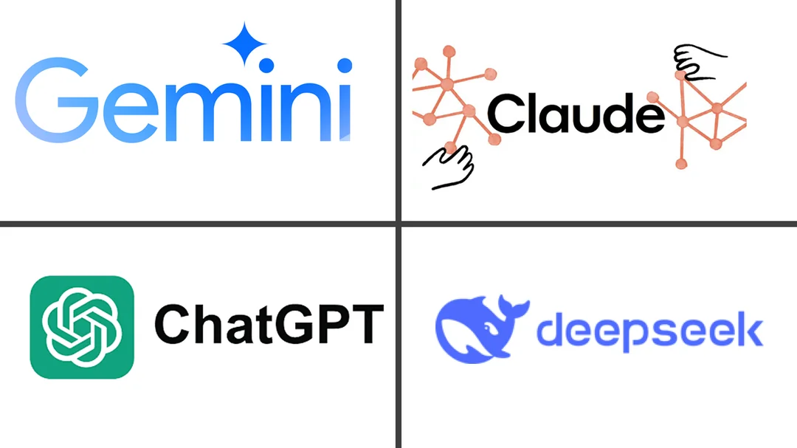

（注：1. 本篇文章主要为对「参考」中的两个视频的学习内化输出，若想要最大化本文的学习效果，可搭配服用。2. 若要读透本文，仍需有基础高中数学知识。3. 本文中标🌟为重点段落）

# 2. 编码解码 Encode, Decode
编码解码是更关键理解Transformer的关键
## 2.1 编码与解码的本质
当我们讨论Transformer架构中的"编码解码"，首先需要理解其核心概念："码"到底是什么？"码"本质上是信息的一种表示方式。在自然语言处理（NLP）领域，这个"码"指的是将语言中的语义信息转换为机器可以理解和处理的形式。

语言的本质是对实体或者是对象去进行编码和解码的过程。不同的语言的编码体系不一样，因此需要去进行翻译。而翻译的过程需要通过对于「对象」的语义作为转换的共同指涉对象。

想象以下场景：特朗普访问中国时看到一个苹果，由于不懂中文，他会指着这个水果，等待中国翻译说出"苹果"的中文。这个过程中，现实中的"苹果"是共同的指涉对象，而英文的"Apple"和中文的"苹果"则是两种不同的编码方式。

虽然不同语言的符号和发音各异，但它们所描述的上下文关系却可以是相同的。比如"苹果"这个词，在不同上下文中具有不同的语义：
- 在"手机，笔记本电脑，乔布斯，苹果"这个上下文中，"苹果"指的是科技公司
- 在"香蕉，梨子，水果店，红色，维生素C，苹果"这个上下文中，"苹果"指的是水果

因此，编码和解码中的"码"，实际上是将各种语言中符号、发音等形式上的差异剥离后，保留下来的纯粹语义关系。

## 2.2 语义关系的数字化表达
要让计算机理解和处理语言，我们需要将这些语义关系数字化。一个理想的编码方式需要满足两个标准：
1. **能够数字化** - 将语言转换为计算机可处理的数值
2. **能体现语义关系** - 这些数值能够反映词语之间的语义的相对关系

在机器学习中，有两种基础的编码方法：分词器（tokenizer）和独热编码（one-hot）。

**分词器（Tokenizer）**：
分词器将文本切分为最基本的语义单元（tokens）。这些语义单元可以是字母、单词、字根或中文中的字、词等。分词器为每个token分配一个唯一的整数ID。
```plain text

例如："我爱机器学习" → [101, 2769, 4263, 7339, 4500, 2110, 102]

```

**独热编码（One-hot）**：
独热编码则将每个token表示为一个向量，向量长度等于词表大小，只有对应位置为1，其余位置为0。
```plain text
例如：假设词表大小为10000
"我" → [0,1,0,0,...,0]（第2位为1）
"爱" → [0,0,0,1,...,0]（第4位为1）

```
这两种方法都存在明显的局限性：
- **分词器的问题**：它将所有语义都简化为长度问题，完全没有利用向量的维度关系来表示语义信息。例如，"好"和"优秀"虽然语义相近，但它们的数字ID可能毫无关联。
- **独热编码的问题**：虽然利用了维度关系，但空间维度过高且稀疏。在一个包含数万词的词表中，每个词的向量中只有一个位置是有效的（为1），其余位置都是0，这非常低效。而且，所有词向量之间的距离都相等，无法体现语义的相似性。

> **Tokenizer和one-hot的问题都是在于没有办法很好的体现语义之间的相对关系。**

## 2.3 走向潜空间
既然分词器和独热编码分别代表了两个极端（一个只用长度，一个只用维度），那么理想的解决方案应该是在两者之间找到平衡——使用维度适中的向量空间来表示语义关系。

这个空间就是我们常说的**潜空间（Latent Space）**。在潜空间中，每个词或短语被表示为一个密集的向量（通常是几百维），向量中的每个维度都有意义，而且语义相似的词在这个空间中的距离较近。
例如，在一个训练良好的潜空间中：
- "国王"和"王后"的向量会很接近
- "国王加上"女人""减去"男人"的结果会接近"王后"的向量
```json
vector("国王") - vector("男人") + vector("女人") ≈ vector("王后")
vector("中国") - vector("北京") ≈ vector("法国") - vector("巴黎")
```

这种表示方法既避免了独热编码的高维稀疏问题，又保留了词语间语义关系的表达能力。在Transformer架构中，编码器和解码器的核心任务就是在这个潜空间中进行信息的转换和处理。

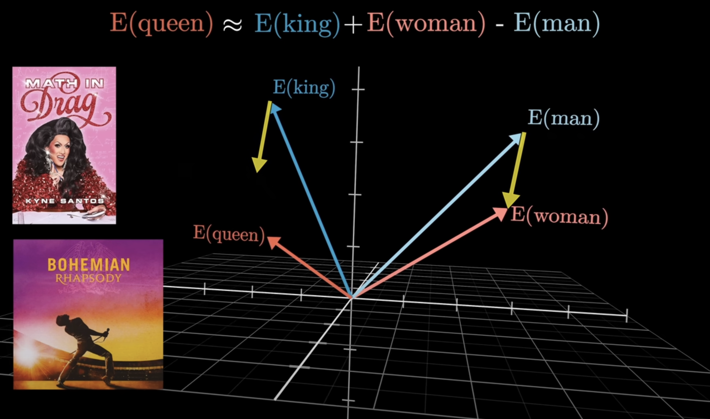

在探索潜空间的过程中，主要有两个大的方向：一是基于分词后的ID进行升维，二是基于独热编码进行降维。其中，更理想的方式是对独热编码进行降维，因为这种方法能够更高效地捕捉语义信息。无论采用哪种方法，本质上都是一种空间变换——通过矩阵操作实现从高维到低维的映射，从而为后续的自然语言处理任务提供更紧凑且语义丰富的表示。

# 3. 矩阵和空间变换 Matrix
（此部分为重新解读矩阵和空间变换的数学含义，若基础扎实或想直入重点可跳过）

## 3.1 矩阵的本质
矩阵最根本的作用之一是表示代表的就是旧坐标系和新坐标系之间的关系。
当我们看到一个矩阵时，应该立即思考它代表了什么样的空间变换：
- **行数**告诉我们原坐标系的维度
- **列数**告诉我们新坐标系的维度

例如，图中左侧的中间矩阵是M×N维，这表明它将向量从M维空间映射到N维空间。这种明确的对应关系使我们能够直观地理解空间变换的本质。
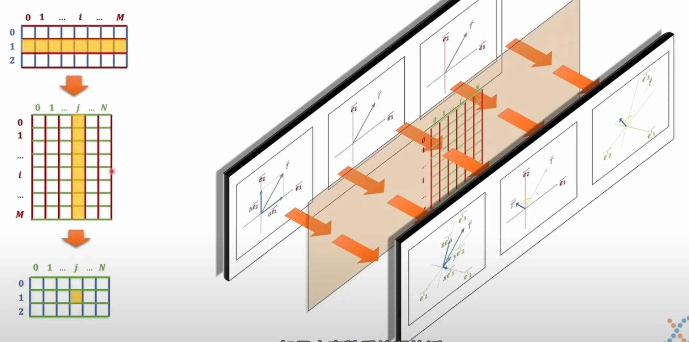

由于向量与矩阵的乘法本质上是一种线性变换，因此它具有以下重要特性：在原始坐标系中的每一个点都会与新坐标系中的点形成一一对应的映射关系。这种变换仅限于旋转操作或在特定方向上的伸缩变换，而不会产生其他类型的几何变化。

**从数学角度来看，矩阵的加法和乘法运算本质上都是线性变换的过程。在几何意义上，这种变换可以理解为空间坐标系的转换。具体来说，当一个向量与矩阵相乘时，就相当于将原始空间中的元素映射到一个新的空间坐标系中。这种空间变换最直观的体现就是原始坐标系与新坐标系之间的转换关系。这种坐标系的改变，实质上反映了空间本身的转变。因此，我们可以将矩阵运算视为一种空间转换工具：它能够将原始空间转换为一个全新的空间，同时保持空间内元素的基本关系。**

**这种转换具有以下关键特征：**
1. 原始空间中的任何向量或几何关系，经过矩阵变换后都会在新空间中获得对应的映射；
2. 新旧空间之间的映射关系是严格的一一对应关系；
3. 由于矩阵表示的是空间变换，因此数据在转换过程中保持了完整性；
4. 任何原始空间中的向量集，经过矩阵变换后，在新空间中必定保持相同的数量。

举例来说，考虑一个由三个向量组成的2×M矩阵（每一行代表一个向量）。当这个矩阵与一个M×N的变换矩阵相乘时，结果仍然是一个包含三个向量的2×N矩阵。这种变换仅仅改变了向量的维度（从M维到N维），即改变了它们的坐标系。值得注意的是，这三个向量的集合本身也可以视为一个矩阵，这就引出了矩阵与矩阵相乘的情况。

如果将矩阵乘法过程视为空间变换，那么乘号前的矩阵代表的是多个向量的集合，而中间的变换矩阵则定义了空间转换的规则。这两个矩阵的位置是不能互换的，因为它们各自承担着不同的数学意义。这也解释了为什么矩阵乘法不具有交换律这一重要特性。

## 3.2 空间变换的本质与矩阵表示
空间变换，简而言之，是指空间中的某个对象根据一个或一组函数关系被映射到另一个空间的过程。当这一组函数关系均为一次函数时，这种变换被称为线性变换。从几何视角来看，线性变换的本质在于：它将原空间中的点与点之间的相对关系投射到新空间中，同时保持某些特定的几何特性不变。

为了更简洁地表示线性变换，数学家们将这一组一次函数的系数提取出来，用矩阵的形式加以表达。这样一来，空间变换的操作就转化为矩阵乘法的运算。然而，矩阵的意义远不止于形式上的简化。它的引入为理解线性变换提供了更直观的视角和工具。

**矩阵在空间变换中的核心作用主要体现在以下几个方面：**
1. **维度信息的直观表达**
	通过矩阵的行数和列数，我们可以快速确定变换前后空间的维度。例如，一个 m\*n 的矩阵可以将一个  n  维空间映射到一个  m  维空间。这种维度信息直接反映了空间变换的性质。
2. **变换规则与数据的独立性**
	在矩阵乘法中，参与运算的两个矩阵是相互独立的。如果将第一个矩阵视为空间中的一组向量，那么第二个矩阵就是变换规则。这种独立性意味着，空间变换的具体形式仅由第二个矩阵决定，而与第一个矩阵中的具体向量无关。如果把第一个数据当作要操作的数据换句话说，数据操作的规则与数据本身是分离的。我们只需关注变换矩阵的性质，即可确定空间变换的整体特征。
3. **变换性质的集中体现**
	变换矩阵中包含了空间变换的所有关键性质。例如，矩阵的秩决定了变换后空间的维度，矩阵的特征值和特征向量揭示了变换的方向和缩放比例。因此，通过分析变换矩阵，我们可以全面把握空间变换的核心特性。
# 4. 词嵌入Embedding
## 4.1 词嵌入的步骤
在第2章节中，我们提到：
> 找到潜空间——其实有两个大的方向，一个是基于分词后的ID去升维，一个是基于独热编码去降维。更理想的情况就是对独热编码去进行降维。但无论如何本质上就是一种空间变换——矩阵。
这段话揭示了词嵌入的核心思想：通过空间变换将高维的离散表示映射到低维的潜空间中。具体来说，词嵌入的实现过程可以分为以下步骤：

1. **独热编码（One-Hot Encoding）**
	首先，将文本中的每个token（如单词或子词）转换为独热向量。在一个包含 V个词汇的词典中，每个token被表示为一个 V 维的向量，其中只有对应token的位置为1，其余位置为0。这种表示方式虽然简单，但存在维度高、稀疏性强的问题。
2. **降维与语义映射**
	为了克服独热编码的局限性，词嵌入通过矩阵乘法将高维的独热向量映射到一个低维的连续潜空间中。这一过程可以表示为：
	$$
	e=W^Tx
	$$
其中：
- x 是独热向量；
- W 是嵌入矩阵（Embedding Matrix）；
- e 是生成的词向量。
嵌入矩阵的维度为 *V*×*D*，其中：
- *V* 是词汇表大小；
- *D* 是潜空间的维度，通常满足 *D*≪*V*。
	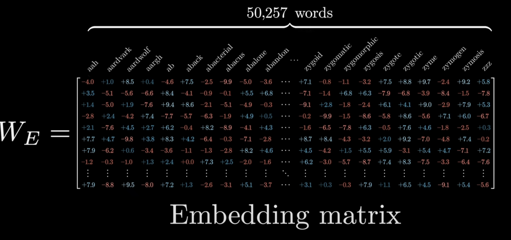

1. **潜空间的语义特性**
在潜空间中，词向量的几何关系反映了token之间的语义关联。例如，语义相近的token在潜空间中的距离较近，而语义无关的token则距离较远。这种特性使得词嵌入能够有效捕捉语义信息，为自然语言处理任务提供有力支持。

## 4.2 词嵌入的本质与意义
1. **空间变换的体现**
	词嵌入本质上是一种**空间变换**，通过矩阵乘法将高维的独热向量映射到低维的潜空间中。这种变换降低了数据的维度，降低了稀疏程度，捕捉了语义信息。
2. **嵌入矩阵的作用**
	嵌入矩阵是实现词嵌入的核心工具。它定义了从高维到低维的映射规则，并通过训练过程不断优化，使得生成的词向量能够更好地反映语义信息。
3. **词嵌入的泛化**
	虽然词嵌入在自然语言处理领域主要针对单词或token，但其思想可以推广到其他类型的数据。例如，在推荐系统中，用户和物品的ID也可以通过类似的方式嵌入到潜空间中，从而捕捉用户偏好和物品特性。

## 4.3 再看潜空间
**基于Embedding后让我们再回到潜空间这个概念。潜空间（Latent Space）是一个剥离了符号、发音等表面形式差异的非常纯粹语义空间**。它通过将语言中的token（如单词或子词）映射为多维向量，捕捉了语义的本质特征。这种表示方式为跨语言翻译等任务提供了极大的可能性，因为不同语言中的相似语义可以在潜空间中找到对应的向量表示。我认为潜空间的核心特性有以下两点
1. **纯粹语义的体现**
	潜空间中的向量不再受限于具体的语言形式（如拼写、发音等），而是专注于语义本身。例如，英语的“cat”和法语的“chat”虽然在形式上不同，但在潜空间中可能被映射到相近的向量位置，因为它们都表示“猫”这一语义。
2. **多维向量的语义解释**
	当一个token被嵌入到潜空间中时，它被表示为一个多维向量。这个向量的每个维度都代表了语义的一个独立方面。例如：
	- 第一个维度可能表示“生物类别”（如动物、植物等）；
	- 第二个维度可能表示“硬度倾向”（如很软、很硬等）；
	- 第三个维度可能表示“具体程度”（如抽象、具体等）。

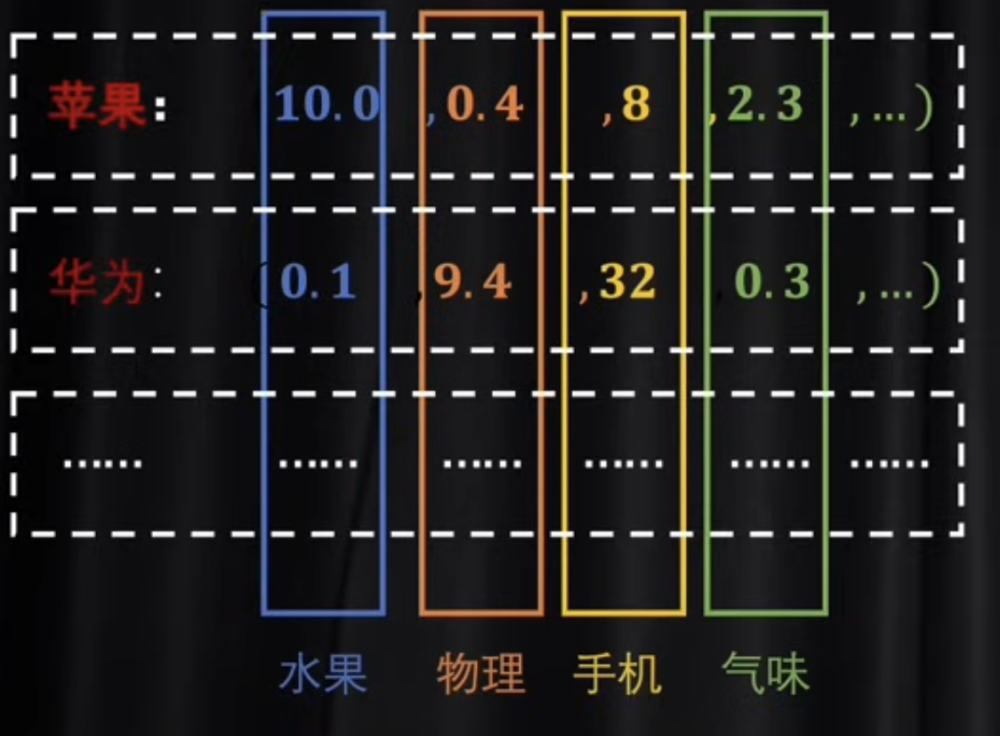

## 4.4 Word2Vec
我们整个第四章节都离不开一个概念——嵌入矩阵。然而这个矩阵中的参数是怎么来的呢？这不得不聊聊Word2Vec 。

Word2Vec 是一种经典的词嵌入模型，其核心目标并非直接输出模型的预测结果，而是通过训练过程得到一个 嵌入矩阵（Embedding Matrix）。这个嵌入矩阵定义了如何将高维的离散token（如单词或子词）映射到低维的潜空间中。换句话说，Word2Vec 的最终目标是学习一种将token投射到语义空间的方法，而非仅仅完成某个具体的任务。说句人话，Word2Vec就是在尝试寻找“编词典”的方法

Word2Vec 提供了一种对语义的最初理解。它通过训练过程，使得语义相近的token在潜空间中的向量距离较近，而语义无关的token则距离较远。这种特性使得嵌入矩阵可以看作是一种“语义词典”，它能够用其他词来解释目标词。

在Word2Vec 的潜空间中，词向量对应的语义是一种客观的表达，它与整个语言环境绑定在一起，而不依赖于作者的主观意图。例如，词向量“猫”和“狗”在潜空间中的距离反映了它们在语言环境中的语义相似性，这种关系是客观存在的。作者的主观性体现在词汇的选择和组合方式上。当作者根据自己的意图将不同的词按照特定的顺序组合在一起时，这种组合方式才具有主观性。例如，两个作者可能使用相同的词，但通过不同的顺序和组合表达出不同的含义。

然而 Word2Vec还是有不少局限性：
1. **单个词的语义捕捉**
Word2Vec 主要针对单个词的语义进行建模，它训练得到的嵌入矩阵只能捕捉token之间的静态语义关系。对于由多个词组成的句子或文本，Word2Vec 无法直接捕捉其整体语义。 

1. **无法处理上下文动态性**
Word2Vec 生成的词向量是静态的，即同一个词在不同上下文中具有相同的向量表示。这种特性限制了其在处理多义词或上下文依赖的语义任务中的表现。 

1. **句子语义的不足 **
如果希望将多个词组合成具有准确含义的句子，仅靠Word2Vec 这种简单的模型是不够的。需要更复杂的模型（如RNN、Transformer等）来捕捉句子级别的语义信息。

这是标准的word2vec的方法。这种方法重点就是训练出一本词典，也就是说这里训练出来的嵌入矩阵W只是针对单个词语义去进行的。如果想把一个一个的词组成有准确含义的一句话，那靠这种简单的模型就不够了。而这就要引入我们再下一篇文章中讲到的注意力机制（Attention）。

# 5. 自注意力 Self-Attention 🌟
这是这篇文章最为关键的章节：Transformer架构的核心——注意力机制（Attention Mechanism）。也正是这一机制使得Transformer能够处理序列数据并理解词与词之间的复杂关系，用人话说，AI**对词和词组合后的语义进行理解，靠的就是注意力机制。**

## 5.1 从客观语义到主观语境：为什么需要注意力机制？
在进入技术细节前，让我们思考一个基本问题：为什么我们需要注意力机制？在前文，我们讨论过的词嵌入（Word Embedding）和Word2Vec已经解决了单个词或token的客观语义表示问题。每个词被转换成一个高维向量，这个向量包含了该词在"词典"中的基本含义。
然而，人类语言远比单个词的简单叠加要复杂得多。相同的词在不同上下文中可能表达完全不同的意思。考虑以下例子：

- "这位美女你好，请问可以加一下微信" - 这里的"美女"很可能真的在描述一个外表漂亮的人

- "美女麻烦请你让一让" - 这里的"美女"可能只是一个礼貌的称呼，与外表无关

- "我需要一份火辣的食物" vs "她有着火辣的性格" - "火辣"在不同语境下表达完全不同的特质


词嵌入无法捕捉这种上下文带来的语义变化。每个词的嵌入向量是固定的，不会因为周围的词而改变。但在实际语言中，词的含义总是受到上下文的调整和修饰。这正是注意力机制要解决的核心问题：**如何让模型理解词与词之间的关联，从而掌握上下文对语义的动态调整和修改**。它使模型能够超越词典中的客观定义，理解语言的在不同场景中的主观表达。举例来说，你正在阅读一本复杂的小说。当你遇到一个模糊的代词（如"它"、"他们"）时，你会自然地回顾前文，寻找这个代词可能指代的对象。你的注意力会在文本中来回跳跃，建立词与词之间的连接。这正是注意力机制试图模拟的过程。从本质来说，注意力机制的是在尝试回答这个问题：

> **当我处理一个词时，我应该"注意"句子中的哪些其他词来正确理解它的含义？**

在传统的序列模型（如RNN、LSTM）中，信息是按顺序线性传递的。这就像你被迫从头到尾一个字一个字地读书，不允许翻回前面的页面查看信息。这使得捕捉长距离依赖关系变得困难。而注意力机制则完全不同——它允许模型直接"查看"句子中的任何位置，无论距离多远。这就像你可以在阅读时自由地在书的各个章节间跳转，随时回顾和关联不同部分的信息。

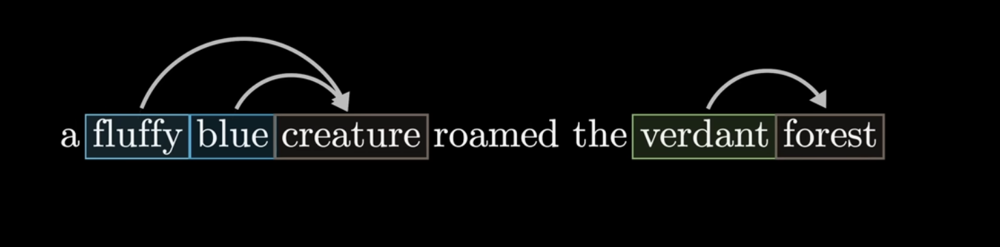

## 5.2 注意力机制的数学表达
当然，如果这篇文章仅仅停留在对注意力机制的比喻理解，那永远无法真正了解注意力机制的神奇之处。因此，请容许我在接下从数学角度理解。
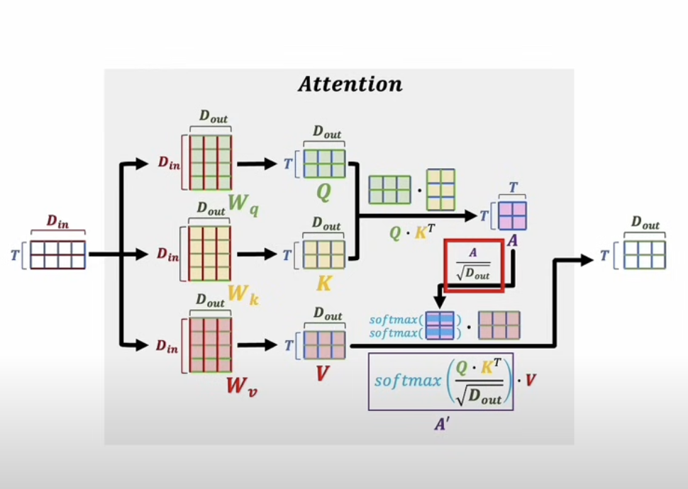

假设我们有一个输入序列，已经通过词嵌入转换为一个矩阵X。其中每一行代表一个词的向量表示。自注意力机制的计算过程如下：
1. **线性投影**：首先，我们通过三个不同的权重矩阵将输入矩阵X转换为三个不同的矩阵：

$$
Q (Query) = X × W_Q
$$
$$
K (Key) = X × W_K
$$
$$
V (Value) = X × W_V
$$

1. **注意力分数计算**：然后，我们计算Q和$`K^T`$(K矩阵的转置)之间的点积，得到注**意力分数矩阵A：**
	$`注意力分数矩阵 = Q × K^T`$
	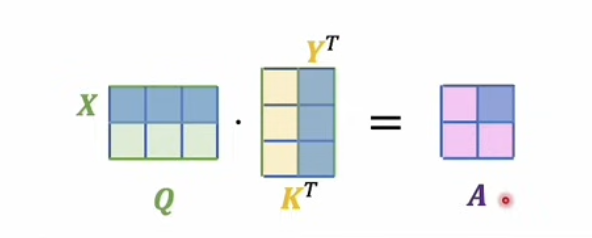
	
2. **缩放（Scaled）**：为了稳定训练，我们将注意力分数矩阵A除以一个缩放因子，后文会提为什么要缩放（通常是$`√d_k，其中d_k是Key向量的维度`$）：
	$`缩放后的分数 =`$ $`Q × K^T / √d_k`$

1. **Softmax归一化**：接着，我们对缩放后的分数应用Softmax函数（每一个词向量的项相加后=1，得到概率分布），是为**注意力权重矩阵A‘**：
	-  $`注意力权重矩阵A‘ =Softmax(Q × K^T / √d_k)`$
	
2. **加权聚合**：最后，我们使用这些权重对Value矩阵进行加权求和：
	- 输出 = 注意力权重矩阵A‘ × V
		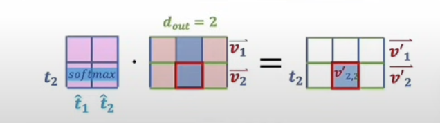
这个过程的数学表达式可以优雅地写为：
$`Attention(Q, K, V) = Softmax(QK^T / √d_k) × V`$

现在我们从数学角度，剖析了QKV机制的机理。接下来，我们在将会回到语义处理，尝试探讨QKV机制的更深层的含义

## 5.3 注意力机制数学背后的深层含义
上面的数学公式看似抽象，但它们背后蕴含着深刻的语言处理逻辑。让我们详细解析QKV（Query, Key, Value）的真正含义：
### Query (Q)：主动寻找关联的工具
Q代表当前处理的词在积极寻找与自己相关的其他词。它就像一个带着问题："在这个序列中，哪些词与我有关联，可以帮助我更好地表达我的含义？"
在信息检索中，Q相当于用户输入的查询词，它主动寻找与之匹配的内容。
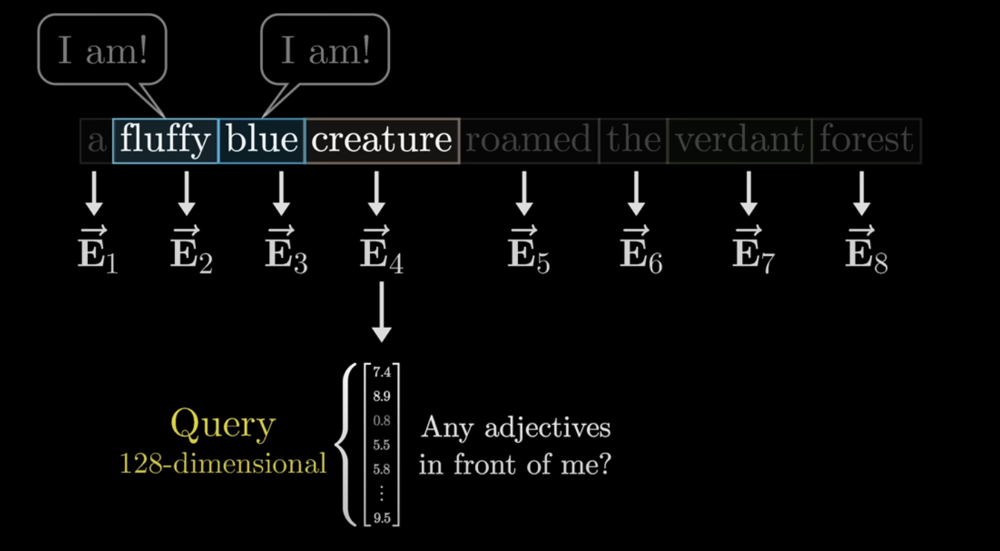

### Key (K)：语义的索引与关联
K可以视为语义的"索引"或"标签"，它帮助模型判断不同词之间的相关性。每个词通过自己的K向量向外界"广播"自己的存在和特征，说明"我是谁"，以及"我可能与哪些词有关"。
在信息检索类比中，K就像是文档的关键词或标签，帮助系统判断这个文档与特定查询的相关程度。
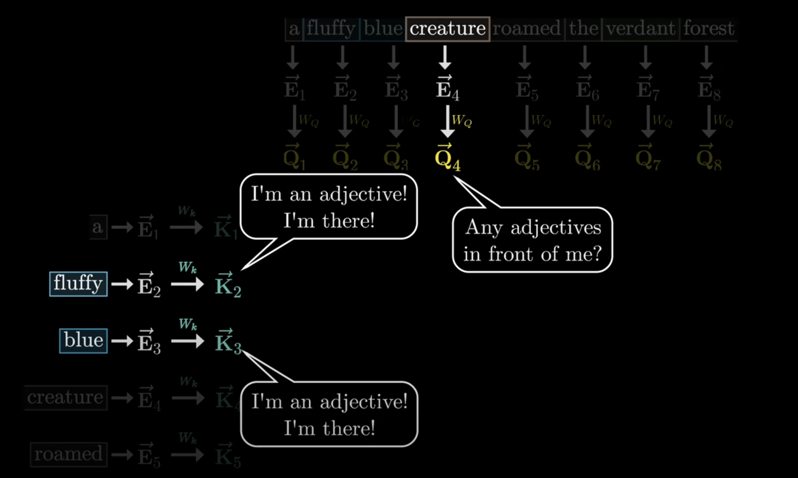

### Value (V)：原始信息的载体
V可以理解为词汇的原始语义信息，，是我们真正想要提取和重组的内容。这就像是词典中查到的客观语义——它包含了我们需要的基础语义，但也仅仅是基础语义，还需要根据上下文进行调整。
从信息检索的角度，V就像是文档的实际内容。当我们查询"苹果"时，V包含了关于"苹果"的所有信息，无论是水果还是科技公司。

### $`Q·K^T`$：构建上下文关联的注意力分数
所以当我们计算Q和K\^T的矩阵乘法时，我们实际上在做什么？

这个操作可以被理解为计算每个位置的词（通过其Query）与所有其他位置的词（通过它们的Key）之间的相关关系。结果是一个大小为序列长度×序列长度的矩阵，其中每个元素(i,j)表示位置i的词与位置j的词之间的关联强度。

从线性代数的角度看，$`Q·K^T`$计算的是向量之间的内积（Dot Product），而内积本质上衡量的是两个向量之间的相似度和方向一致性。如果两个向量的方向相近（即相似度高），它们的内积会较大；如果方向相反，内积可能为负；如果垂直，内积为零。

因此，$`Q·K^T`$这一步构建了注意力分数A，形成了一张完整的"关联图谱"（如下），每个数字揭示了序列中每个词与其他所有词的关系强度。
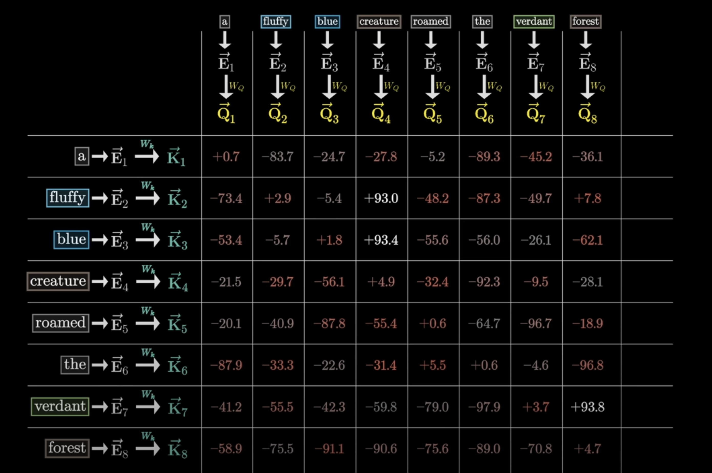

### $`Softmax(Q·K^T / √d_k)`$：注意力权重
将$`Q·K^T`$得到的注意力分数A通过softmax函数进行处理，我们得到了真正的**注意力权重A’**。Softmax确保了每个位置对所有其他位置的注意力权重之和为1（正所谓归一化），本质上是将关联强度转换为概率分布。

我们注意到$`Q·K^T`$除以 $`√d_k`$ 这一步骤，这被称为"缩放点积注意力"（Scaled Dot-Product Attention）。为什么需要这一步？这与softmax函数的性质有关。当输入值很大时，softmax函数会产生极端的概率分布，几乎所有权重都集中在一个位置上，其他位置接近于零。这被称为"梯度消失"问题，会使得模型难以训练。通过除以$`√d_k`$，我们可以控制点积的方差，使其保持在合理范围内，保持梯度的有效传播。

因此，通过将注意力分数高注意力权重意味着两个词之间有强关联，低权重则表示关联较弱。

### $`A' × V`$：上下文语义的动态校准和动态重塑
最后一步，用注意力权重A'去乘以V，完成了从固定语义到上下文相关语义（客观语义——主观语义）的转换。

这个过程可以理解为：
1. **V其实就是在表示从词典里查出来的token的客观语义**
2. **A‘就相当于是这段话因为上下文关联而产生的修改系数。**
3. A' × V 得到的是经过上下文调整和加权聚合后的基于上下文的主观语义

回到我们本章节最开头的例子，当模型处理"美女麻烦让一让"中的"美女"时：
- V包含了"美女"的原始含义（漂亮的女性）
- 通过注意力计算，模型发现"麻烦"、"让一让"等词与"美女"有强关联
- 这些关联通过A'反映出来，调整了对"美女"一词的理解
- 最终，模型得到的"美女"表示更接近"被礼貌称呼的对象"，而非单纯的"外表描述"

**因此，相较于“美女能不能加个微信”，“美女麻烦让一让”中的美女“美”的程度就要下降了**

让我们在整体过一遍以上的流程，Q和K的揭示了一组词向量之间的内在关联模式（得到了这一组词向量自己和自己之间的相互关系）这种关联随后被用来精确调整每个词向量的表示。当两个词在语义空间中的距离越近，它们之间的关联值就越大，相互影响也就越显著。
通过这种计算机制，我们可以观察到：与原始词向量V相比，经过注意力机制调整后的词向量呈现出明显的上下文敏感性。换言之，这些词向量不再仅仅包含词典中的静态、客观语义，而是根据它们所处的具体「**上下文**」进行了动态校准和语义重塑。

相同的词汇在不同人的表述中能够承载截然不同的含义和情感色彩，这是人类语言如此灵活多变、富有表现力的根本原因。而注意力机制这种上下文驱动的语义调整机制，赋予了文本序列丰富的表达层次和语义深度，使得即使使用相同的词汇，不同的组合方式也能传达截然不同的意义和主观表达。这种机制优雅地模拟了人类语言理解中的上下文依赖性，是Transformer架构在NLP任务取得突破性成功的关键。

# 6. 位置编码 Positional Encoding
Transformer的自注意力机制有一个根本性的局限：**它本质上是"位置无关"的**。
什么意思呢？我们回顾一下自注意力的计算过程：每个词通过Query和Key的交互来确定与其他词的关联强度，然后基于这些关联对Value进行加权聚合。这个过程本身并不包含任何位置信息——如果我们打乱句子中词的顺序，自注意力的计算结果可能完全相同。

然而，在自然语言中，词序对语义至关重要，举例而言：
- "猫追狗"和"狗追猫"包含相同的词，但表达完全不同的意思
- "我不喜欢这部电影"和"我喜欢这部电影不"尽管词几乎相同，但语义相反
- "小明在河边钓鱼"和"鱼在河边钓小明"——位置调换会导致滑稽的误解

因此，为了让Transformer能够感知序列中词的位置，我们需要显式地引入位置信息。这就是位置编码的作用。在Transformer论文中中，作者使用了正弦和余弦函数的组合：
$$
PE(pos, 2i) = sin(pos / 10000^(2i/d_model))

$$
$$
PE(pos, 2i+1) = cos(pos / 10000^(2i/d_model))
$$
其中：
- pos：词在序列中的位置（0, 1, 2, ...）
- i：向量维度的索引
- d_model：模型的隐藏维度大小

这种设计有几个重要特性。首先，每个位置都有唯一的编码，而编码间的差值可以表示相对位置。
这会为每个位置生成一个与词嵌入维度相同的向量，然后简单地将其与词嵌入相加：

$`输入表示 = 词嵌入 + 位置编码`$

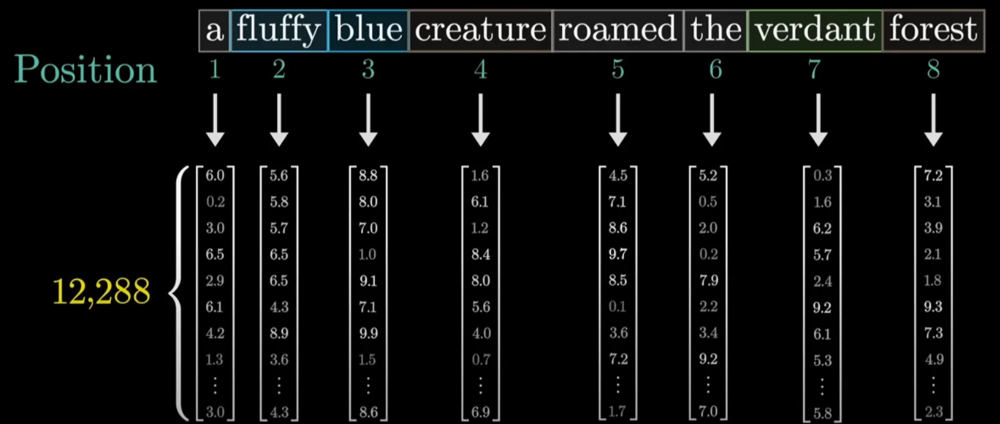

# 7. 多头注意力机制 Multi-Head Attention 🌟
多头注意力（Multi-head Attention）是Transformer论文中另一大突破，这种架构允许模型同时关注（attend to）来自不同表示子空间的信息。相较于单一层的Attention，多头注意力机制极大地增强了模型捕捉复杂语言模式的能力。
## 7.1 多头注意力的工作原理
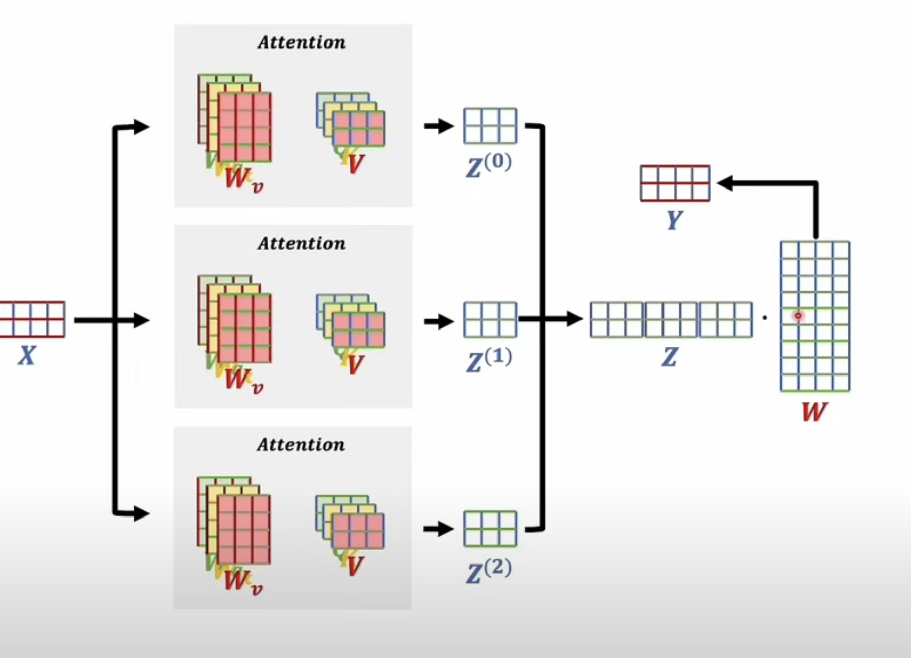
如图所示，多头注意力的实现可以理解为"并行的多个注意力计算"：
1. **输入分发**：将相同的输入矩阵X并行地送入多个注意力计算单元
2. **独立参数**：每个"头"都有自己独立的参数矩阵$`W_v`$（也就是上文说的注意力分配权重A‘）
3. **并行计算**：每个头独立地计算自己的注意力结果，得到$`Z^0, Z^1, Z^2`$等输出
4. **结果拼接**：将所有头的输出在特征维度上拼接（concate）成一个更大的矩阵Z
5. **统一投影**：最后通过一个共享的线性变换矩阵W将拼接后的结果投影到所需维度，得到最终输出Y
在图中的例子中，我们看到一个3头注意力系统，每个头都执行完整的注意力计算，但使用不同的参数集。
## 7.2 为什么分头计算比单一计算更有效？
这是一个很自然的疑问：为什么要分成多个头计算，而不是直接用一个更大的注意力机制？关键原因包括以下两点：

**1. 多维度的特征提取**
每个注意力头可以专注于捕捉不同类型的模式和关系。例如，在分析句子时：
1. 一个头可能专注于捕捉主谓关系
2.  另一个头可能关注时态信息
3. 第三个头可能注重情感表达
这种"分工"使模型能够同时关注输入的多个方面，就像我们阅读文本时会同时注意语法、语义和上下文一样。

**2. 表示空间的多样性**
从数学角度看，多头注意力相当于在不同的子空间中进行特征学习。这允许模型以不同的"视角"来表示同一信息，从而捕捉更丰富的特征。如果使用单一更大的注意力机制，所有特征都必须竞争同一表示空间，可能导致某些微妙但重要的模式被主导性特征掩盖。

## 7.3 论文中的具体实现细节
虽然图中简化了表示，让我们回到Transformer这篇论文，完整的多头注意力实际上包括Q、K、V三个投影：
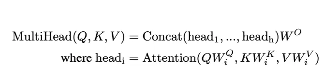

每个头有三个投影矩阵（$`W_i^Q、W_i^K、W_i^V`$），将输入投影到较低维度的子空间，然后计算注意力，最后所有头的输出通过$`W^O`$合并。

论文中，作者使用了8个注意力头（Attention head），但不同变体可能使用不同数量。头的数量是一个重要的超参数：
- 头太少：限制了模型捕捉多种模式的能力
- 头太多：增加计算成本，可能导致每个头的维度太小而难以学习有用特征

多头注意力通过并行计算多个独立的注意力机制，然后合并结果，使Transformer能够同时捕捉序列中的多种关系模式。这种"多视角"处理方式是Transformer在复杂语言理解任务中表现优异的关键因素之一。

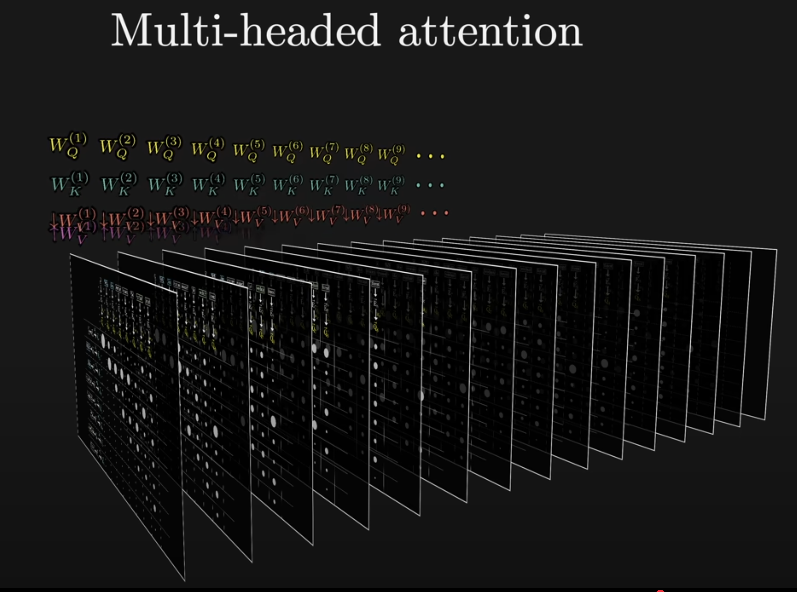

# 8. 掩码 Masking
掩码（Masking）是Transformer架构中一个不太引人注目但极为重要的技术组件。本文不会进行深度拆解。
## 8.1 为什么我们需要掩码？
在Transformer的解码器中，使用掩码的根本原因与自回归生成的本质有关。自回归生成指的是模型一次只生成一个词，然后将已生成的词用作下一步生成的条件。这带来一个关键约束：**当预测第t个位置的词时，模型只能看到位置0到t-1的信息，而不能"偷看"未来的位置**。然而，标准的自注意力机制会让每个位置都能关注到序列中的所有其他位置，包括"未来"的位置。这在训练阶段会导致信息泄露问题——模型可以作弊，直接从未来位置获取信息，而不是真正学会预测。
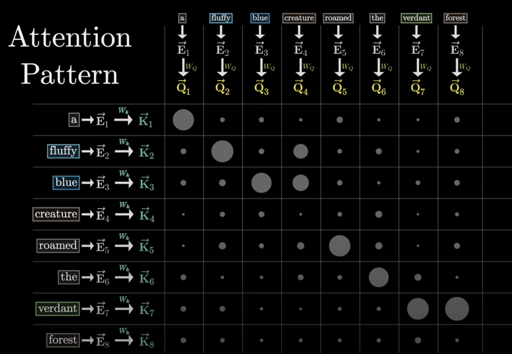

## 8.2 掩码注意力的实现
掩码注意力通过修改注意力分数矩阵A来实现这一约束。具体方法是：
1. 在计算注意力分数矩阵($`Q·K^T`$)后，但在应用softmax之前
2. 对于每个位置i，将所有j\>i的位置（即"未来"位置）的分数替换为负无穷大（$`-∞`$）
3. 当应用softmax函数时，这些负无穷大的值会变成0
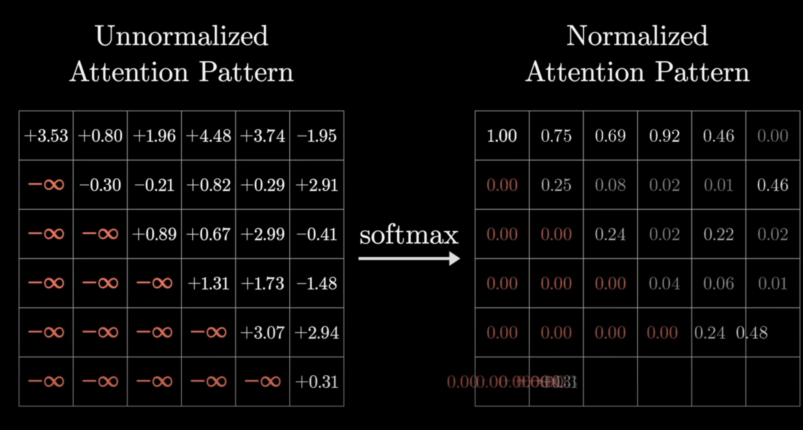

# 9. 训练与推理 Training & Inferencing
## 9.1 Transformer 训练
在深入理解了注意力机制的核心原理后，我们最后需要探讨Transformer模型如何进行实际的训练和推理（生成）。这两个过程虽然基于相同的架构，但运行方式却截然不同。
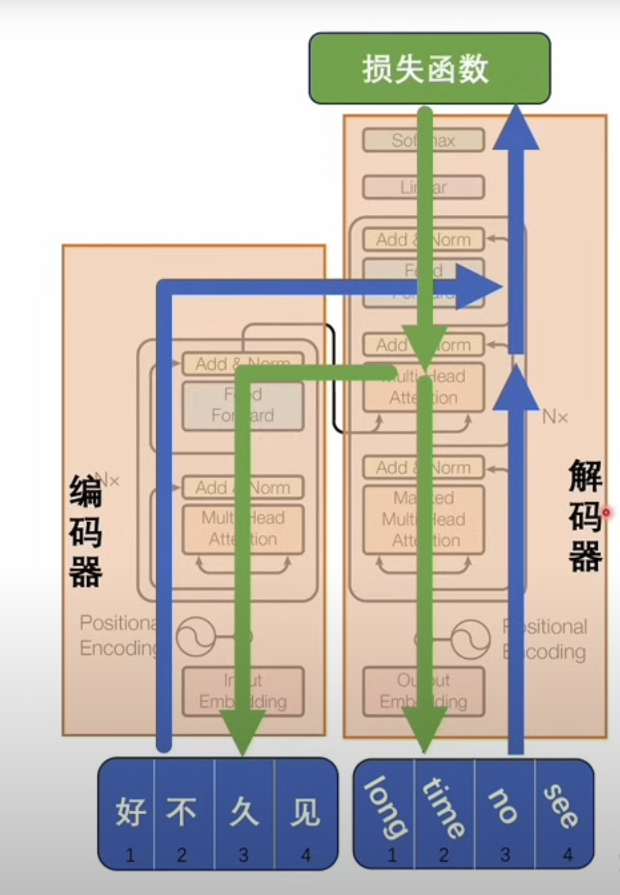
Transformer在训练阶段，编码器和解码器是同时参与工作的。以中英文翻译为例，假设我们想让模型学会将"好久不见"翻译成"long time no see"：
1. **并行输入**：我们将中文句子"好久不见"输入到编码器，同时将英文句子"long time no see"输入到解码器。
2. **信息流动**：信息在编码器和解码器内部分别向上流动，通过多层自注意力机制和前馈神经网络进行处理。关键是，编码器的输出会通过交叉注意力（Cross-Attention）机制与解码器进行信息交互。（蓝色向上箭头）
3. **交叉注意力匹配**：交叉注意力机制允许解码器"查询"编码器的输出，学习两种语言之间的对应关系。例如，"好久"可能对应于"long time"，而"不见"对应于"no see"。
4. **损失计算与反向传播**：最终，模型会在解码器顶部输出预测结果，并与真实的目标句子比较，计算损失函数。这个损失值衡量了模型输出与目标之间的差异，然后通过反向传播调整整个网络的参数。（绿色向下箭头）
训练的核心目标是让编码器和解码器在潜空间中建立一种语义对齐——即中文"好久不见"和英文"long time no see"虽然在词汇和语法上完全不同，但在潜空间的表示应当尽可能接近，因为它们表达了相同的含义。

## 9.2 Transformer的生成（推理）过程
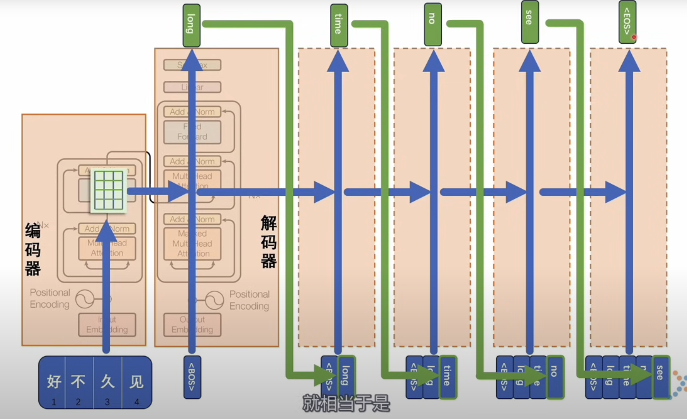
训练完成后，在实际应用中，我们面临一个根本性的挑战：序列到序列（Sequence-to-Sequence）的转换。不同语言之间的表达往往长度不一，中文的四个字"好久不见"被翻译成英文的四个词"long time no see"仅仅是个例，大部分的情况是我们中文的所表达的语义，你要翻译成英文，那个token个数就不一定了。这与模型的并行处理特性似乎存在矛盾——如果输入和输出长度不同，我们如何进行转换？
Transformer通过引入自回归（Autoregressive）生成机制解决了这个问题：
1. **编码器处理**：首先，将完整的源句子（如"好久不见"）输入编码器，得到其潜空间表示。
2. **解码器起步**：解码器不是一次性生成完整的目标句子，而是从一个特殊的起始符号（通常表示为\<START\>或\<BOS\>）开始。
3. **自回归生成**：解码器接收起始符号，通过交叉注意力访问编码器的表示，预测第一个词。假设预测出"long"，则将\<START\>和"long"一起作为新的输入。再次通过模型预测下一个词"time"。将\<START\>、"long"和"time"作为输入预测"no"。以此类推，直到生成特殊的结束符号\<END\>或\<EOS\>
通过这种逐步生成的方式，Transformer能够生成任意长度的输出序列，有效解决了序列到序列转换的长度不匹配问题。

## 9.3 解码器的双重角色
就像上述所示，解码器并不像字面意思那样仅仅"解码"。事实上，它同时具备编码和解码的功能：
1. **编码功能**：解码器会先将输入的目标语言token（训练时）或已生成的token（推理时）编码为潜空间表示
2. **解码功能**：通过交叉注意力与编码器的表示进行比对和融合，再生成下一个token
这也解释了为什么某些大型语言模型（如GPT系列）可以只使用解码器架构（Decoder-Only）。它们不是靠魔法凭空生成内容，而是通过一种巧妙的方式：将用户输入视为已经生成的内容的一部分，然后模型只需要继续生成后续内容。

## 9.4 单解码器(decoder only)模型的工作原理
GPT等只有解码器的模型是如何工作的？它们如何在没有编码器的情况下完成翻译等任务？
关键在于这些模型将所有可能的输入（不同语言的token）都放入同一个大词表中进行训练。当模型足够大，训练数据足够丰富时，它能够在同一个向量空间中表示不同语言，并学习它们之间的转换关系。例如，当你输入"翻译成英文：好久不见"时，模型理解这是一个翻译任务，并能够生成对应的英文表达。这不是因为有单独的编码器-解码器结构，而是因为模型在预训练过程中已经学习了语言间的转换关系。当没有明确指令时，模型会根据训练时学到的模式来决定执行什么操作（续写、摘要、翻译等）。这就是为什么有时候需要明确的提示词（Prompt）来引导模型完成特定任务。

# 10. 结语 End
语言，这个人类智慧的载体，通过Transformer得到了一种全新的数学化理解方式。我们看到了如何将离散的符号转化为连续的向量，如何将这些向量投射到高维空间，以及如何通过自注意力机制捕捉词语之间复杂的关系网络。这一切都依赖于矩阵运算后的空间变换。在此，矩阵不再只是线性代数课本中的抽象概念，而是成为了连接人类语言与机器理解的桥梁。通过嵌入矩阵，我们构建了一个语义丰富的潜空间；通过注意力矩阵，我们让模型能够将注意力集中在最相关的信息上；通过层层变换，我们让模型能够从表面文字中提炼出深层意义。

本文中最精华的部分莫过于从Word2Vec到Transformer，我们也从此窥探了一个有趣的演进：从静态的、上下文无关的词表示，到动态的、上下文敏感的语义理解。这一演进同时也揭示了一个深刻的洞见：语言的意义不仅存在于单词本身，更存在于单词之间的上下文关系网络中。Transformer通过自注意力机制精确地捕捉了这一网络，使机器首次能够接近人类级别的语言理解和生成能力。

最后，让我们回到最为根本的问题：

> 计算机如何理解意义？

当我们将文字转化为向量，将向量投射到潜空间，当自注意力在这个空间中建立连接时，我们是否正在接近对"理解"本质的把握？

Transformer的成功或许给了我们一个启示：理解可能就是在合适的表示空间中，建立起合适的关联。当足够多的文本通过这个架构被处理时，一种接近人类认知的模式似乎在高维空间中自然涌现.
然而，我们仍需保持清醒：尽管今天的大型语言模型表现出惊人的能力，但它们的"理解"与人类的理解仍有本质区别。它们没有意识，没有目的，没有真正的主观体验。它们的"智能"更像是一种复杂的统计模式匹配，建立在海量数据和精巧算法之上。**然而，我们却无法证明我们人类引以为傲的智能是否与前者有根本性的区别……**

# 参考
```json
https://www.youtube.com/watch?v=eMlx5fFNoYc

https://www.youtube.com/watch?v=GGLr-TtKguA&t=2552s
```
