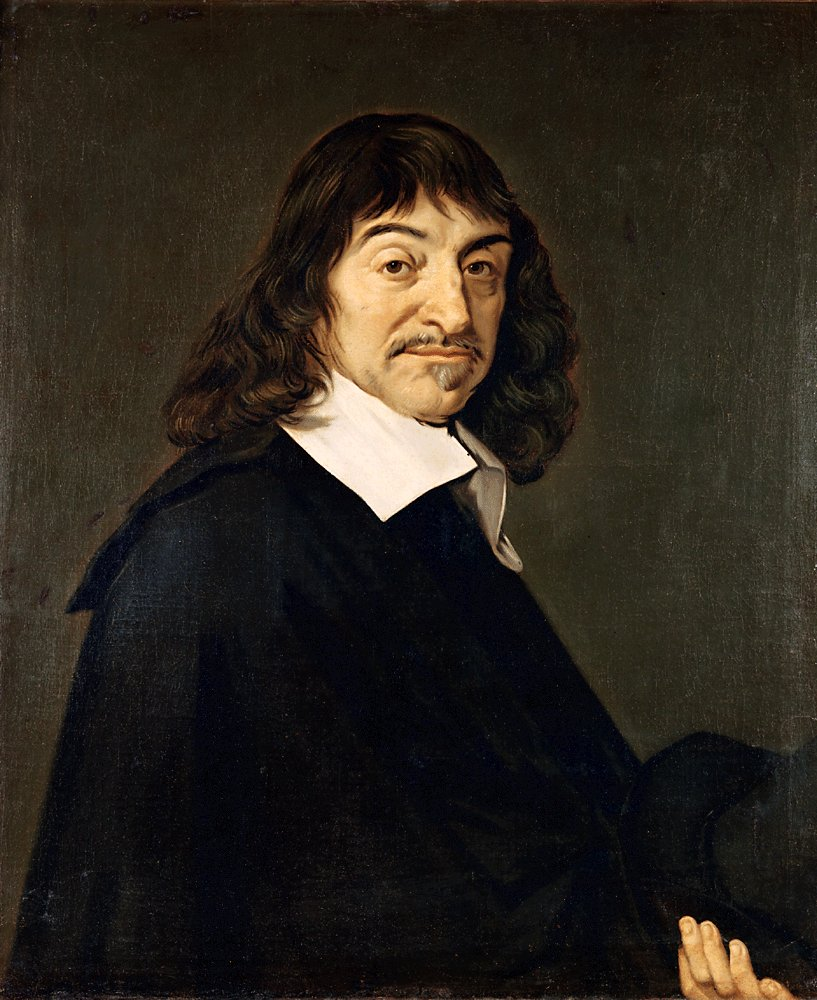
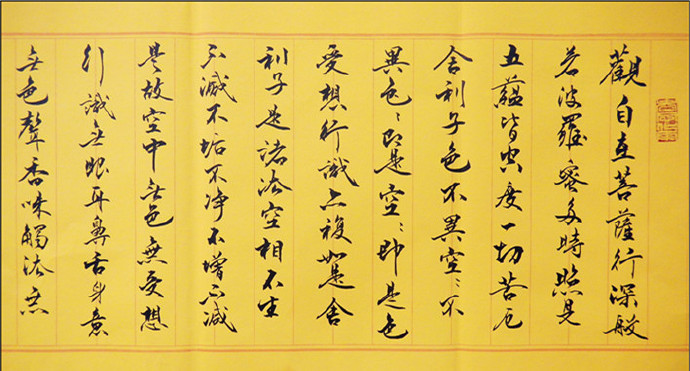
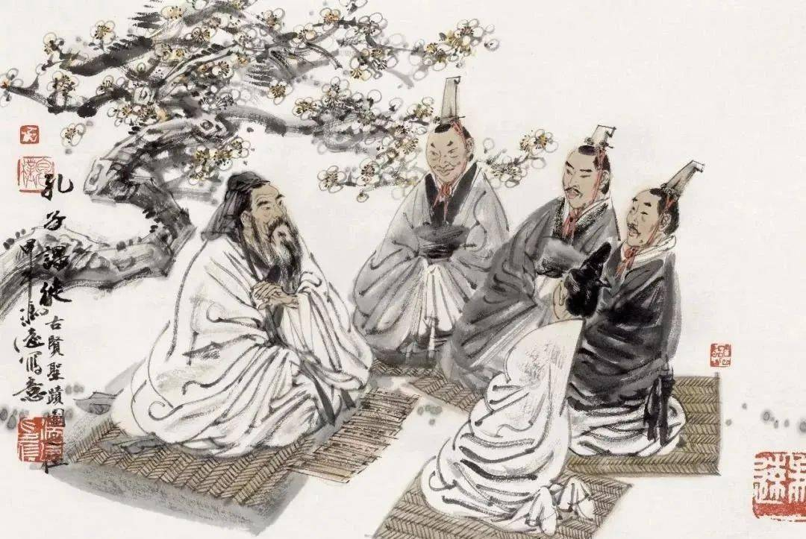

# “我” 與 “他”

# 西方哲學
## 意識與主體性 consciousness and subjectivity
西方哲學對與該問題有很多的解答。 首先，“我是怎麼知道我是我的”，我們可以先聊聊看自我意識。自我意識是指個體對自己存在的認識和理解。 

哲學家約翰·洛克在其身份理論中提出了“意識連續性”（consciousness continuity）的觀點，認為個體之所以能認出“我是我”，是因為意識中連續不斷的自我體驗和記憶。換句話說，通過連續的意識體驗，我們認識到自己就是那個在不同時間點上擁有相同思想和記憶的人對於“我怎麼知道他是他”，這涉及到他者認知和主體間性（intersubjectivity）。 愛曼努爾·萊維納斯探討了他者的認識，強調了對於通過與他者的關係我們才能認識到他者的存在。 我們通過觀察他人的行為、表情和通過交流來理解他人與我們自己的不同。當然探討主體間性則不可避免地討論到主體性的概念，即每個人都是一個獨立的意識主體。 從笛卡爾的“我思故我在”（Cogito， ergo sum）便是自我意識存在性證明的經典例子（雖然我用了一個學期在罵他不可靠）。 我們通過懷疑和意識到自我思想的獨立性來區別自我與他者。

# 佛家
## 無我 Anatta
佛教對於該問題的看法與西方哲學中的自我意識、主體性以及他者認識的探討有着本質的不同。 **佛教的核心教義之一是“無我”（Anatta），指出一切存在的事物都沒有永恆不變的自我。** “無我”挑戰了固有的“我”或“自我”概念，認為對於“我”的執著是痛苦的根源（心經）。

 佛教認為，人們常常錯誤地將身體、感受、認知、行為形成的構成和意識等作為一個固定不變的“我”。 然而，這些都是不斷變化的，沒有任何獨立存在的自我實體。 通過禪修和覺察，佛教徒逐漸領悟到這種無我的真理，從而超越對自我的執著，達到涅槃，即痛苦的終結。 在“無我”的視角下，問題“我怎麼知道他是他，我怎麼知道他不是我”被重新理解。 佛教通過緣起法（因緣生）來解釋事物的存在，認為一切事物都是相互依存、相互影響的。 在這個框架下，自我與他者不是固定的實體，而是因緣和條件相聚的暫時現象。 這種理解促使人們超越固有的自我與他者的區分，看到眾生之間的本質聯繫。

# 儒家
## 仁 Ren
儒家對於自我與他者的認識，以及個體如何識別自我與他者的問題，提供了一套不同於佛教的視角。 儒家哲學強調的是人與人之間的關係、角色和道德責任，而非探討自我意識或自我與他者之間的本質區別。 在儒家思想中，個體的身份、責任和價值在很大程度上是通過其在家庭和社會中所扮演的角色來定義的。

儒家哲學中的核心概念之一是“仁”，意指對他人的深切關愛。 孔子認為，通過修身、齊家、治國、平天下的過程，個體應當在社會中扮演好各自的角色，如孝順的子女、負責的父母、誠信的朋友等。 在這種框架下，**“我是怎麼知道我是我的”這個問題被轉化為個體如何在不同的社會關係中實踐仁愛和道德德行。** 

儒家思想中還強調了「五倫」：君臣、父子、夫妻、兄弟、朋友。 每一種關係都有其相應的道德規範和行為準則。 在這樣的體系下，個體識別自我與他者的方式主要是通過瞭解和履行這些角色關係中的道德責任。

** 這意味著，個體的自我認識和他者認識是通過其在這些關係中的行為和責任來實現的。** 在儒家思想中，自我與他者的關係是相互聯繫和相互依賴的，強調的是通過個體與社會的和諧來實現個人的道德完善。 這種觀點並不直接回答“我怎麼知道他不是我”的問題，而是通過教導個體在社會中尋找自己的位置，通過與他人的和諧相處來達到自我實現和道德提升。

# 我的思考
綜上，可見不同思想體系對於這個問題的解答皆有不同的抓手。 西方哲學傾向於從理性或個體經驗出發，探討自我與他者的區分及其認識基礎。 在佛教中，通過無我的視角，看待自我與他者的區分為相對而非絕對，強調一切事物的相互依存性。 儒家側重於社會角色和倫理道德，看待自我與他者之間的關係是通過個體在社會中的角色和道德實踐來界定的。** 每一種思想對這一問題的答案本身並無對錯，但是有意思的是這也是日後不同文明之間在不同思想體系的指導下逐漸趨異演化，並凝結為各種意識形態的方式呈現出來。**

 因此，在我看來意識形態這個東西本身很沒有意義，本身僅僅只是為了區分我者與他者的一種共識的凝聚，但是現在諷刺的是往往人民對於這種意識的來源並非基於完善的思考而是被通過操縱從眾心態被進行強行的植入，但是古往今來這也並非罕事。 

《左傳》中“非我族類，其心必異” 實際上反映了古代社會對“他者”認知的一種原始形態，是對內群體和外群體之間天然差異的一種認識。 一個簡單的二分邊給予人民分辨我他的標準，更可以進一步延伸為善惡的標準。 不能發現，直至今日，我們的社會中還是充斥著這種簡單的我他二分法，無產階級-有產階級; 資本主義-社會主義...... 這種對立在歷史和現代社會中常常被用來動員群眾、強化集體認同，有時卻忽視了複雜的個體經驗和跨越這些界限的可能性……
