# 理性的七重奏：七位思想巨匠解读现代世界

# **引言 Intro**
2022年7月27日，那是一个酷热的暑假，夜晚散不去的热气浸淫着黏腻的汗水。那一年，我刚结束了大一，对整个世界抱着无限的遐想。但同时，我发现自己在清华大学里却十分挣扎，仿佛一直掉入水里的蚂蚱，使出浑身解数直至精疲力竭却依旧在同样的地方打转，我心中有很多的疑问，我是谁？我为什么在这里？世界为什么是这个样子？未来又将把我和世界带向何方？……直到那天，我读完了《刘擎：西方现代思想讲义》，当我合上书本的那一刻，我感觉眼前的世界已悄然改变，很多对于人生、对于社会的大问题已经悄然获得了来自世界上最有智慧的一群思想者的指点逐渐有了轮廓。读完书的当下，我走在清华校园内，感慨书籍中蕴含的智慧才是真正的“无尽藏”。

2024年的年末，距离第一次看完本书也已经过了两年了，当我再次翻看本书时还是会被这些伟大的思想所吸引，这些思想也已经俨然成为我人生的一部分。我希望能在这篇文章中，根据本书的内容，跟随这七位思想巨匠的足迹，聆听他们对理性、现代性、自由、正义等永恒议题的思考。

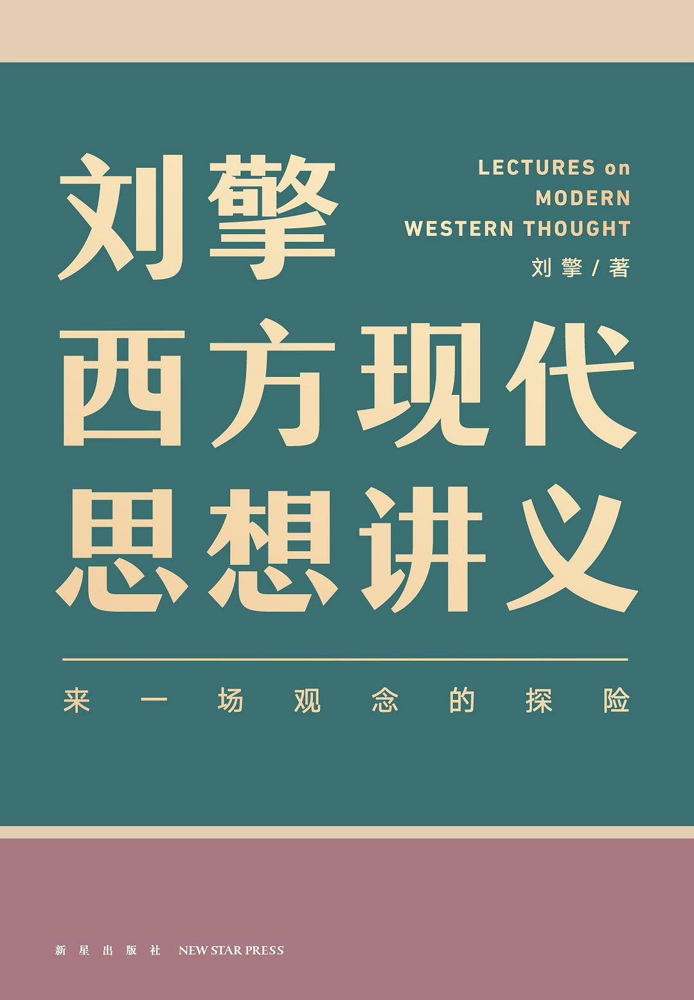

# 理性 Rationality 
当我们说一个人"很理性"时，我们究竟在表达什么？在日常生活中，理性常常被视为感性的对立面：理性代表冷静的判断，感性代表炽热的情感；理性强调逻辑分析，感性依赖直觉感受。但这种简单的二分法真的能揭示理性的本质吗？要理解理性在现代社会中的核心地位，我们需要追溯理性概念的哲学渊源，重新思考它的深层含义。
在西方哲学传统中，理性始终占据着特殊地位。早在古希腊，柏拉图就将理性视为通向真理的桥梁。在他的哲学体系中，理念世界是真实的、永恒的，而我们感知到的现象世界不过是理念的投影。唯有通过理性的思考，人们才能超越感性认识的局限，把握永恒的真理。这一观点奠定了西方理性主义的基础：理性不仅是认识工具，更是通向本质真理的唯一途径。

到了18世纪，康德对理性的本质进行了更深入的探讨。他将人的认识能力分为感性、知性和理性三个层次：感性接收直观材料，知性运用范畴进行整理，而理性则追求对终极问题的理解。在康德看来，理性具有双重性质：作为理论理性，它试图通过先验理念（如灵魂、宇宙、上帝）理解世界的本质，但这种尝试往往陷入二律背反；作为实践理性，它又是道德法则的源泉，指引人的行为。康德的分析揭示了理性的力量与局限：理性既是人类最崇高的认知能力，也有其不可逾越的边界。

那么，今天我们该如何理解理性？理性首先是一种思维能力，是人类运用逻辑、分析和推理来理解世界、解决问题的能力。但它不仅仅是冷冰冰的计算工具。真正的理性包含了批判的维度：它既能指导我们进行理性思考，也能让我们认识到理性本身的局限。正如等下即将在韦伯、尼采等思想家那里看到的，对理性既不能盲目崇拜，也不能完全否定，关键是要理解它的边界与局限性。

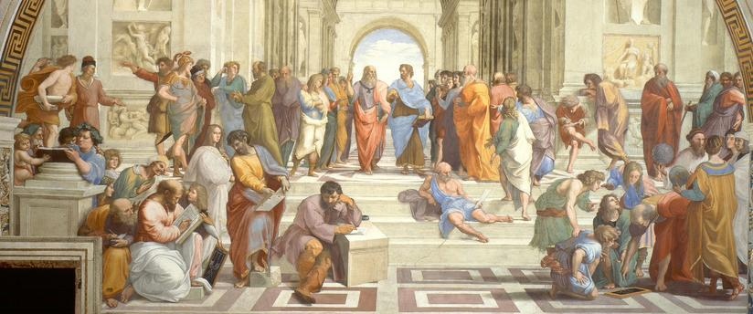
# 现代性 Modernity
现代性的概念广义且复杂。现代（Modern）这个词本身的原意是“当下或最近当下的时代，而现代性的兴起通常与17世纪启蒙运动和18世纪工业革命紧密相连。这段时期，人类逐渐摆脱了以宗教和传统为核心的世界观，转而崇尚理性、科学和个体自由。

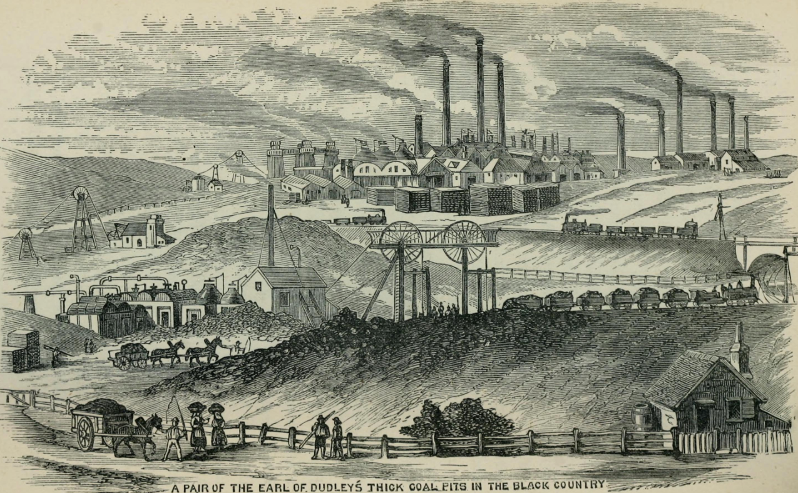

在经济上，现代性伴随着资本主义的发展。工业化的进程催生了大量工厂、铁路和城市，改变了人类的生产方式和生活方式。城市化成为现代社会的主要特征之一，人们从乡村涌入城市，寻求新的工作机会，同时也体验到与传统农业社会截然不同的节奏和生活方式。

文化层面上，现代性强调个人的自主性和创造力。艺术与文学从古典主义中解放，转而探索人类情感的复杂性和世界的多样性。科学的迅猛发展使人类对自然界的认识不断加深，而这种探索的精神也融入了社会制度的变革中，催生了民主、平等等现代社会的基本价值观。

具体而言，现代性所带来的改变是巨大的，具体带来的改变：
- 过去我们更重视事物内在的客观价值，主观意见不能轻易动摇这种客观价值。而现在，个人主观赋予的价值变得极其重要，有时甚至能压倒其它一切标准。

- 在当代社会，人们越来越质疑那些所谓“与生俱来”的意义，仿佛一切都是自然注定的观念已经难以为人所信。取而代之的是一种全新的信念——命运掌握在自己手中，而非听凭天命的摆布。我们放弃了关于“自然秩序”的古老神话，却在这种解放中赢得了真正的自由。人们观念中的自然秩序被理性打破了

- 当自然秩序被理性打破后，我们建立起了由理性所构建起的秩序

而这些改变带来的冲击也是剧烈的：
- 对个人的冲击。当原本世界秩序崩塌后，我们丧失了唯一的信仰与价值的依托。如果上帝已经死了，那我们还能相信谁？我们的信仰是什么？质言之，我们人生 的意义是什么？以往，这个问题我们还能从宗教中获得答案。而当我们试图用理性去解答这个问题时，往往发现它超出了理性所能触及的范围，甚至让我们感到无力。正因如此，焦虑和空虚时常侵袭我们的内心。那么，我们该如何直面这些精神上的困惑？又该如何在看似迷茫的生活中找到意义与方向？

- 对社会的冲击。在理性建立起的新秩序中，我们相信自由平等是社会应有的底色，自然等级之间的界限正在逐渐模糊。然而只要有人群，就会有阶级，就会有统治和被统治的区分。但是，统治和服从都需要依托“故事”，之前的故事是基督，是君权神授，，然而往后的故事经得起理性的考验吗？

以上就是这本书的时代背景。在这本书中，来自不同时代、不同领域的思想家们，都在试图回答这些由现代性引发的根本问题……

# 马克思韦伯 Max Webber
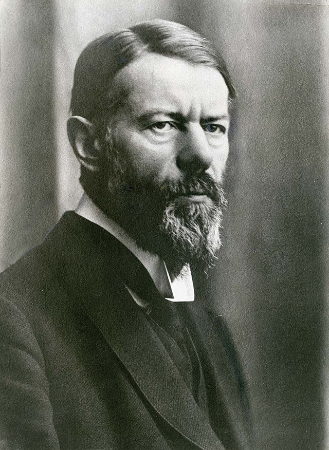

在社会学领域，马克思·韦伯是一位真正的巨人。他与涂尔干、卡尔·马克思并列为社会学的三大奠基人，其思想对现代社会学的发展产生了深远的影响。韦伯以惊人的洞察力审视现代文明，以严谨的逻辑分析现代社会，以深沉的忧虑提醒世人警惕理性化的悖论。而以下是他对现代性的诊断一一“祛魅“、“诸神之争“、“工具理性“、“铁笼“。

## 祛魅
“祛魅“(Entzauberung，**disenchantment**)，是韦伯分析现代性的一个关键词。所谓“祛魅“，意即清除世界的神秘色彩，用理性的光芒驱散蒙昧的迷雾。韦伯指出，西方“祛魅“经历了两个阶段：

第一步是“宗教的理性化“，即用哲学理性解释宗教，去除原始宗教中的巫术迷信；

第二步是科学对宗教权威的挑战，现代科学以客观、求证、反驳的态度怀疑一切超验之物，动摇了宗教的精神主导地位。

“祛魅“宗教的消亡，而是宗教不再是共同默认的人生意义之源。在“祛魅“的时代，我们每个人都需要为自己的信仰寻找理由。这是一个个体自由的时代，也是一个价值失范的时代。正如韦伯所言

> 我们这个时代的宿命，便是一切终极而最崇高的价值，已自公共领域隐没。

如果说“祛魅“揭示了一个人获得精神独立的过程，那么它更是人类思想的一场成人礼。当我们直面世界的真相，当我们认识到生命的意义无法依赖外在权威时，我们便告别了思想的稚嫩，迈向了精神的成熟。

## 诸神之争
随着宗教信仰退出公共领域，“诸神之争“（**Kampf der Götter**）悄然而至。韦伯用这个富有神话色彩的隐喻，描绘了现代社会日益激烈的价值冲突。他分析道，科学的理性只能回答“是什么“的问题即事实判断，而无法告诉人们“应当如何“的问题即价值判断。宗教、道德、法律、艺术等价值领域，失去了统一的标准，价值观念各自为政，相互角力。个人无所适从，社会缺乏凝聚。

“诸神之争“是现代人的宿命。在传统社会，价值有着超越个人的神圣性，人们信仰同一套普世观念。而在现代社会，价值成为个人选择，你崇拜的“神“，可能正是我反对的“魔“。这是令人苦恼的处境，却也是我们无法回避的现实。面对“诸神之争“，韦伯主张每个人应以“内在的一致性“来寻求人生的意义。这就是说，与其依附外在权威，不如探寻内心，选择适合自己的价值坐标。这不是一蹴而就的，而是需要在人生实践中不断摸索，在与他人的对话中不断反思。

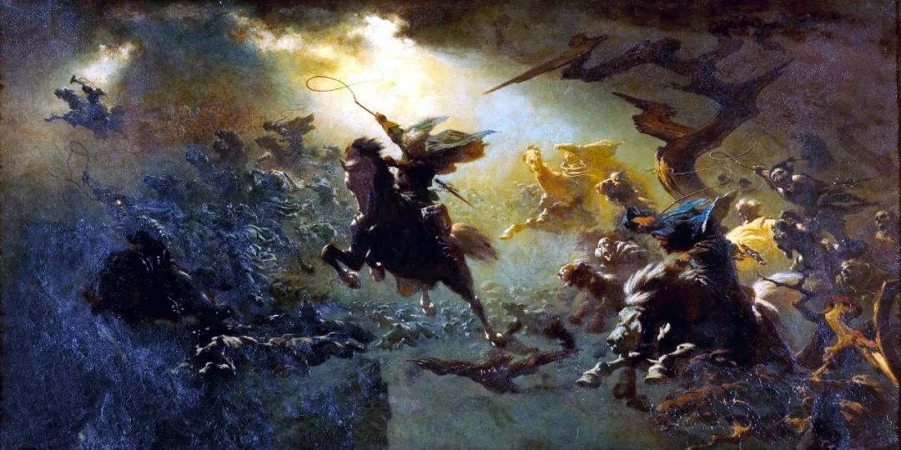

## 工具理性
韦伯对“工具理性“的剖析，是他现代性思想的一个闪光点。工具理性关注手段效率，以计算的方式谋求最优结果；价值理性关注目的正当性，以价值信念作为行动指南。现代性的悲剧在于，工具理性获得了史无前例的胜利，而价值理性却在节节败退。

资本主义就是工具理性的巅峰表现。资本运动惟利是图，“理性“如同一只永不餍足的怪兽，吞噬传统，侵蚀信仰，搅动社会的每个角落，人们的思想和行为无时无刻不在它的引诱之下。它用效率的逻辑取代生活的逻辑，用数量的增长湮灭质量的提升，用功利的算计排斥道德的感怀。工具理性的确为现代文明的腾飞插上了翅膀。但如果失去了价值理性的引导，它无异于一条迷途的航船，一场有去无回的豪赌。正如韦伯警示我们的，工具理性如果僭越了界限，只会让人无家可归。因为人终究不是机器，生命的意义无法用金钱的多寡衡量。

## 铁笼
如果说工具理性揭示了个人生存困境，那么“铁笼“则指向了现代社会的内在逻辑。对韦伯而言，“铁笼“既是官僚制对人的禁锢，也是资本主义对社会的裹挟。在这个笼子里，每个人都有自己的位置，都在扮演特定的角色。表面的有序、高效，却掩盖了内在的冷酷、无情。个体的独特性消失了，自由的空间缩小了，整个社会犹如一个自我循环的机器，而人不过是其中的一颗螺丝钉。

“铁笼“深刻影响着我们的日常生活。当我们把自己的同事称为 “人力资源“，当我们不假思索地把“自我发展“等同于“提升竞争力“，我们便落入了“铁笼“的逻辑。这种逻辑把人当作工具，把教育视为投资，把休闲等同消费。它割裂了人的生存，侵蚀了人的尊严，制造了无数的异化和不幸。

“铁笼“看似牢不可破，却并非没有改变的可能。韦伯呼吁我们要坚守人的主体性，反抗外在强加的角色期待。这需要我们时时保持反思的勇气，以及改变的决心。当我们拒绝把自己“物化“，当我们为他人留出理解的空间，当我们为世界注入人性的温暖，我们便为人的解放开辟了道路，为生存困境找到了出口。

> **人是悬挂在自己编织的意义之网上的动物。

*** **man is an animal suspended in webs of significance he himself has spun**,*

# **尼采 Nietzsche**
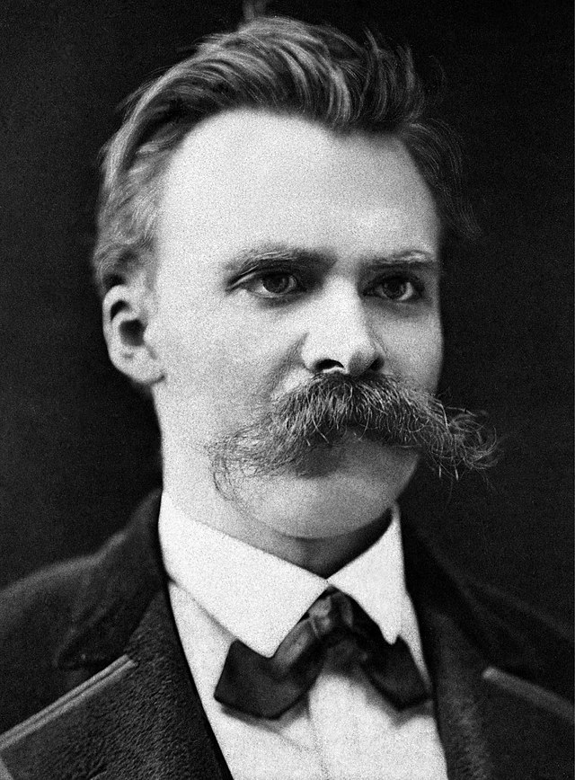

19世纪末，一个孤独的思想者凝望深渊。在他眼中，上帝已死，一切价值分崩离析，虚无主义的阴霾笼罩世界。这个人就是弗里德里希•尼采，德国哲学家、古典文献学家、诗人。他以锋利的思想挑战传统，以悲悯的眼光直视生命，以犀利的笔触描绘未来。尼采常被误读为虚无主义者，但实则不然。他深入虚无主义的内核，却是为了超越它、战胜它。他在直面虚无的深渊，是为了教人学会舞蹈。他以思想的锤音敲碎一切偶像，是为了重塑生命的尊严。探寻尼采的思想，是一次充满悖论、令人眩目的精神之。我曾经跟朋友开玩笑比喻过，读尼采是要在悬崖边缘，在生与死的恍惚间方能最终意识到他的**“成为你自己“**。让我们从尼采最著名的宣言开始——“上帝死了“。

## 上帝死了
“上帝死了!“当尼采通过疯子之口喊出这句话时，西方世界为之震动。这句宣言就像一记重锤，击碎了千百年来支撑西方文明的信仰基石。人们不禁要问：没有了上帝，我们的道德该何去何从？生命还有什么意义？

然而，尼采并非要替上帝举行葬礼。他想揭示的，是一个更深刻的真相：上帝作为一切价值之源的地位已经动摇了。在科学和理性的冲击下，基于神的形而上学世界图景正在分崩离析。人们对上帝的信仰已经成为一种虚假的、僵化的东西。可悲的是，人们还没有意识到这一点。这就像一个孩子得知生他养他的人并非亲生父母。这个真相让他痛苦，却是他必须面对的。上帝之死的启示也是如此。它撕下了虚伪的面纱，将人们推向虚无的深渊。这是痛苦的，但也是必要的。因为只有直面虚无，我们才能真正找到生命的意义。

为什么上帝会死去？根源在于形而上学的幻象。在尼采看来，自柏拉图以来，西方哲学就陷入了二元对立的窠臼：一方面是变动不居的感知世界，另一方面是永恒不变的理念世界。前者是表象，后者是本质；前者是虚幻，后者是真实。形而上学家们在本质世界中寻找一切存在的根基，上帝、绝对精神、物自体……种种概念应运而生。他们试图凭借理性和逻辑去把握终极真理。但在尼采看来，这不过是一场荒诞的闹剧。因为这种真理根本不存在。在尼采看来，形而上学的终极世界不过是人类编织的一张理论之网，是虚构的产物。我们的语言和逻辑犹如 一面哈哈镜，将世界歪曲成符合我们期望的样子。本质、真理、因果、目的……这一切都是我们强加于世界的。我们沉醉于自己编织的概念牢笼，却忘了它本是我们的创造物。

为什么我们要编织这张网？尼采洞察到，这源于我们的软弱。我们惧怕变化、惧怕无常，惧怕直面生命残酷的真相。我们渴望确定性、单一性和永恒性，即便它们并不存在。我们以为有了形而上学，就找到了永恒的栖身之所，获得了恒久的安全感。但这不过是一厢情愿的幻象。

作为一个没有基督信仰的民族，为了更好的理解以上抽象的概念，我想用一个简单的比喻。想象你是一个游牧民族。长久以来，部落里流传着一个传说：某个地方有一片永恒的乐土，那里食物丰沃、气候宜人、风调雨顺。人们对那片乐土的向往支撑着他们经受漂泊的艰辛。但有一天，一个探险者告诉大家，他去了传说中的那片乐土，发现那里并不存在，从来就是虚构的神话。这个真相让人心灰意冷，但同时也给了人们自由——不必再受幻象的奴役，欺骗自己活在梦中。既然没有永恒的乐土，不如脚踏实地，努力把此时此地经营好。既然没有既定的意义，不如自己去创造意义。这就是尼采所说的“上帝死了“的启示。

## 超人
上帝死了后，心灵彷徨无依，虚无的深渊令人心悸，尼采却视之为一个新的开端。在尼采看来，虚无恰恰昭示了人的伟大使命：在“没有上帝“的时代，人应当成为一个全新的创造者，去塑造生命的意义，去成为自己的立法者。

然而，这是一个多么艰巨的任务!没有现成的信仰可以依靠，没有固定的道德可以遵循，一切都需要从零开始。创造比接受更需要勇气，自律比服从更需要意志力。走出虚无的阴影，需要人性的一次革命性的飞跃。尼采以“超人“来指称这种全新的人性境界。

> 人是一根连接动物和超人的绳索——一根横跨深渊的绳索。

尼采的这个比喻显示了人的处境：我们既非兽性，也不到超人，而是悬挂于两者之间。兽性循着自然的本能生存，超人则以自由意志创造价值。而人，则徘徊于本能和自由之间。我们脱离了自然的枷锁，却尚未抵达自主的彼岸。这种“悬置“的状态，正是人。

他所憧憬的超人，不是特定的个人，而是一种崇高的人性境界。它代表着生命意志最高的表现，创造力最丰沛的喷发。超人以生命本身为尺度，不屈从于任何外在权威。他以“Amor fati – 爱命运“的精神，勇敢地拥抱生命的苦难。他以同情的眼光俯视一切，心中盛载着对生命的无尽热爱。超人放弃一切幻觉，直面虚无和荒谬，像西西弗斯那样用生命的激情去自我创造，做一个勇敢、荒谬的英雄。尼采说：“难道我们不能使自己成为上帝吗？就算哪怕试一试也不行吗？”这就是尼采口中的“超人”
由是观之，超人学说并非要塑造一个“超级人类“或者“独裁者“，而是为人指明一条通往生命崇高的艰难道路。

在本书中，刘老师这么描述超人：“超人与普通人的差距，相当于人与猿猴的差距。猿猴对于人来说是什么？是一个玩笑，或者是一个痛苦的羞辱。人对于超人来说也是如此。在尼采的心目中，超人能够在上帝死后，自己成为自己的主人。用自己的生命意志去创造，追求自身生命力量的增长和完满，最终确立和实现自己的生命意义，这就是超人。”

## 成为你自己
讨论了这么多尼采的思想，我们不禁要问：尼采本人何以能够直面深渊，创造辉煌？尼采绝非一个闲云野鹤的思想家，而是将思想融于生命，用生命诠释思想的哲人。透过他个人的遭遇，或许能管窥“成为你自己“的真谛。

尼采的一生充满了悲剧色彩。他体弱多病，经常遭受偏头痛和胃病的折磨；他孤高矜持，难以融入学术圈和社交圈；他锐意革新，思想过于超前，难以被同时代人理解；他晚年精神错乱，最后十年生活在疯狂的阴影下。然而，尼采从未向命运低头。他以超人的意志力对抗疾病的折磨，常常带病写作，创造力惊人。他以深沉的孤独悲悯世人，视孤独为思想者的必经之路。他以勇敢的锋芒挑战时代，即便遭到误解和攻击，仍然初心不改。

尼采曾经写道：最高贵的美德是爱命运（Amor Fati）。这意味着，我们不应逃避命运的苦难，而应当勇敢地拥抱之，将之转化为塑造自我的机缘。命运砥砺心志，痛苦磨砺灵魂。唯有在苦难中升华自我，生命才能绽放出悲剧的壮丽。尼采正是用自己的生命诠释了何谓“爱命运“。他在《悲剧的诞生》的结尾写道：

> 凡是我们所经历的一切，都是一种象征，在这种象征里，生存的深层意志向我们微笑。最痛苦的也能成为崇高，最残酷的也能成为美。这就是'悲剧的智慧'。

直面深渊、战胜虚无、高扬生命，不正是这一伟大工程的写照吗？天地那样广大，生命那样深邃。拿起自己的锤子吧，在**重估一切价值**中开辟生命的道路，让我们学会在危险的海域中自在地舞蹈。也许，这正是“成为我们自己“的秘密。这就是我们从尼采那里学到的生命箴言。尼采的道路高远而艰险，即便我们难以企及超人的境界，但在攀登的过程中，我们已经塑造了生命的意义。这个意义不在彼岸，而在征途。

> **凡不能毁灭我的，必将使我更强大。

Was mich nicht umbringt， macht mich stärker**

# **萨特 Sartre**
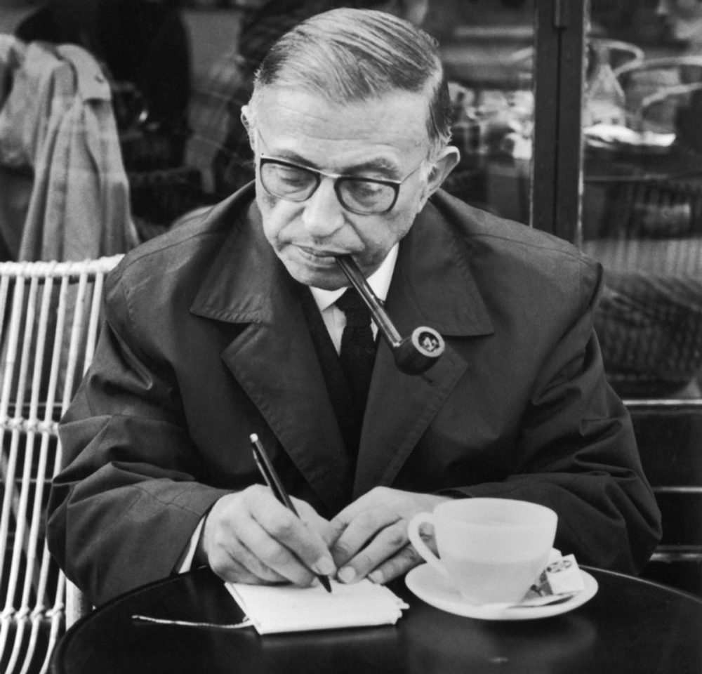

让-保罗•萨特是 20 世纪最重要的哲学家之一。他的存在主义思想，在战后的欧洲思想界引发了一场革命性的变革。在那个信仰坍塌、价值失范的年代，萨特高扬个人主体性的大旗，为迷惘的现代人重新点燃了生存的勇气和自由的希望。

萨特何许人也？他是个怪才，行事特立独行。他拒绝诺贝尔文学奖，抗议体制；他公开声援学生运动，反对威权；他三次拒绝法兰西学士院的席位，对抗权威；他与伴侣波伏娃缔结了一个开放而持久的契约，挑战世俗偏见。一言以蔽之，萨特以自己的生活方式诠释着存在主义精神的内核——个人自由与社会责任的统一。他以卓越的理论和彻底的实践，为他笔下的"自由的使者"画像添上了最后一笔。

萨特的自由学说，源于一个起点——**虚无**。

## 存在即虚无
萨特曾经坐在花神咖啡馆里冥思苦想。他看着眼前忙碌的服务员，又看着面前的咖啡杯，突然生出一个奇特的念头:这个服务员和这个咖啡杯，它们的存在方式根本不同。

杯子的存在是固定的，不可改变的。它就是一个杯子，除此之外别无选择。即使被打碎了，它也只是一个碎掉的杯子。但服务员就不一样了。他之所以是一个服务员，是因为他选择成为一个服务员。他随时可以改变这一身份，去做别的事情。换句话说，杯子的存在是被决定了的，而服务员的存在却是开放的、可以改变的。

这个区别的关键，就在于意识。物，比如杯子，没有意识，所以它的存在就是"自在"的，有一个固定不变的本质。**而人有意识，所以人的存在是"自为"的，没有固定的本质，而是要靠自己去选择、去创造。**

可是，意识本身是什么呢？萨特受到胡塞尔现象学的启发，认为"意识总是对某物的意识"，意识具有指向对象的特性。比如，我们总是在想着什么、感受着什么、意识到什么。可是，如果我们撇开意识的对象，单纯考察意识本身，它又是什么呢？

萨特恍然大悟:意识本身就是虚无!就像一个空空如也的容器，只有被某种内容充填时，它才成为某种特定的意识。一个杯子，只有倒进了水、酒或咖啡，我们才能说它是装了某种东西的杯子。同样，人的意识本身就是一片虚无，只有当某种内容进入意识，人才获得某种特定的本质。人首先就是一个存在，一个意识，但这个意识本身是虚无的、不确定的，没有预设的本质。人的本质不是先天注定的，而是要后天创造的。

由此，萨特得出了他的第一个重要命题：

**存在先于本质  l'existence précède l'essence**

## 自由
"存在即虚无"听上去令人绝望，这否定了我们能感知的所有。难道我们只是一片虚无的泡沫，漂浮在茫茫宇宙中，生命毫无意义可言？ 恰恰相反。萨特认为，正是在这片虚无中，自由的种子萌芽了。事实上，人从虚无走向自由，是必然的过程。刘老师在本书中用了比喻来阐释：

假设你是一名演员，站在舞台上，等待扮演一个角色。在这一刻，你是虚无的，因为你还没有角色。但正是因为你是虚无的，所以你才能选择去扮演任何一个角色。一旦你选择了一个角色，你就为自己赋予了一个特定的本质。但在下一出戏中，你又可以选择新的角色。所以，虚无并不可怕，反而是自由的基础。

又比如，一个画家面对一张白纸，白纸是虚无的，但也因此可以容纳无限的创造可能。一个雕塑家面对一块石头，石头本身没有特定的形象，但雕塑家可以赋予它无数种形态。可见，越是虚无，越意味着自由。

存在之所以是虚无，意味着它不受任何外在的决定，没有任何先验的本质。这时，人就只能依靠自己，为自己选择一个本质。而选择本身，正是自由的彰显。所以萨特说:**"人被判处自由"。**当然，我们无法选择自己的出身、才能、环境等客观条件，但我们仍然可以选择如何看待它们、如何面对它们。即使身陷牢狱，思想也可以是自由的。正如作家**维克多·弗兰克**所说

> 人有一项不可被剥夺的自由，就是对这个世界采取什么样的态度

可以说，萨特最了不起的洞见，就是在虚无中发现了自由的必然性。人之所以自由，不是因为人有多么强大的能力，而恰恰是因为人的存在最初就是一无所有的。这种自由，植根于存在的根基，因而是强韧的。

## 沉重的负担
人之所以为人，就在于拥有选择的自由。可是，萨特却说自由是一种沉重的负担。

其实，在自由中隐藏着一种不可避免的焦虑。因为自由意味着选择，而选择意味着拒绝和牺牲。你选择了成为一名冒险家，就意味着拒绝了安稳的生活；你选择了献身艺术，就意味着牺牲了生活的舒适。更重要的是，每一个选择都意味着一种价值判断，要对选择负责。

可问题在于，是否存在一种客观、普遍的价值标准？萨特的回答是否定的。尼采宣告"上帝死了"，意味着世界已经失去了绝对价值的源泉。陀思妥耶夫斯基也曾说:"如果上帝不存在，一切都是被允许的。"换句话说，我们在道德上成了"无家可归者"。

这就给人的选择带来了一种沉重的负担:你要为自己的选择负全责。你无法将责任推卸到传统、社会或他人身上。你是你自己的立法者，你的选择就是你认可的价值标准。即便是不作选择，也是一种选择。这种责任感，往往伴随着深深的焦虑，因为我们永远无法确定自己的选择是正确的。每时每刻，我们都在选择我们将成为什么样的人。这种自由，赋予了人以尊严，但同时也是一种沉重的负担。

## 他人即地狱
如果说必然的焦虑来自自身，那么**"他人即地狱"**的感受则来自他者。这是萨特另一个著名的论断。

在日常生活中，我们难免要与他人打交道。可是在萨特看来，他人的目光却往往让人感到不自在。想象一下，你独自漫步在街头，沉浸在自己的思绪中。突然，你发现有人在盯着你看。在这一瞬间，你感到一阵不安，仿佛自己的存在方式被他人的目光固定了、判定了。你不再是独立自由的主体，而成了他人眼中的客体。这种目光，萨特称之为"他人的凝视"。这种凝视让人感到自己的自由被剥夺了，感到自己被物化了。就像商店里的模特，在顾客的目光下失去了自主性，成了一件商品。更糟糕的是，我们无法控制别人如何看待我们，无法决定自己在别人眼中的形象。这种无力感，往往带来深深的挫败和屈辱。这就是"他人即地狱"的由来。

然而，萨特并不是要否定人际关系的意义。他提醒我们，面对他人的目光，我们仍然可以选择如何反应，如何坚持自我。 正因为有了旁人的眼光，主体才会看见自己的存在。没有旁人，就没有羞耻，也没有自豪。他人的目光，既是自由的障碍，也可能成为自我认识的出发点。

萨特无疑是 20 世纪最重要、最富争议的哲学家之一。他的存在主义思想，震撼了一个时代的灵魂。今天重读萨特，我们仍能感受到那股触及灵魂深处的力量。这力量，源于他对生存处境的尖锐洞察。人是被"抛"到这个世界上的，没有任何先验的本质和意义。面对虚无，我们难免感到彷徨、恐惧、焦虑。这是生而为人的宿命。而萨特为我们描绘了一种勇气。这是一种无条件地承担起自己存在的责任，拥抱生命注定的自由的勇气。

> **人是自由的，人就是自由 

il n'y a pas de déterminisme， l'homme est libre， l'homme est liberté.**

# **哈耶克 Hayek**
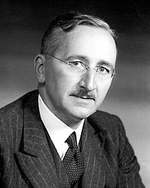
弗里德里希·哈耶克(Friedrich Hayek， 1899-1992)是20世纪最具影响力的经济学家和政治哲学家之一。他出生于维也纳的一个知识分子家庭，在维也纳大学获得法学和政治学博士学位。作为奥地利学派的代表人物，他对自由主义思想的发展做出了重大贡献，并因其在货币理论和经济波动领域的开创性研究获得1974年诺贝尔经济学奖。

## 自发秩序
 **自发秩序 Spontaneous order **这个概念。这是是哈耶克思想大厦的基石。可以说，如果我们理解了什么是"自发秩序"，如何形成"自发秩序"，"自发秩序"又意味着什么，那就等于掌握了穿越哈耶克思想的关键。

所谓"自发秩序"，是指在没有任何预先设计和安排的情况下，通过许多个体自发性地（spontaneous）的行动而形成的有序状态。它不同于人为设计的秩序，因为后者总是出自某个理性的规划。在哈耶克看来，社会秩序很大程度上属于"自发秩序"，是在无数个体自发调适、博弈的过程中形成的。这个观点常常令人大跌眼镜，因为它挑战了我们根深蒂固的成见: 只有权威才有秩序，没有权威的设计，将怎么产生秩序呢？ 要回答这个问题，让我们从哈耶克《通向奴役之路》这本书提到的一个比喻讲起——乡间小路。

## 乡间小路
想象一片开阔的田野，起初并没有路径，每个路过的人都随心所欲地选择自己的路线。渐渐地，一些路线由于地势、风景等缘故，吸引了更多的行人。于是，一条条若隐若现的路径逐渐浮现。经年累月，其中最受欢迎的路径被反复踩踏，越发清晰，最终形成了一条人人都乐于走的小径。

这里并没有一个全能的设计者，没有一套详尽的规划，更没有谁强制别人必须走哪条路。小径的形成完全出于许多个体偶然的、自发的选择。乡间小路带给我们的启发是在没有任何刻意组织和强制的情况下，个体自发的行动积累起来，竟然能产生出有序、稳定的模式。换言之，秩序未必需要理性的设计，而往往源于自发的演化。

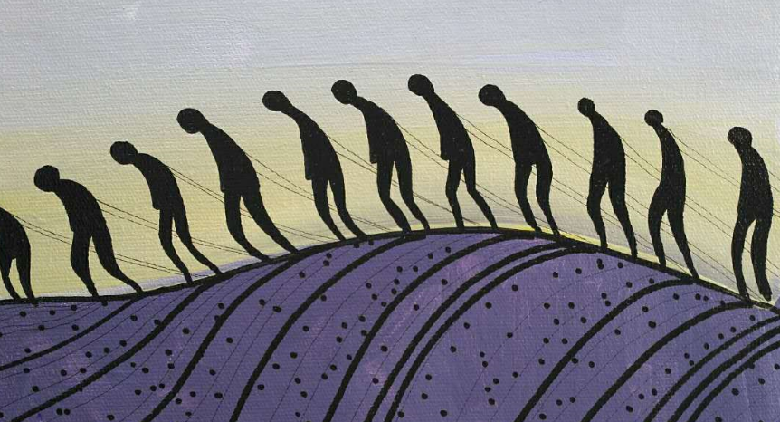

反观我们现在生存的社会，也许很多社会制度，并非源于全知全能的理性规划，而是源自无数看似微不足道的个体选择； 也许，真正持久、有生命力的规则，也许恰恰是在无意识中形成、经过自然选择而留存下来的。这不禁让我们反思:

哪**些秩序需要人为设计？哪些秩序应该听任自生自灭？**

## 市场经济
如果说乡间小路是一个微观的隐喻，那么自由市场经济则是"自发秩序"最鲜活、最令人信服的例证。在哈耶克那里，市场不仅仅是商品交换的场所，更是一个庞大的信息加工机制。

**想一想，一个自由市场究竟在运作些什么？无数的个体带着各自的需求、偏好、知识、判断进入市场，通过竞争与合作、试错与学习，逐步调整自己的行为。在这个过程中，个体掌握的局部信息，如同涓涓細流，汇聚成磅礴的信息洪流。产品的价格、品质、库存等等都在这汹涌的信息洪流中被传递、被加工。而个体又从市场汲取信息，去指导下一步行动。如是循环往复，一个有效配置资源的秩序渐次呈现。**

请注意，这里没有一个全知全能的规划者在刻意安排。市场秩序的形成，完全依赖于无数个体自发的博弈。哈耶克曾用"市场过程"一词来描述市场秩序的形成，"过程"二字很能说明问题。它强调这是一个动态的、渐进的过程，而不是某种预定的、静止的状态。正是在这样一个过程中，市场展现了它神奇的功效:把星罗棋布、互不相识的个人连结在一起，把散落在不同脑海中的知识和信息组合起来，指引着资源流向最需要它的地方。

可见，哈耶克是市场经济的绝对拥簇。然而，在上世纪用另外一位思想家带来了截然不同的经济学思想，深远地改变了人类的历史——凯恩斯。而哈耶克与凯恩斯的辩论是现代经济思想史上最引人注目的学术交锋之一。这场始于1930年代的辩论，实质上是关于政府在经济中应该扮演什么角色的根本分歧。

凯恩斯认为，市场经济存在内在的不稳定性。当经济陷入衰退时，私人部门的需求不足会导致失业上升，形成恶性循环。在这种情况下，政府应该通过扩大支出来刺激总需求，帮助经济摆脱困境。他主张政府在经济中发挥积极作用，通过财政和货币政策来平抑经济周期的波动。

而哈耶克则持完全不同的观点。他认为经济衰退往往是之前过度信贷扩张的必然结果。政府试图通过人为刺激需求来避免衰退，反而会扭曲市场的自我调节机制，导致资源错配，最终使问题更加严重。在哈耶克看来，政府干预不仅无法解决问题，反而会阻碍市场的自发秩序形成。

这场辩论体现了两种截然不同的经济思维方式:
-  凯恩斯相信通过理性设计和积极干预可以改善经济运行
- 哈耶克则强调市场的自发演化和政府干预的局限性

有趣的是，这场辩论不仅仅局限于经济领域。它涉及更深层的问题:我们应该在多大程度上相信人类理性的力量？政府能否通过集中决策取代分散的市场机制？个人自由与集体福利如何平衡？在当时，凯恩斯的主张获得了更广泛的认同。二战后的"凯恩斯革命"深刻影响了西方各国的经济政策。但到了1970年代，滞胀危机的出现使人们开始重新审视哈耶克的观点。他强调的市场机制的重要性、政府干预的局限性等思想重新引起关注。并为最后为当今世界格局的“新自由主义”提供了一定程度的理论基础。

值得一提的是，哈耶克对市场经济的支持并非仅仅建立在基于个体理性的自发秩序之上。他认为，良好的制度既是市场经济得以运行的基础，也是自发秩序能够形成的关键保障。在他看来，制度的作用不是去规划和指导具体的经济活动，而是要为自发秩序的形成创造适宜的环境。

要理解哈耶克的制度观，我们需要认识到他所强调的两个关键维度。首先，制度必须保护和鼓励个体的自主性与创造力。这意味着要建立健全的产权制度，确保契约的可执行性，维护公平的竞争环境。没有这些基本制度保障，市场参与者就会陷入一种短视的、掠夺式的行为模式。就像一场没有规则的比赛必然导向混乱，缺乏制度保障的市场活动也容易演变为弱肉强食的丛林法则。

其次，制度的设计要保持适度和克制。哈耶克特别警告我们，不要试图通过过度细致的规则去管控每一个市场行为。他认为，那些试图事无巨细地规范市场的做法，往往会扼杀市场的活力和创新动力。好的制度应该像园丁培育植物一样，重在创造有利的生长环境，而不是去规定植物应该如何生长。

在这个框架下，哈耶克特别强调了几个核心制度的重要性。**首先是法治，它为市场活动提供可预期的行为规则和公平的争议解决机制。其次是货币制度，它需要保持相对稳定，为市场交易提供可靠的计价单位。再次是产权制度，它不仅保护财产权，更重要的是激励创新和长期投资。这些制度共同构成了市场经济的"基础设施"。**

这种对制度的重视，也体现了哈耶克思想的成熟与深刻。他指出，建立和维护良好的制度是一个漫长的过程，需要历史积累和社会实践的检验。我们既不能期望通过某种理性设计就能一蹴而就地建立完美制度，也不能寄希望于完全自发的制度演化。恰当的做法是，在尊重历史经验的基础上，谨慎而持续地改进制度安排，为市场的自发秩序创造更好的生长环境。

## 理性的自负
在我看来，哈耶克虽然以经济学家的名号不朽于世。然而，在本书的作者，以及在我看来，他都是一位伟大的思想家，哲学家，他的自发秩序理论背后，有着更深层的哲学关怀。它针对的是一种根深蒂固的倾向，哈耶克称之为"理性的自负"。

所谓"理性的自负"，就是一种过分相信理性能力的倾向，一种以为通过理性的设计和规划就可以创造完美社会的幻想。它的表现有很多，比如认为社会的一切弊病都可以通过"从上到下"的改革来解决，认为只要掌权者足够明智，就可以设计出完美无缺的蓝图。在极端的情况下，"理性的自负"会走向专制和极权，因为它无法容忍有悖于理性设计的任何行为。

哈耶克对此深感忧虑。在他看来，"理性的自负"忽视了人类认知的有限性，忽视了每一个个体头脑中蕴含着的独特知识和经验。这些知识是如此分散，如此难以言传，以至于任何一个中心规划者都不可能掌握。可一旦"理性的自负"占了上风，它就会用简单粗暴的蓝图取代这些丰富细腻的个体知识，用僵化刻板的指令扼杀个体自主的创造力。其结果，往往适得其反。

就如同一位不谙农业的官员，仅凭一纸文书，就想对农民的耕作、播种进行事无巨细的规划。他忽略了农民积累的关于土壤、气候的丰富经验，忽略了农民面对变幻风云时的灵活应变。这种脱离实际的规划，即便出发点是善意的，结果往往也是灾难性的。

对哈耶克而言，**真正的理性，不是狂妄自大，而是谦逊谨慎。**它不是一味追求有限理性的扩张，而是时刻提醒自己认知的局限。正是出于这种谦逊，哈耶克呼吁我们尊重个体的自主性，尊重自发秩序的演化逻辑。只有敬畏每一个个体的自由意志，社会才能涌现出源源不断的活力；只有对理性能力心存敬畏，我们才不至于陷入"理性的自负"的陷阱。

这也我反思为什么我们人类世界从未出现过真正的乌托邦，真是因为乌托邦制度的构建是依托于人的理性与美好善良的愿望。然而，一方面，我们理性是有局限的，但是我们却往往会陷入理性的自负中去。另一方面，我们自觉地根据一些崇高的理想来缔造我们的未来，实际上却不知不觉地创造出一种和他们想要奋斗的东西截然相反的结果。

> **通往地狱的道路，是由善意铺就的

The road to hell is paved with good intentions**

# **罗尔斯 Rawls**
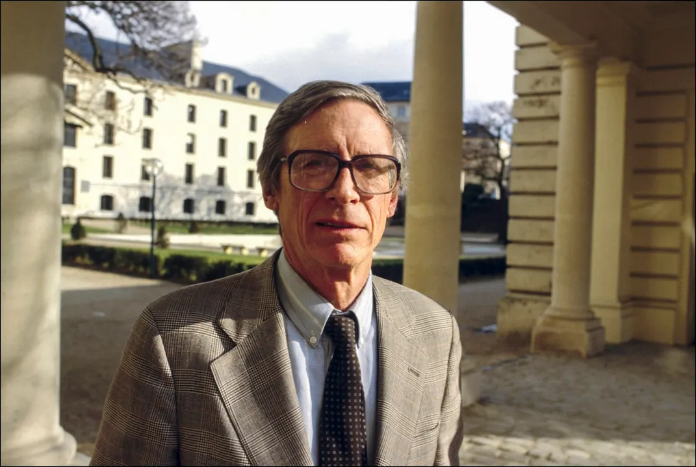

约翰·罗尔斯是20世纪最重要的政治哲学家。为何罗尔斯如此重要呢，因为他向世人揭示了揭示了正义的本质，在他眼中正义是约束社会制度的基本原则，是评判制度好坏的基准。一个缺乏正义的社会，就如同一个谬误百出的思想体系，根基难以立足。

可是，何为正义？这个看似简单的问题，却困扰了人类数千年。无数哲人智者在这个问题上殚精竭虑。是"各得其所"的分配正义？还是"付出与回报相称"的交换正义？抑或"人人平等"的社会正义？众说纷纭，莫衷一是。在这个语境下，罗尔斯的《正义论》横空出世。他开创性地提出"作为公平的正义"理论，试图在各种争议中找到一个"阿基米德支点"，重新奠定正义的基石。要了解罗尔斯的“正义”，让我们先从这个理论的灵魂——"无知之幕"开始。

## 无知之幕
假设一群人聚在一起，要讨论如何制定一个社会的基本规则。但在讨论之前，罗尔斯让每个人都站到一个叫"无知之幕"的帷幕后。在那里，没人知道自己将在未来社会中扮演什么角色。你可能是总统，也可能是乞丐；可能是男性，也可能是女性；可能是黑人，也可能是白人……在这个"原初状态"下，每个人都是平等的，因为没人知晓自己的特殊处境。这种状态下，每个人都无法凭借特殊身份谋取私利，只能以所有人利益为依归来制定规则。换句话说，在无知之幕后，没人敢为一己之私而损害他人，因为你不知道"他人"最终会不会是自己。

罗尔斯的无知之幕的颠覆性在于，有别于传统理论往往预设人性自私，把个人利益视为决策基点，罗尔斯巧妙地移除了这个预设，迫使人们站在全体立场上思考问题。这种"拟似普遍性"的立场，其实体现了康德"绝对命令"的精神:我们的行为准则必须具有普遍性，要设身处地为所有人着想。只是罗尔斯把这种"换位思考"嵌入了一个巧妙的思想框架。

有趣的是，罗尔斯的无知之幕并未否认人性的自利面。恰恰相反，每个人在幕后仍然是理性自利的，都在为自己争取最大利益。但关键在于，在无知之幕的掩映下，我唯一能确保自己利益的方式，就是维护所有人的利益，因为"所有人"最终必然包括我自己。个人理性与普遍理性在此神奇地交融一体。

无知之幕的思想实验是罗尔斯整个理论大厦的奠基石。在这个基础上，罗尔斯进一步提出，无知之幕后的理性谈判者会达成两个基本原则，也就是著名的"正义二原则"。让我们一探究竟。

## 正义第一原则
在正义二原则中，首要的是"平等自由原则"。这个原则要求，每个人都拥有平等的基本自由权利，如思想自由、言论自由、集会自由、参政权等。这些权利是不可剥夺、不可让渡的，任何社会制度都必须予以保障。

乍一看，这个原则似乎不言自明，但仔细推敲，就能发现其独到之处。传统理论常把自由视为与平等对立的价值，认为两者不可兼得。比如，人们为了获得更多财富，往往需要付出超常的努力，结果必然导致财富分配的不平等。如果硬要推行平等，势必损害个人自由。但罗尔斯巧妙地化解了这种张力。他指出，自由与平等并非对立，而是相辅相成。真正的自由应当是人人平等享有的，一个人的自由不能以损害他人自由为代价。反过来，真正的平等也应当体现在自由的维度上，而非物质利益的简单均分。

在罗尔斯看来，基本自由是实现个人理性生活计划的前提。没有思想、信仰、行动的自由，人们就无法选择适合自己的生活方式，发展个性才能，追求美好理想。这些自由如同阳光和空气，是每个人生存发展不可或缺的基本条件。因此，对基本自由的平等尊重，是社会正义的首要内容。

当然，罗尔斯也意识到，绝对的平等自由只是一个理想。现实生活中，基本自由权常常会发生冲突。比如，一个人的言论自由可能侵犯他人的隐私权。在罗尔斯看来，面对这种冲突，我们只能"在平等自由的框架内"寻求解决方案。他提出了一个优先性规则:基本自由权只能为了自由本身而加以限制。具体而言，一种自由的限制只有在满足两个条件时才是正当的：

- 其一，这种限制可以更好地维护整个自由体系

- 其二，这种限制是普遍适用于所有人的

举例而言，我们禁止在公共场合高声喧哗，是为了维护他人的安宁权。这虽然限制了喧哗者的行动自由，但如果这个规则普遍适用于包括喧哗者在内的所有人，那它就是正当的，因为它维护了一个更完备的自由秩序。相反，如果我们禁止特定人群(如少数族裔)集会游行，却允许其他人这样做，这个规则就是不正义的，因为它违背了自由权利的平等性。

## **正义第二原则**
如果说第一原则直面政治领域的正义，那么第二原则就聚焦于社会经济领域的正义。这个原则包括两个部分:一是机会平等原则， 二是差别原则。

**机会平等**
按照机会平等原则，每个人应当享有平等的机会去竞争社会地位和职务。用罗尔斯的话说，在天赋和能力相同的人之间，"机会的预期应当相同"。注意这里的措辞:不是"机会相同"，而是"机会的预期相同"。罗尔斯之所以强调"预期"，是为了纠正形式平等掩盖实质不平等的问题。比方说，高考对所有人开放，这似乎体现了机会平等。但仔细想想，农村学生与城市学生的教育资源往往大不相同，他们在考场上的竞争力也就天差地别。从结果看，尽管考试形式一视同仁，入学机会实质上却是不平等的。为了矫正这种不平等，罗尔斯提出了更高标准的机会平等，即"公平平等"。他要求，除了提供形式上的机会，社会还应该积极创造条件，尽可能抹平不同出身、不同禀赋者的起点差异。比如对农村学生实行学费减免、提供助学贷款，在师资、设备等方面向农村学校倾斜，提供职业培训和再教育的机会……惟其如此，才能让不同背景的人获得实质的机会平等。

**差别原则**
正义第二原则的后半部分，就是著名的"差别原则"。这可能是罗尔斯理论中最有创见，但也最容易引起争议的部分。差别原则直面一个现实:在机会平等的条件下，社会成员由于天赋和努力程度的差异，收入和财富分配难免出现不平等。罗尔斯并没有简单地否定这种不平等，而是提出，只要这种不平等**"对最少受惠者的最大利益"**有利，它就是正义的。

这个提法可能令人困惑。一个分配不平等怎么会对弱势群体有利呢？举个例子，假设一个企业的老板获得巨额利润，而员工只得到微薄工资。这难道不是对员工的剥削吗？但别急着下结论。罗尔斯告诉我们，要综合考虑分配制度对整个社会的影响。如果在竞争性的市场中，高额回报能够激励企业家不断创新，扩大再生产，而这又能带来更多就业机会，让更多人获得体面工作，那即便分配不平等，最贫穷的人也能从中受益。相比之下，如果我们提高累进税，平均主义地瓜分利润，企业家的积极性受挫，经济停滞甚至倒退，结果是整个社会蛋糕缩小，穷人拿到手的反而更少。

由此可见，罗尔斯并非简单地提倡平均分配，而是主张建立一种有利于整个社会持续繁荣的分配制度。他的独到之处在于，评判一个制度的标准不是财富在人群中的离散程度，而是这种制度能否改善最贫穷者的长远利益。换言之，即便贫富悬殊，只要穷人的日子一天比一天好过，社会就是在进步；反之，若只是单纯控制收入差距，结果可能适得其反。

这个结论虽然有悖于一般直觉，但有其合理内核。罗尔斯指出，真正的公平不应仅仅体现为表面的"为同而等"，更应落实到改善每个人尤其是弱势群体的实际生活条件上。如果过度的平均主义剥夺了人们改善处境的动力，最终受害的恰恰是社会底层。相比之下，在公平竞争的基础上允许适度差异，反而更有利于调动各方面的积极性，促进社会整体的发展，从而让每个人的日子都一天天好起来。这才是罗尔斯心目中最佳的"帕累托改进"。

当下，人类社会面临诸多挑战。当技术发展日新月异，当贫富分化愈演愈烈，当文化冲突此起彼伏，公平正义的理想似乎显得那么遥不可及。但是，罗尔斯的正义依然闪耀着如琥珀般的光辉，它带给我们的是一个理论基础，以更宽广的视野来反思每一个制度、每一项政策的合理性，在错综复杂的利益冲突中探寻最大公约数，在矛盾和分歧中寻求和解与共识的可能。这不仅关乎社会的良序运行，更关乎每个个体的尊严与发展。

> **正义是社会制度的首要价值，正如真理是思想体系的首要价值一样。

Justice is the first virtue of social institutions，as truth is of systems of thought**

# **诺齐克 Nozick**
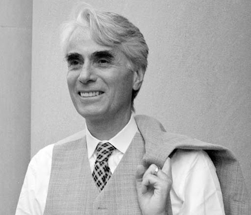

诺齐克是自由至上主义(Libertarianism)或称为放任自由主义的代表人物。他在1974年出版的《无政府、国家与乌托邦》(Anarchy， State， and Utopia)一书中，对约翰·罗尔斯的《正义论》提出了有力的批评和替代性方案。同时因为他太帅了，以至于收获了“too handsome to be a philosopher”，意思是说诺齐克太帅了，帅到不像一个哲学家。我曾经还因为非常崇拜诺齐克，将他的照片作为自己的微信头像。

## 个人权利
个人权利的绝对优先构成了诺齐克政治哲学的理论基石。在《无政府、国家与乌托邦》中，诺齐克将个人权利定位为任何政治制度和道德理论必须首要尊重的根本约束。

在诺齐克的理论中，每个个体都是独立的道德主体，拥有不可侵犯的自我所有权(self-ownership)。这种自我所有权不仅包括对自己身体和才能的完全支配权，还延伸至通过正当劳动获得的财产权。这些权利构成了道德的边界约束( side-constraints)，即使为了实现更大的社会效用，也不能逾越这些边界。

这一思想传统可以追溯到洛克的自然权利理论。洛克在《政府论》中论证了生命、自由和财产这些自然权利的基础地位。诺齐克在继承这一传统的同时，通过自我所有权的概念对其进行了系统化的发展。与洛克相比，诺齐克更强调了这些权利的绝对性：个人权利不是可以为了集体利益而被权衡取舍的因素，而是构成了任何正当政治安排的先验边界。

此外，康德在《道德形而上学基础》中提出了著名的"目的王国"公式：**永远要把人当作目的本身，而不仅仅是手段**。诺齐克将这一道德原则引入政治哲学领域，认为任何政治制度都不能把个人仅仅作为实现某种社会目标的工具。这一观点直接挑战了功利主义的核心主张，也对罗尔斯式的社会正义理论构成了有力批评。在诺齐克看来，任何未经权利人同意的强制性干预，即使是出于再分配的目的，都构成了对个人权利的侵犯。这种对个人权利的绝对化理解，使诺齐克的理论成为旗帜鲜明的自由至上主义的代表。

## 自由主义至上
如果说个人权利是诺齐克理论的起点，那么对自由主义的坚持就是他的归宿。事实上，诺齐克常被誉为"当代最彻底的自由主义者"。这种彻底，体现在他对国家干预的极力限制。

在诺齐克眼中，一个理想的国家应当是"最小国家"（minimal state）。这意味着，国家的职能应被限制在维护个人权利、防止暴力、盗窃欺诈等非常有限的范围内。至于再分配、福利等涉及对个人财产的征用和干预的行为，国家都不应越雷池一步。

这一主张可谓自由主义在经济领域的极端表达。传统的自由主义者如洛克、密尔等，主要强调在政治领域保障个人自由，如言论自由、宗教自由等。到了20世纪，随着社会主义思潮的兴起，自由主义面临新的挑战。罗尔斯试图调和自由与平等，主张在保障基本自由的同时兼顾社会公平。但在诺齐克看来，罗尔斯走得还不够远。诺齐克认为，真正的自由必须延伸到经济领域，个人对自己的劳动所得拥有绝对支配权，任何形式的政府干预和再分配都是对个人自由的侵犯。

想象你在自家的农场里辛勤劳作，种植了一批优质苹果。当你满心欢喜地收获果实时，政府的人突然来到你家，把你的一部分苹果拿走，说要分给更需要的人。诺齐克会说，这种行为无异于一种"强盗逻辑"。你对自己劳动所得的苹果拥有完全的所有权，政府无权对你施加道德义务，强迫你施舍或分享。

也许有人会问，如果人人都只顾自己，社会公平正义如何实现？穷人的利益如何保障？诺齐克的回答是，市场会自动调节。在一个完全自由的市场中，个人为了追求利益最大化，会自发地提供他人需要的商品和服务。这一过程虽然由私利驱动，结果却能使社会资源实现最优配置，使每个参与者的利益都得到改善。也就是说，追求私利和增进公共利益在长远来看是一致的。用亚当•斯密的话说，就是"看不见的手"会引导市场走向均衡。

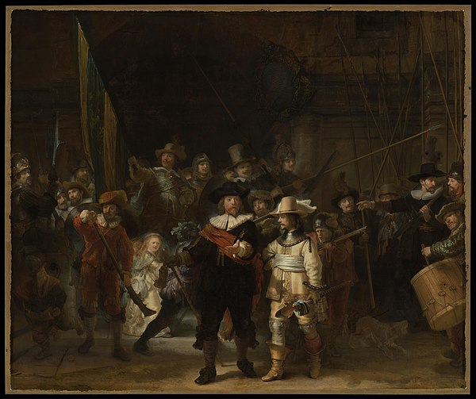

## 持有正义的三原则
个人权利至上、自由至上，这些都体现了诺齐克对个人主义和自由主义的坚持。但理论的生命力还在于能够回应现实。诺齐克心知肚明，在一个充满不平等的世界，单单呼唤自由是不够的，还需要论证自由社会的正当性。这正是他提出"持有正义 Entitlement Theory"理论的缘由。

我们前面讨论过，诺齐克的正义不是"分配正义"，而是关注个人对财产的正当持有。他提出了三条原则:

- 一是获取正义

- 二是转移正义

- 三是矫正正义

只有同时满足这三条原则，一个人对财富的占有才是正义的。

获取正义原则(The Principle of Justice in Acquisition)表明了财产权的正当起源。诺齐克认为，财产权的最初取得必须符合道德要求。就是你所持有的财产在起点上，也就是最初获取的时候必须是正当的。要么通过劳动占有了天然资源，比如“无主之地”，或者接受了别人自愿的馈赠，比如来自父母的遗产；反正是不能侵犯任何他人所有的财产，否则就失去了“获取正义”。

转让正义原则(The Principle of Justice in Transfer)关注的是财产在不同主体间流转的正当性。诺齐克强调，只有建立在双方自愿基础上的转让才是正义的。这包括市场交易、赠与、继承等形式。这一原则实际上为市场经济提供了道德基础：只要交易是自愿的，产生的结果就是正义的。这也说明了为什么诺齐克反对强制性的再分配 - 因为它违背了自愿原则。

矫正正义原则(The Principle of Rectification of Injustice)处理历史不正义问题。诺齐克认识到，现实中的许多财产关系都带有历史不正义的烙印。这一原则要求我们追溯历史，纠正过去的不正义。这种纠正不仅包括直接还原，还可能需要补偿。比如，对原住民土地权的侵犯就需要适当的补偿机制。

尽管存在局限，诺齐克的理论依然是现代政治哲学的一座丰碑。他以锐利的思辨和严谨的逻辑，为自由主义筑起了一道铜墙铁壁，至今仍令人景仰。即便时过境迁，他的理论依然有许多启示意义。在我看来诺齐克给我们最大的启发是个人权利是社会的基石。在个人与国家的关系上，个人从来都应是目的，而非手段。任何牺牲个人利益以成全集体利益的做法，都要经受严格的道德审视。

> **每个人都拥有不可侵犯的权利，这些权利设定了任何个人或群体都不得逾越的界限。

Individuals have rights， and there are things no person or group may do to them.**

# **哈贝马斯 Habermas**
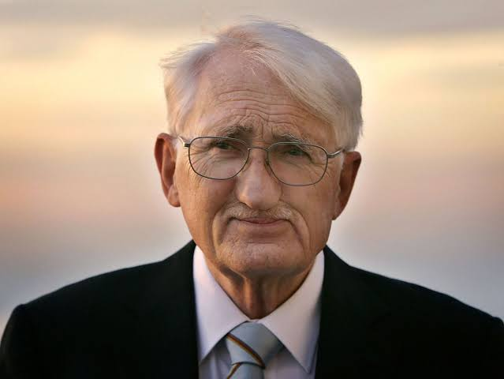
尤尔根·哈贝马斯(Jürgen Habermas， 1929-)，是当代最具影响力的社会理论家和哲学家。哈贝马斯是法兰克福学派第二代的代表人物，他的思想对现代社会理论、政治哲学和公共领域理论都产生了深远影响。而要理解这位依旧在世的思想家伟大思想的脉络，我们必须先回头最开头，从“韦伯难题”说起。

## 韦伯难题
什么是"韦伯难题"？简单来说，就是现代理性在"祛魅"过程中的自我分裂与内在张力。这是哈贝马斯思考的起点，也是他毕生努力的难题。

让我们先回顾一下韦伯的洞见。在韦伯看来，现代性的本质在于"理性化"。随着科学的进步，世界逐渐失去了神秘色彩，"祛魅"的铁笼无情地扼杀生命的诗意。与此同时，理性本身也经历了一场分裂。工具理性大行其道，将世界视为可以被计算、被把控的对象；价值理性却日渐式微，个体在终极价值问题上无法达成共识，"诸神之争"不可调和。这一悖论令人不安。理性化似乎带来了人类摆脱蒙昧、实现自由的希望； 但它的结果却是一个黯淡无光、冷漠疏离的铁笼世界。工具理性固然带来了效率的提升，但失去了价值引导的灵魂；价值理性蕴藏着意义追寻的渴望， 却在"诸神之争"中无法落地生根。现代性由此陷入理性分裂的困局。就像是一枚硬币的两面。一面是工具理性，一面是价值理性，两者都源自启蒙时代对理性的信仰。但随着世界日益复杂，两种理性渐行渐远，硬币被生生撕裂成两半。

韦伯本人对这一困境感到无奈。他一方面承认工具理性的重要性，一方面又对价值理性的衰落扼腕叹息。但他似乎看不到化解悖论的出路。在他眼中，现代人只能在"铁笼"中苦苦挣扎，在"诸神之争"中彷徨犹疑。这就是令人绝望的"韦伯难题"。

哈贝马斯显然不甘心接受这一命运。他敏锐地意识到，"韦伯难题"的关键在于重新思考理性的内涵。如果我们对理性有一个更加宽广、更加丰富的理解，或许就能找到一条化解悖论的道路。对哈贝马斯而言，语言和交往正是通往这条道路的密钥。这就引出了他的"交往行动理论"。

## 交往行动
让我们暂时抛开那令人沮丧的"铁笼"和"诸神之争"，转而思考一下日常生活中再平常不过的现象——人与人之间的交谈。当我们彼此交谈时，我们在做什么？

很容易想到，我们在传递信息，在表达观点，在交换看法。但哈贝马斯告诉我们，交谈的意义远不止于此。交谈的过程，同时也是一个协调行动、达成共识的过程。通过语言交往，个体超越了各自狭隘的视界，在"主体间性"中建立起一种相互理解、相互认同的关系。这种关系就是哈贝马斯所说的"交往行动"。与工具行动不同，交往行动的目的不是操控对象，而是增进共识，不是实现个体既定的目的，而是在平等对话中形成共同的意愿。简言之，工具行动体现的是主体对客体的关系，交往行动体现的是主体与主体的关系。

举个例子，想象一下法庭上的交锋。控辩双方各执一词，试图说服对方接受自己的观点。这里的说服，不是强制，而是诉诸理性的证据；目标不是操纵，而是达成共识。在这个过程中，双方都必须以开放、平等的态度对待彼此，以事实为依归，以逻辑为准绳。只有在遵循交往理性的规则下，才有可能实现真正的相互理解。交往理性的光芒，不正是从这里散发出来的吗？与工具理性不同，交往理性不是个体理性的简单相加，而是在主体间的互动中生成的，因而具有了超越个体局限的品格；与价值理性不同，交往理性不诉诸独断的信仰，而是以论证的方式争取普遍的认同，因而获得了道德上的合法性。

在哈贝马斯看来，这种理性蕴藏着化解"韦伯难题"的希望。因此，韦伯难题的解答其实就**“在人间”**。如果我们在社会生活的方方面面，都能运用交往理性，通过平等对话的方式凝聚共识、协调行动，那么价值冲突就有了化解的出路，"铁笼"也就不再那么无情。当然，哈贝马斯并非天真地认为，交往理性可以轻而易举地实现。交往行动要真正发挥作用，需要一个开放、自由、平等的环境。在现实生活中，权力的不对称、利益的冲突时刻威胁着交往的纯粹性。正是出于这种考虑，哈贝马斯提出了"理想言说情境"的设想。

## 理想言说情境
什么是理想言说情境（ideal speech situation)？简单来说，就是一种对交往行动及其预设条件的理论抽象。它描绘了这样一种情境:所有参与交往的个体都拥有平等的地位，都有充分表达自己观点的机会；交往过程不受权力或金钱的扭曲，唯一的强制力量就是论证的力量；参与者以开放坦诚的态度对待彼此，不怀私心，不图操纵，真诚地致力于达成共识。

这当然是一种理想状态，现实生活中很难完全实现。但哈贝马斯之所以提出这一理念，是为了为交往行动确立一个规范性的参照系。它为我们指明了一个方向:要让交往理性真正发挥作用，我们必须努力营造一个近似理想言说情境的制度环境。哈贝马斯对此有深入的思考。他认为，在现代社会，理想言说情境的实现有赖于一套制度性的保障，其中最重要的就是"公共领域"（Public Sphere）的建构。所谓公共领域，是一个独立于国家权力和市场力量的社会领域，是公民参与政治生活、进行理性讨论的舞台。只有在这样一个自由开放的空间里，交往理性才能获得生长的沃土。

以新闻自由为例。一个健康的公共领域，离不开独立、客观的新闻媒体。如果媒体受到政治权力的操纵或商业利益的绑架，公众就很难获得真实可靠的信息，更难以展开理性讨论。反之，如果媒体能够秉持专业操守，为不同观点提供平等表达的机会，那么即便在利益冲突严重的问题上，公众也更有可能通过理性交谈找到共识的基础。这，正是理想言说情境的现实缩影。

哈贝马斯的交往行动理论，对"韦伯难题"做出了极富创见的回应。面对现代理性的分裂，他没有简单地否定理性，而是挖掘出理性的另一种可能——交往理性。这种理性扎根于主体间性，以论辩的方式寻求普遍共识，为重建人类共同生活的道德基础提供了思想资源。哈贝马斯的交往行动理论，绝非只停留在学院的象牙塔里。就以我个人而言，都收到交往理性非常大的启发与影响。它提供了一种超越工具理性的生活方式。在日常交往中秉持平等、开放、真诚的态度，用论证说服他人，用倾听理解他人，这有助于我克服自我中心，并且培养换位思考的能力。哪怕在观点严重对立的场合，交往理性也为我指明了一条化解分歧的路径:与其简单否定对方，不如去倾听对方的理由；与其急于表态，不如去追问己见的预设。唯其如此，我们才能摆脱狭隘视界的桎梏，实现真正的相互理解。

> **交往行为的目标不是成功，而是理解
**
	**Das Ziel des kommunikativen Handelns ist nicht der Erfolg， sondern die Verständigung.**

# 结语 The End

**人类因为理性而伟大，因为知道理性的局限而成熟**

本次演奏最后一个乐章的音符悄然落下，感谢你“听”到这儿，这次七重奏中，我们跨越时空，与众多西方伟大的思想家展开了一场场对话。从韦伯、尼采、萨特到哈耶克，从罗尔斯到诺齐克，再到哈贝马斯，他们对于基于“我”和“我们”所产生的大问题一一作出了回应，这些智慧火花照亮了直到现在徘徊在现代性道路上迷途的我们。
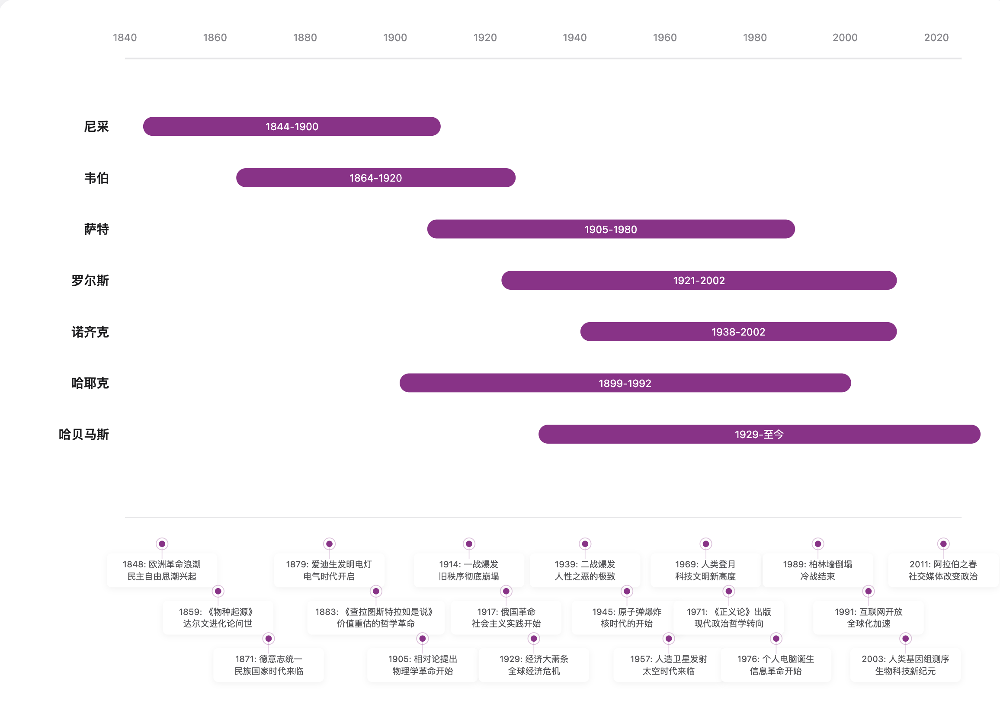

最后的最后，我想要回到本篇文章的的起音：

**理性**

它固然是人类之所以伟大的根基，我们所建构的璀璨文明与精神瑰宝离不开理性的参与。然而，人类的理性并非无所不能，它的局限性其实也是人客观的局限性。唯有认识到理性自身的边界，我们才能不断反思和完善自身的理性。因此，我们才说自省理性局限的能力，是人成熟的标志。

最后，我想用自己的motto作为本篇文章的结尾：

> **谦卑是看见自己在无垠中的位置，既不因渺小而绝望，也不因成就而傲慢。它是一种在永恒面前的清醒。

Humility is seeing one's place in infinity - neither despairing in our smallness nor arrogant in our achievements. It is lucidity before eternity.**

2025/01/05 
清华园 冬
