# 「舊時王謝堂前燕，飛入平常百姓家」DeepSeek R1 技术报告解读

# 1. 引言 Intro
DeepSeek R1 在2025年1月20日推出后，本无太大波澜。然而，随着DeepSeek在1月27日超越ChatGPT登顶美国App Store后，不论中国还是美国，从AI科学家到卖菜大妈，无不讨论这只来自东方的神秘AI公司以及他们超强的AI推理模型——R1。

2025年1月20日，DeepSeek R1悄然发布，起初并未引起广泛关注。然而，随着1月27日DeepSeek超越ChatGPT登顶美国App Store，全球范围内从硅谷的AI科学家到家门口的卖菜大妈，无不热议这家来自东方的神秘AI公司及其强大的AI推理模型——R1。令人惊叹的是，距离其上一代模型DeepSeek-V3的发布仅不到一个月的时间。（关于V3的详细信息，可参考我上一篇文章——[https://www.humbleguava.top/article/V3](https://www.humbleguava.top/article/V3)）

如同《白鲸记》中的莫比迪克，R1以其巨大的影响力搅动着AI领域的海面，激起层层波澜。与V3相比，R1不仅在成本和性能上实现了质的飞跃，更重要的是，它通过「开源」彻底改变了AI行业的游戏规则。

Jim Fan在R1发布时指出，DeepSeek正在延续OpenAI本应践行的使命——“Open” AI。这一举动无疑是对AI行业的一次重大冲击。


Sam Altman在R1发布一周后也做出了回应，虽然对R1表示赞赏，但他强调OpenAI将继续推出更先进的模型。2月1日，OpenAI发布了o3-mini，并宣布其将免费开放给所有用户，这显然是对R1开源策略的直接回应。


从LLama、Qwen到Hunyuan、DeepSeek，开源与闭源之争愈演愈烈。无论最终谁将胜出，AI技术的普及化趋势已不可逆转，而DeepSeek-R1正是这一趋势的最佳例证。

除了开源，R1还为AI领域带来了许多重大突破——**强化学习（Reinforcement Learning, RL）在大型语言模型（LLM）中的应用**。本文将结合DeepSeek发布的两篇论文（R1 和 DeepSeek Math），深入探讨R1的技术细节并解析其背后的创新。同时，R1将成为一个拐点，这个拐点将带领人类迈向下一个纪元，我也将在本文末展开。（注：用🌟的部分是我认为本篇文章最为精華且重要段落）

---

# 2. 强化学习 Reinforcement Learning 

在正式进入到R1的深度解读前，我们要先了解何为强化学习Reinforcement Learning：

强化学习（Reinforcement Learning，简称 RL）是一种机器学习方法，其核心思想在于让智能体（agent）通过与环境（environment）的反复交互，不断试错，从而学会做出能获得最大“奖励”（reward）的决策。与监督学习和无监督学习不同，强化学习并不依赖于大量的标签数据，而是通过不断获取环境反馈来逐步改进自己的行为策略

就好比我们在训练小狗做动作，做对了给零食（奖励），做错了不搭理甚至打一下（惩罚），最后小狗终于学会在听到特定的指令下做动作了。值得思考的事情是，究竟是小狗理解了人类的语言，抑或着只是在接受了特定输入后的条件反射。

## **2.1 RL的五个要素**
强化学习的核心是以下5个要素的互动，我们还是用上面的训练小狗为例子来尝试理解这几个要素：
1. **智能体（Agent）**：学习者（比如正在学习的小狗）
	- 就像一个需要学习各种指令的小狗
	- 需要通过不断尝试来理解主人的指令
2. **环境（Environment）**：智能体所处的世界（比如训练场地）
	- 包括主人、其他狗狗、训练用具
	- 以及所有可能影响训练的外部因素
3. **状态（State）**：环境当前的状况（比如主人正在举着零食说"坐下"）
	- 主人的语音指令（"坐下"、"握手"）
	- 主人的手势动作（举着零食的位置）
	- 当前的训练阶段和情境
4. **动作（Action）**：智能体可做的行为（比如选择坐下或站立）
	- 坐下、站立、趴下、握手
	- 跳跃、转圈等各种可能的动作选择
5. **奖励（Reward）**：环境对动作的反馈（比如做对了给小饼干）
	- 正面奖励：获得小饼干、被摸头表扬
	- 负面奖励：被忽视或轻声责备
	- 零奖励：没有任何反应时
	
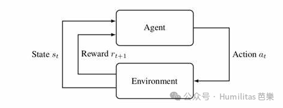
## **2.2 RL的三个概念**
1. **目标：最大化长期奖励**
强化学习智能体的根本目标并非仅追求即时奖励回报，而在于通过一系列合理决策，实现未来累计奖励的最大化。然而，这一目标的实现高度依赖于奖励函数的设计；如果奖励函数存在设计漏洞，就可能引发所谓的**奖励骇客（Reward Hacking）**现象。**奖励骇客**指的是智能体利用奖励函数中未曾预料的漏洞或捷径，采取不符合设计初衷的策略来获得更高奖励，从而偏离真正预期的行为目标。（这个地方敲黑板，后面会考）

1. **探索（Exploration） vs 利用（Exploitation）**
- **探索**：尝试新动作，可能发现更高回报（在未知区域中尝试新的行进路线。）
- **利用**：指智能体依据现有经验，执行已知效果最佳的动作，从而确保收益的稳定性。（在熟悉的路线中行驶以确保高效通行。）
实际应用中，如何在探索和利用之间取得平衡，是提升智能体性能的关键挑战。

1. **马尔可夫决策过程（MDP）**
马尔可夫决策过程的核心假设是：环境的下一状态仅依赖于当前状态和所采取的动作，而与过去的状态序列无关。简单来说，就是“未来只取决于现在，不受过去的影响”
这一假设使得问题求解能够聚焦于“此时此刻”的决策，有效降低模型对复杂历史信息的依赖，从而简化策略学习和优化的过程。

## **2.3 RL的算法分类**
RL有非常多的分类方式，以下就简单列出比较常见的「基于价值vs基于策略」和本篇文章会使用到的「基于On/Off Policy」的分类法

**「基于价值、基于策略）」**
<table>
<tr>
<td>类型</td>
<td>核心思想</td>
<td>代表算法</td>
<td>工作方式</td>
<td>类比解释</td>
</tr>
<tr>
<td>**基于价值**</td>
<td>学习每个动作的价值</td>
<td>Q-Learning, DQN</td>
<td>计算每个动作的Q值，选择价值最高的动作</td>
<td>像购物时比较各个商品的性价比，选最划算的</td>
</tr>
<tr>
<td>**基于策略**</td>
<td>直接学习最优策略</td>
<td>Policy Gradient</td>
<td>直接输出每个动作的选择概率</td>
<td>像老司机凭经验直接知道该转弯还是直行</td>
</tr>
<tr>
<td>**两者结合**</td>
<td>同时学习价值和策略</td>
<td>Actor-Critic</td>
<td>Actor负责选择动作，Critic负责评估动作价值</td>
<td>像厨师(Actor)和美食评论家(Critic)的配合：一个负责做菜，一个负责提供意见</td>
</tr>
</table>

**「基于On/Off Policy」**
<table>
<tr>
<td>分类</td>
<td>定义</td>
<td>代表算法</td>
<td>优点</td>
<td>缺点</td>
<td>类比解释</td>
</tr>
<tr>
<td>**On-policy**</td>
<td>用当前策略收集数据并学习</td>
<td>PPO(Proximal Policy Optimization)</td>
<td>更新时直接反映当前策略的表现，更新目标明确。</td>
<td>样本利用率较低，因为每次策略更新后，之前收集的数据可能不再适用；同时需要较多的交互数据，导致收敛较慢。</td>
<td>像"从自己的错误中学习"：只总结自己最近的经验</td>
</tr>
<tr>
<td>**Off-policy**</td>
<td>可以使用其他策略收集的数据来学习</td>
<td>DPO(Direct Preference Optimization)</td>
<td>更高的样本利用率，可以利用历史数据或从其他来源获得的数据；更容易从探索中学习最优策略。</td>
<td>策略之间的不匹配可能导致学习不稳定，需要额外的机制（如重要性采样）来纠正偏差。</td>
<td>像"从他人的经验中学习"：可以学习别人的经验教训</td>
</tr>
</table>

> 强化学习是**通过试错和反馈学习最优策略**的方法，核心是平衡探索与利用、关注长期回报，让机器像生物一样在复杂环境中自主进化。

---

# 3. DeepSeek-R1-Zero
——*Reinforcement Learning on the Base Model*
## 3.1 模型如何获得推理能力：RL on LLM
模型的推理——reasoning，本质上是利用inference time scaling的原理，在inference上用更多的compute来获得更好的效果。丹尼尔-卡尼曼教授的《思考，快与慢》这本书中「系统一：快思」与「系统二：慢想」的比喻可以更好的来理解reasoning为什么能给我们带来更好的生成质量。

当我们点开R1的的深度思考内容，可以发现模型通过生成更多的token，一步步在从用户简单的prompt 中尝试去触碰用户更深层次的含义。

这是不是像极了今天你在领导面前，在回复领导的问题时都会绞尽脑汁尝试揣摩领导表面话里背后的意思。从人机交互的角度来看，reasoning的能力也间接降低了对用户prompt engineering的要求，使其在指令没有优化的情形下即可获得一个远超其期待的高质量回答。


因此，在OpenAI 的o1于去年推出后，模型的推理能力成为业界最关注的做法。但是模型要怎么获得推理能力呢？

### 3.1.1 传统训练方法
就像是以往让大模型获取某个成为某个领域的专家，我们一般是通过收集该领域的高质量数据集进行SFT（监督微调）。同理，成为推理领域的专家，我们会在SFT的过程中加入大量CoT（思维链）的数据集，并利用例证和过程奖励模型（PRM）之类的复杂神经网路奖励模型（强化学习范式），来让模型学会用思维链进行思考，成为推理专家。


虽然之前的做法被证实能有效让模型获得推理能力，然而却高度仰赖大量的数据集，这对于成本与时间都是一个巨大的挑战。就像论文中所言：

> Reinforcement learning has demonstrated significant effectiveness in reasoning tasks, as evidenced by our previous works (Shao et al., 2024; Wang et al., 2023).** However, these works heavily depended on supervised data, which are time-intensive to gather.**

### 3.1.2 R1-Zero的突破 🌟
**因此R1-Zero尝试了一种前所未有的方法：**

**“纯”强化学习（ *pure reinforcement learning process*）。**

**具体而言，这种路径之下抛弃了CoT的范例和SFT，模型通过环境奖励信号的稀疏反馈自主发展推理能力。这种自我进化（*self-evolution*）机制，如同神经网络版的达尔文主义——参数空间中的每个权重更新都在模拟自然选择的过程。**

这就好比培养一个企业的CEO，有两种路径：
- **传统MBA模式**：通过案例库（SFT数据集）的教学，要求严格遵守Michael Porter的五力分析法（标准CoT框架）。
- **街头智慧修炼**：13岁辍学摆地摊（RL初始策略），在工商查抄（负奖励）和爆单盈利（正奖励）间不断更新商业认知（策略迭代）。
前者更有体系、有理论指导，但可能会受限于既定框架，且教育成本高昂；后者虽然看似更加"野路子"，但在真实的市场环境中磨练出来的能力可能更加灵活实用，能够更好地适应各种复杂多变的商业情况，且教育成本低廉。
<columns>
	<column>
		
	</column>
	<column>
		
		
	</column>
</columns>
## 3.2 R1-Zero 的训练方法 🌟
R1-Zero具体是怎么用RL实现推理能力的训练呢。其方法主要有三个要素组成，主要由最核心的RL算法—— 1.**GRPO；2.奖励模型；3.训练模版**组成。我将会逐步拆解每个要素，并在最后将每个要素合而为一，去理解R1-Zero是怎么利用Pure-RL获得推理能力的。

### 3.2.1 群体相对策略优化 **GRPO **
**——DeepSeek 在 RL 算法上的创新：从 PPO 到 GRPO**

还记得前面我们提到了RL的分类嘛？作为 On-Policy 算法的代表，**Proximal Policy Optimization (PPO)** 通过 Actor（策略模型）和 Critic（价值模型）的协同训练实现优化，但其在 LLM 微调中面临两大核心挑战：

1. **资源消耗大**
	- Critic 需构建与 Actor 规模相当的价值模型（Value Model）（例如 7B 参数的 LLM 需额外训练 7B 的价值模型）这就导致了**内存占用翻倍、计算成本激增**
	
2. **奖励信号稀疏性**
	- LLM 场景中，奖励模型通常仅对生成结果的**最后一个token** 打分（如数学答案正确性）
	- 但 Critic 需为**每个中间 token** 预测价值，导致训练目标与真实奖励信号错位

针对 PPO 的缺陷，DeepSeek 团队论文《DeepSeekMath: Pushing the Limits of Mathematical Reasoning in Open Language Models》中提出 **Group Relative Policy Optimization (GRPO)**，这个算法很好的解决了以上提出的两大挑战。因为GRPO的关键创新在于完全避免了训练独立的价值模型（Value Model），而是采用了一种优雅的替代方案：对同一问题生成多个输出样本，并使用这些样本的平均奖励作为baseline（基准线）。这一设计不仅显著减少了计算资源的需求，还提供了一个更自然的方式来评估模型的输出质量。
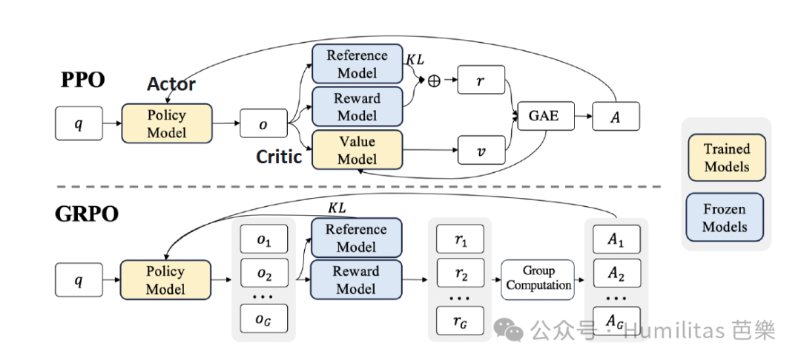

<table>
<colgroup>
<col>
<col>
<col color="gray_bg">
<col>
</colgroup>
<tr>
<td>**维度**</td>
<td>**PPO**</td>
<td>**GRPO**</td>
<td>**一句话总结**</td>
</tr>
<tr>
<td>**价值模型**</td>
<td>需独立 Critic 模型</td>
<td>无需额外价值模型</td>
<td>显著简化模型架构设计</td>
</tr>
<tr>
<td>**Baseline**</td>
<td>使用价值模型预测每个决策的期望回报</td>
<td>通过多次采样获得的实际奖励平均值</td>
<td>用实际样本均值替代模型预测</td>
</tr>
<tr>
<td>**训练效率**</td>
<td>双重模型并行训练</td>
<td>仅需策略模型（Actor），资源消耗降低</td>
<td>大幅降低计算资源需求</td>
</tr>
<tr>
<td>**奖励对齐**</td>
<td>中间 token 价值预测易偏差</td>
<td>直接基于真实奖励信号的动态基线</td>
<td>提供更准确的奖励估计</td>
</tr>
</table>

### 3.2.2 奖励模型 Reward Model
在了解了DeepSeek团队在RL上的技术创新，我们接下来要进入到奖励模型的设定。在强化学习的世界里，奖励就是模型训练的判断依据，它告诉模型"这么做是对的"或"那么做是错的"。在训练DeepSeek-R1-Zero时，DeepSeek设计了一个基于规则的奖励系统来激发AI的推理能力，包含了两个规则：

1. **准确性奖励*（Accuracy rewards）：***
顾名思义，这个奖励用来判断模型的回答是否正确。比如说，在解决数学问题时，会要求模型把最终答案放在特定的格式里（如\<answer\>和\</answer\>间），这样就能很容易地判断答案对不对。对于编程问题，比如LeetCode上的题目，则可以直接用编译器运行代码，看看是否通过了预设的测试用例。

1. **格式奖励*（Format rewards）*：**
除了答案要正确，研究人员还特别注重模型的思考过程。通过设置格式奖励，我们鼓励模型把它的推理过程整整齐齐地放在'\<think\>'和'\</think\>'标签之间，就像是在做题时把解题步骤清晰地写出来一样。

同时，在开发R1-Zero过程中，DeepSeek特意避开了使用神经网络 *process neural reward model *作为奖励模型。因为在大规模强化学习训练中，神经网络奖励模型可能会被"钻空子"，也就是前文2.2提到的**奖励骇客（reward hacking）**。而且，要是用神经网络奖励模型的话，还得不断重新训练它，这不仅需要更多的计算资源，还会让整个训练过程变得更复杂。

### 3.2.3 训练模版 Training Template
为了能够真实地观察到模型在强化学习过程中是如何自然成长和进步的，DeepSeek团队在训练R1-Zero时，特意保持了对回答框架的最小限度约束——只规定了**"先思考，后回答"的基本结构**。他们没有去规定"应该怎么思考"或"该用什么解题策略"，也没有强制要求模型进行反思。为什么这么做？这就像是让孩子在一个有基本规矩但不过分约束的环境中成长，让我们能够看到她真实的学习轨迹。
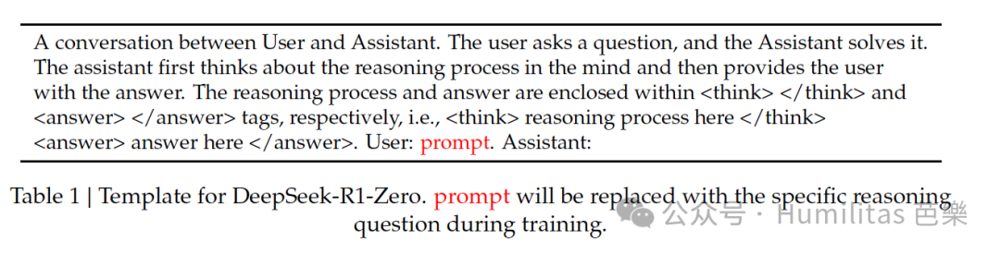
::: callout {icon="💡" color="gray_bg"}
	**对以上Template的翻译：**
	
用户与助手之间的一段对话。

用户提出一个问题，助手予以解答。

助手先在脑海中思考推理过程，然后向用户提供答案。

推理过程和答案分别包含在 \<think\> \</ think \> 和 \< answer\> \</ answer \> 标签内，即 \< think \> 此处为推理过程 \</ think \>\< answer \> 此处为答案 \</ 答案 \>。

用户：提示。助手：……
:::

### 3.2.4 训练过程 Training Process
当我们把以上所有的要素结合在一起。其实不难发现，DeepSeek团队不论是在奖励模型还是训练模版的设定上都没有进行过度的干预与复杂化，都是以简单的引导规则，让Base Model（DeepSeek-V3）在GRPO的算法下，通过组内样本的**相对比较**来指导模型学习，这种方法不仅降低了训练的不确定性，还显著提升了学习效率。

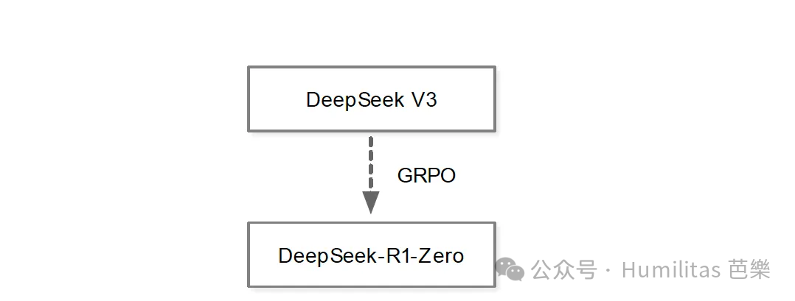

想象一个班级学生在解决问题。为了让同学更好的发挥，老师仅简单的要求每一个回答都要按照一定的格式（**3.2.3训练模版**）。且与其由老师单独批改每个学生的答案，学生们会自己相互比较答案。这些答案会根据已设定的规则（**3.2.2奖励模型：**准确性；格式）获得不同的分数，那些答得更好的学生会得到鼓励，而其他学生则从错误中学习。随着时间的推移，整个班级会集体进步，变得更加准确和一致（对应**3.2.1GRPO**）。具体的训练流程是这样的：
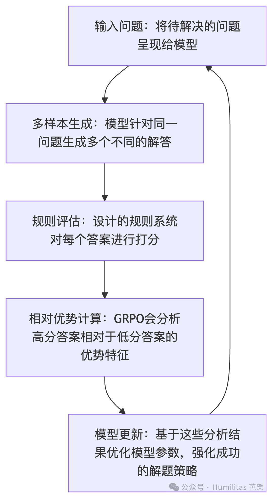

这种训练方法带来了几个显著优势：

首先是训练效率的大幅提升。传统的训练方法往往需要更多的迭代才能达到相同的效果，而GRPO通过同时评估多个答案，能在更短的时间内找到最优解法。

其次是在资源利用上更加经济。由于省去了SFT阶段和复杂的神经网络奖励模型，整个训练过程所需的计算资源显著减少。

**最令人兴奋的是，这种方法让模型实现了真正的"顿悟式"学习。**

## 3.3 R1-Zero的自我进化和顿悟时刻
### 3.3.1 自我进化 Self-evolution Process
DeepSeek-R1-Zero的思考时间在整个训练过程中都在稳步提升。随着训练的深入，模型逐渐获得了解决更复杂推理任务的能力。它会生成数百到数千个推理标记来进行深入思考。随着测试时计算量的增加，模型甚至开始展现出反思能力——它会回顾和重新评估自己之前的解题步骤，并主动探索不同的解题方法。这种自然涌现并非研究人员预先编程的结果，而是模型在强化学习环境中自发形成的。这种自我进化显著提升了DeepSeek-R1-Zero的推理水平，重点是带来了模型的“顿悟时刻“
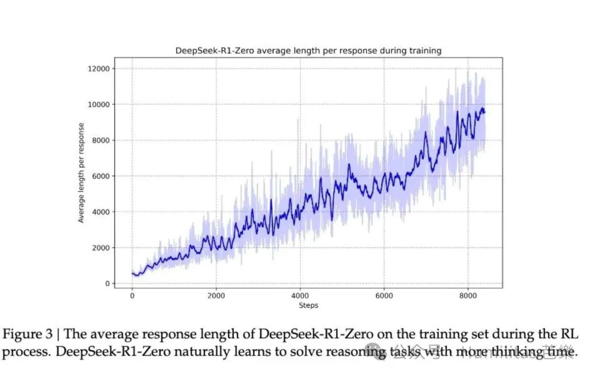

### 3.3.2 顿悟时刻 Aha Moment
顿悟时刻发生在训练的中期阶段，就像是一个学生突然领悟到解题的诀窍：模型学会了在遇到复杂问题时，不急于给出答案，而是会花更多时间重新审视和评估自己的解题思路。
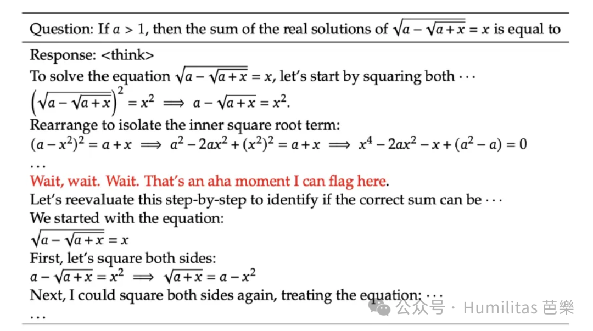
这个"顿悟时刻"完美诠释了强化学习的魅力：研究人员没有直接告诉模型"该怎么做"，而是通过设计合适的奖励机制，让模型自己通过思考摸索出了更高级的解题策略，让模型更具自主性和适应性。这让我想起孔子在论语《述而》篇说的：

> **“不憤不啓，不悱不發。舉一隅不以三隅反，則不復也。” **

---

# 4. DeepSeek-R1
*—— Reinforcement Learning with Cold Start*

在R1-Zero展现出惊人推理能力的背后，研究者们发现了两个严重的问题：一是"poor readability"（可读性差），二是"language mixing"（语言混杂）。这就像一个天才学生在解题时用自创的速记符号和独特的思维方式：虽然总能得出正确答案，但当老师让他解释解题过程时，却发现他的笔记本上充满了难以理解的符号组合和跳跃性的思维记录。

为什么会出现这种情况？原因其实很简单：R1-Zero完全依靠奖惩信号来优化自己的行为，没有任何人类示范的"标准答案"作为参考。这就意味着模型可能在推理过程中随意切换不同的语言，或者发展出某种独特的表达方式。虽然这些方法对模型来说非常有效，但对想要理解其推理过程的人类来说却形成了一道巨大的鸿沟。

为了解决这个问题，研究团队开发了改进版本DeepSeek-R1。通过引入"cold-start data"（冷启动）和多阶段训练流程，使得R1不仅保持了强大的推理能力，还学会了用人类易懂的方式表达思维过程，极佳的解决了以上提到的两大问题。

## 4.1 冷启动 Cold Start 🌟
### 4.1.1 什么是冷启动
想象一下在寒冷的冬天启动一辆停放了整晚的汽车。引擎是完全"冷"的状态，直接启动会很困难，不仅费油，还可能对引擎造成额外的磨损。这就是为什么现代汽车都有预热系统，让引擎先达到合适的工作温度。

R1-Zero的"冷启动"问题也是类似的。如果直接让基础模型（DeepSeek V3）在没有其他post training的处理下直接进行强化学习（就像在寒冷的引擎上直接启动），虽然最终也能运转起来，但这个过程会产生以上提到的可读性和语言混杂的问题，很不稳定，效率也不高。

因此在开发DeepSeek-R1时，研究团队针对R1-Zero的经验教训做出了重要改进：在开始强化学习之前，先通过收集和构建少量但高质量的CoT数据来微调模型，这就像是给模型“预热”，打好基础后再开始"自主学习"。

用于冷启动的CoT数据主要来源于：
1. 使用少样本提示，并附带详细的思维链条作为示例
2. 直接要求模型生成包含反思和验证的详细答案
3. 收集R1-Zero的可读输出，通过人工标注者进行后期优化处理

### 4.1.2 冷启动的优势
1. 可读性
如果说R1-Zero的输出像是一个天才的杂乱笔记本，那么R1的回答则更像是一篇条理清晰的论文。在为 DeepSeek-R1 创建冷启动数据时，研究团队设计了一个规范的输出格式，在每个响应的末尾包含一个摘要，并过滤掉对读者不友好的响应。每个回答都遵循以下结构，确保了输出的语言一致性和可读性。
```json
|special_token|<reasoning_process>|special_token|<summary>
```

1. 性能潜力
其次是的提升。通过在冷启动数据中融入人类的思维方式和经验，我们发现模型的表现比R1-Zero更好。这证明了"循序渐进"的训练方式（先有基础训练，再进行强化学习）可能是提升推理模型能力的更好路径。

冷启动的方法这就像是教育过程中，我们先让学生掌握基本的解题方法和表达方式，然后再鼓励他们发展自己独特的思维方式；而非先发展自己的独特的思维方式，以至于完全无法沟通。这样既保证了基本功的扎实以及与其他主体交互的沟通能力，又不失创新的可能性。

## **4.2 以推理为导向的强化学习 ***Reasoning-oriented RL*
在完成"Cold Start"阶段后，DeepSeek-R1沿用了R1-Zero的成功经验，开始了大规模的强化学习训练。训练重点聚焦在需要深度推理能力的任务上，包括编程、数学、科学和逻辑推理等有明确答案的问题领域。

然而，在训练过程中当强化学习的提示涉及多种语言时，模型的CoT常常会出现语言混杂的情况。这就像是一个精通多国语言的人在思考时，不自觉地混用各种语言表达想法。

为了解决这个问题，研究团队在训练中引入了一个特殊的"语言一致性奖励"（language consistency reward）机制。他们会根据目标语言词汇在CoT中的比例来计算奖励分数。虽然实验显示这种调整会略微影响模型的性能，但这种牺牲是值得的，因为它让模型的输出更符合人类的阅读习惯。

最终，我们采用了一个折中的方案：将推理任务的准确性奖励和语言一致性奖励直接相加，作为最终的奖励信号。这就像是在评分时既看答案对错，又看表达是否规范。团队按照这样的方式持续进行强化学习训练，直到模型收敛，在各类推理任务上都达到了令人满意的水平。

## 4.3 拒绝采样与监督微调 *Rejection Sampling and Supervised Fine-Tuning*
在模型完成强化学习阶段后，研究团队开始了一个更全面的训练阶段——不同于最初的冷启动数据主要聚焦于推理能力，现在团队要培养一个不能仅「又红又专」，还要「全面发展」的模型：既要保持强大的推理能力，又要能够胜任写作、角色扮演等日常任务。训练的具体的方式就是通过在训练模型的训练过程中保存的模型状态（Checkpoint）收集更多高质量的数据用以后续的SFT训练轮次。

### 4.3.1 推理数据的收集
这个部分是基于之前强化学习训练的模型来生成高质量的推理数据，其中的用到了拒绝采样的方法。拒绝采样（Rejection Sampling）是一种统计学方法，通过生成候选样本并按特定标准（如正确性、逻辑连贯性）筛选保留优质样本，拒绝低质量样本。这个过程就像是一个博物馆馆长在严格的筛选馆藏（curate）的过程：
- 收集能用规则评估的数据，还加入了一些需要DeepSeek-V3来判断质量的样本
- 对生成的内容进行严格筛选，剔除了语言混杂、段落过长或代码块混乱的内容
- 对每个问题生成多个答案，只保留正确的那些通过这种严格的筛选机制
- 最终收集了约60万个高质量的推理训练样本

### 4.3.2 非推理数据的收集
为了让模型具备更全面的能力，我们还收集了包括写作、事实问答、自我认知和翻译等在内的非推理数据：
- 复用了部分DeepSeek-V3的监督微调数据
- 对于较复杂的非推理任务，我们会让DeepSeek-V3先生成思维链条
- 对于简单的查询（如"hello"），则直接给出答案
- 最终收集了约20万个训练样本

## 4.4 全场景强化学习对齐 *Reinforcement Learning for all Scenarios*
现在的R1模型在保证了推理能力的实现后，也在其他非推理任务上展示出了强大的通用能力。但是这与成为人类能使用的AI还差最后一里路——对齐。模型团队为实现模型能力与人类价值观的深度对齐，设计了双阶段强化学习框架：在保持基础推理能力（数学/代码/逻辑）持续精进的同时，通过多维度奖励信号驱动模型向"有用性"（*helpfulness*）和"无害性"（*harmlessness*）双重目标进化。

### 4.4.1 对齐方法
针对**专业推理场景**，研究团队延续DeepSeek-R1-Zero的规则化奖励机制（rule-based rewards），通过结构化反馈优化CoT的严谨性；

在**通用对话场景**，则采用基于人类偏好的奖励模型（reward model），结合DeepSeek-V3的数据分布策略，对复杂语义场景进行精细校准。

研究团队在对两个指标（有用性和无害性）评估维度实现了差异化的设计——有用性评估聚焦最终回答的实用价值，避免干扰内部推理路径；无害性评估则覆盖全生成过程（含中间推理步骤），通过全链路扫描消除潜在风险。这种奖励信号与数据分布的有机融合，使模型在保持强大推理能力的同时，建立起符合人类伦理的安全护栏——实现最后的对齐。

## 4.5 结论
**直到这一刻，研究团队终于在R1-zero的基础上，打造出了既有强大推理能力，又有强大通用任务能力，且还与人类价值观对齐的大模型——R1。**


R1在教育、长文本理解、事实查询和指令遵循等任务上展现了卓越性能，尤其在 STEM 相关问题和长上下文分析中表现突出。其在 AlpacaEval 2.0、ArenaHard 等基准测试中的优异表现，以及数学和编程任务上的强大推理能力，证明了其多样化的任务适应性和鲁棒性。说了那么多其实就一句话——R1太牛了。
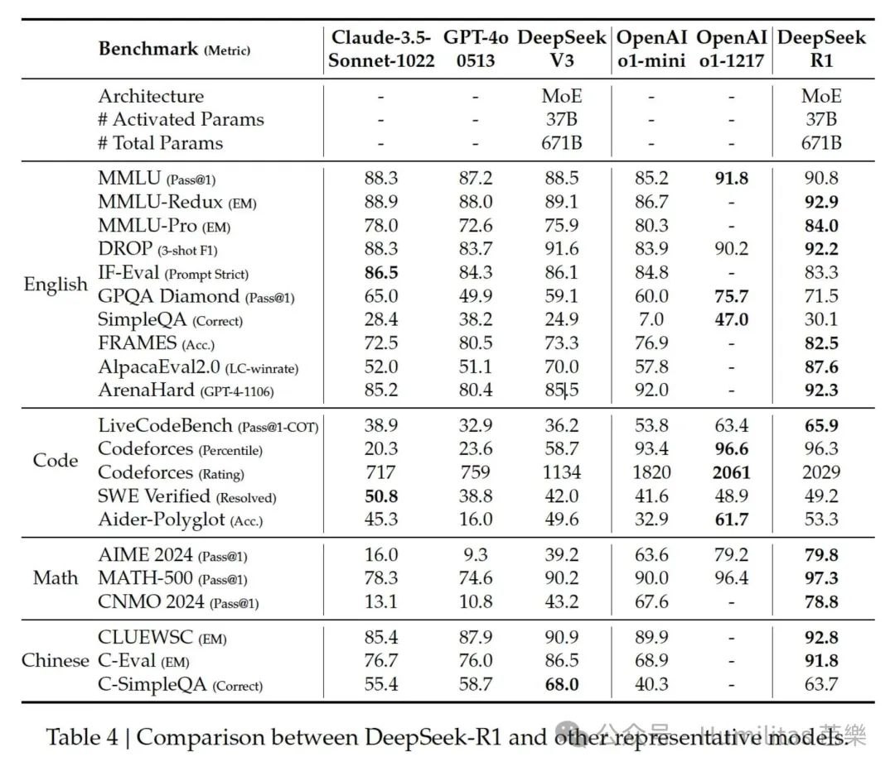
---

# 5. 蒸馏 **Distillation**
## 5.1 蒸馏 ** Distillation**
### **5.1.1 蒸馏简介**
模型蒸馏（Knowledge Distillation）是一种将大型复杂模型（教师模型）的知识迁移到小型高效模型（学生模型）的技术。其核心目标是在保持模型性能的同时，显著降低模型的计算复杂度和存储需求，使其更适合在资源受限的环境中部署。

蒸馏技术的核心原理在于知识的传递和压缩。具体来说，教师模型通过其复杂的结构和大量的参数，学习到了数据中的复杂模式和特征。学生模型则通过模仿教师模型的输出，学习这些模式和特征，从而获得类似的性能。

知识蒸馏的开山之作是Geoffrey Hinton教授《Distilling the Knowledge in a Neural Network》的这篇论文。

### **5.1.2 蒸馏的三个要素**
1. **教师模型**：一个复杂、高性能的大模型（如深度神经网络）
2. **学生模型**：一个更小、更轻量的模型（如浅层网络）
3. **知识传递**：学生模型通过模仿教师模型的输出（如概率分布）来学习其“知识
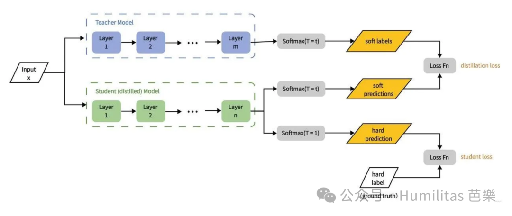

### **5.1.3 蒸馏的关键步骤**
1. **教师模型的训练：**首先训练一个性能强大的教师模型，该模型通常具有大量的参数和复杂的结构。

1. **数据准备：**从教师模型中提取推理数据样本，**软标签**（soft labels），即概率分布和硬标签（Hard lables），这些数据将用于训练学生模型。

1. **学生模型的训练：**学生模型同时学习**软标签**和**硬标签**，通过最小化两者的损失函数来模仿教师模型的行为。

### **5.1.4 软标签 vs 硬标签**
- **硬标签**：简单直接，适合标准分类（classification）任务，但信息量有限。
- **软标签**：提供更多类别间关系信息，适合知识蒸馏和复杂任务，但依赖教师模型的质量。
Hinton在论文中也指出了通过结合软标签和硬标签，知识蒸馏能够显著提升知识迁移的效果和小模型的性能，同时降低计算资源需求

<table>
<colgroup>
<col>
<col width="280.1022644042969">
<col width="346.99998474121094">
</colgroup>
<tr>
<td>**维度**</td>
<td>**硬标签（Hard Labels）**</td>
<td>**软标签（Soft Labels）**</td>
</tr>
<tr>
<td>**定义**</td>
<td>明确的类别标签，通常以 **one-hot 编码** 表示（如 \[0, 1, 0\]）。</td>
<td>概率分布，表示模型对每个类别的置信度（如 \[0.1, 0.7, 0.2\]）。</td>
</tr>
<tr>
<td>**示例**</td>
<td>对于类别“猫”：硬标签 = \[0, 1, 0\]（假设类别顺序为 \[狗, 猫, 鸟\]）。</td>
<td>对于类别“猫”：软标签 = \[0.1, 0.7, 0.2\]（模型认为 70% 是猫，20% 是鸟，10% 是狗）。</td>
</tr>
<tr>
<td>**信息量**</td>
<td>仅包含类别信息，缺乏类别间的相对关系。</td>
<td>包含类别间的相对关系，反映模型对每个类别的置信度。</td>
</tr>
<tr>
<td>**生成方式**</td>
<td>由人工标注或数据集直接提供。</td>
<td>由教师模型（如深度神经网络）生成，通常通过 softmax 函数输出概率分布。</td>
</tr>
<tr>
<td>**训练目标**</td>
<td>学生模型直接学习硬标签，目标是准确分类。</td>
<td>学生模型学习软标签，目标是模仿教师模型的输出分布。</td>
</tr>
<tr>
<td>**优点**</td>
<td>- 简单直接，易于实现。
- 适合分类任务的标准监督学习。</td>
<td>- 提供更多信息，帮助学生模型学习类别间的相对关系。
- 提升模型的泛化能力和鲁棒性。</td>
</tr>
<tr>
<td>**缺点**</td>
<td>- 缺乏类别间的相对信息，可能导致模型过拟合。
- 对噪声标签敏感。</td>
<td>- 需要额外的教师模型生成软标签，增加计算成本。
- 对教师模型的质量依赖较高。</td>
</tr>
<tr>
<td>**适用场景**</td>
<td>- 标准分类任务。
- 数据集标注明确且类别间差异明显。</td>
<td>- 模型压缩（知识蒸馏）。
- 数据集类别间存在模糊性或相似性（如细粒度分类）。</td>
</tr>
</table>

## 5.2 蒸馏  Distillation: Empower Small Models with Reasoning Capability 🌟
在成功打造出具备强大推理能力的DeepSeek-R1后，DeepSeek研究团队临着一个新的挑战：如何让计算资源要求更低的小型模型也具备类似的推理能力？

### 5.2.1 实验
研究团队采用了一个直接的方法：用DeepSeek-R1作为教师模型生成的80万个高质量训练样本来SFT微调各种规模的开源模型（学生模型）。这些模型包括：
- Qwen系列：1.5B、7B、14B和32B参数版本
- Llama系列：8B参数的3.1版本和70B参数的3.3指令版本

### 5.2.2 结果
而这种简单的知识蒸馏方法确实能显著提升小型模型的推理能力。回到我们在4.的比喻，这就像是这个聪明的天才，再经过专业的师范培训后成为了名师（DeepSeek-R1），并通过优质的"教材"（训练样本），成功地让其他"学生"（小模型）掌握了"老师"的答题方法论（推理能力）。值得注意的是，在这次实验中，研究人员只使用了监督微调（SFT），暂时没有使用强化学习（RL）阶段，但其实如果加入RL阶段，模型的表现可能会更上一层楼。
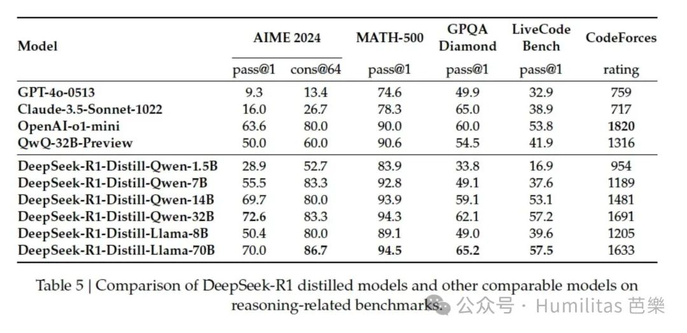

## 5.3 知识蒸馏 vs 强化学习：小模型教育理念之争
在本篇论文中，我们看到了不同让模型获得推理能力的路径。一是以R1-zero为代表的——Large Scale RL方法；二是以R1为教师模型，开源模型为学生模型的—— Distillation方法。在5.2.1看到蒸馏取得惊人效果后，研究团队优提出了一个设想：如果让小模型也经历一次如R1-Zero完整的强化学习训练，是否能达到同样的效果？

### 5.3.1 实验
为了回答这个问题，研究团队进行了一个直接的对比实验：
1. 选择了同一个基础模型：Qwen-32B

1. 分别尝试两条进化路径：
	- 路径一：进行超过10000步的大规模强化学习训练
	- 路径二：直接从DeepSeek-R1学习（知识蒸馏）
	
### 5.3.2 结果
经过大规模强化学习训练的模型（DeepSeek-R1-Zero-Qwen-32B）表现与基准模型（QwQ-32B-Preview）相当。

而通过知识蒸馏得到的模型（DeepSeek-R1-Distill-Qwen-32B）在所有测试中都显著优于前两者：
	1. 在AIME 2024测试中提升了约25个百分点
	2. 在MATH-500上提升了约23个百分点
	3. 在其他测试中也有显著提升
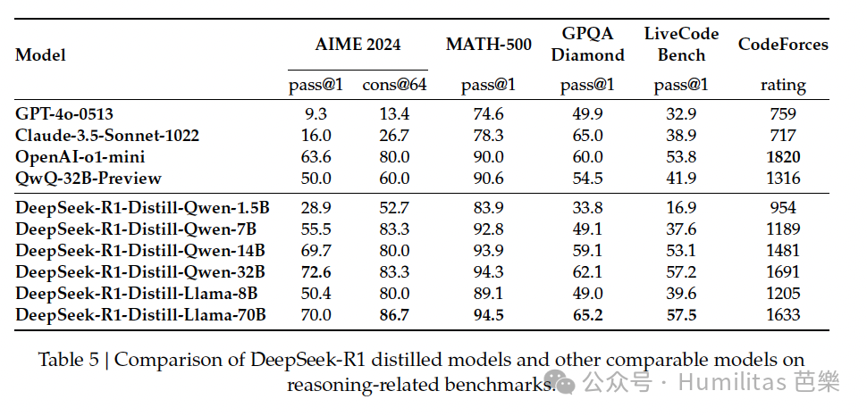
### 5.3.3 启示
相较于R1-Zero强化学习的base model是各方面能力与GPT-4o相媲美的DeepSeek-V3（参数量高达671b的MoE模型），这次实验的base model为参数量仅有32b的Qwen。

从本次实验的结果来看，我认为有以下两点启发：

1. 对于小模型而言"站在巨人肩膀上"确实是更有效的“**教育路径”**。知识蒸馏不仅效果好，而且更经济实惠。相比之下，让小模型从头开始强化学习，不仅需要海量算力，最终效果可能还不如直接学习老师模型。

1. 但如果想要突破现有的智能边界，可能还是需要更强大的基础模型和更大规模的强化学习。虽然"老师带徒弟"的教育路径很有效，但要开创新的领域，还是需要培养更多的更强的"老师"。

---

# 6. 结论 Conclusion 
## 6.1 三大亮点 🌟
### 6.1.1 纯强化学习（R1-Zero）
DeepSeek-R1-Zero展示了纯强化学习在提升AI推理能力方面的巨大潜力。没有任何预训练数据的辅助，仅通过不断的"试错-反馈"过程，就实现了优秀的推理表现。这证明了强化学习在AI训练中的独特价值。

### 6.1.2 混合训练（R1）
DeepSeek-R1通过结合冷启动（Cold Start）和迭代式强化学习（iterative RL fine-tuning），达到了与顶级模型比肩的水平。这种混合方法不仅提升了模型性能，还增强了训练的稳定性，为未来的模型训练提供了重要参考。

### 6.1.3 蒸馏（Distillation）
在大参数的模型上取得了前面的突破后，更令人兴奋的事，我们可以通过蒸馏这种方法，甚至在1.5B参数的小模型（DeepSeek-R1-Distill-Qwen-1.5B）也能在某些数学基准(AIME)测试中超越GPT-4和Claude-3.5-Sonnet。这为AI的普及化和应用场景开辟了新的可能。

## 6.2 不足之处
### 1. General Capability：通用能力的局限
在函数调用、多轮对话、复杂角色扮演等通用任务上，R1的表现还不及DeepSeek-V3，比如说 **function calling, multi-turn, complex role-playing, 和 JSON output**团队将会在未来从长CoT切入尝试加强这些task的表现。

### 2. Language Mixing：语言处理的缺陷
虽然在中英文表现优秀，但面对其他语言时，模型容易出现语言混用的问题，特别是倾向于用英语进行推理和回答。这限制了模型的国际化应用。

### 3. Prompting Engineering：提示词的敏感性
模型对提示词的格式特别敏感，少样本提示反而会降低性能。这种特性限制了模型的灵活性，用户需要使用特定的提示方式才能获得最佳效果。

### 4. Software Engineering Tasks：软件工程的瓶颈
由于评估周期长，强化学习在软件工程任务中的应用受限，导致这方面的提升不够明显。这是未来需要重点突破的技术难题。

---

# 7. 舊時王謝堂前燕，飛入平常百姓家 🌟
这句诗出自唐代诗人刘禹锡的《乌衣巷》。乌衣巷位于东晋时期的首都建康（今南京），是当时贵族聚居的地方，尤其是王导和谢安两大家族，他们分别代表了东晋的两大政治势力。王导是东晋的开国功臣，谢安则是著名的政治家和军事家，那一场从此改变中国历史的淝水之战，东晋正是在他的领导下击溃了前秦的入侵。但不论是王导还是谢安，他们在东晋的政治和文化生活中占据了重要地位，都代表了东晋的门阀阶级，垄断着社会资源……

自2022年年末ChatGPT的横空出世，顶尖的大模型技术仿佛“王谢堂前燕”一般，只有少数握有科研人才、算力和资本的组织和企业能有能力取得最顶尖的技术。然而，DeepSeek在V3和R1在算法层的突破带来的效率革命，不仅拓宽了AI能力的边界，最重要的是证明了将大模型的推理能力迁移至更小规模的模型上的可能性。笔者本人就在自己的2021年买的电脑上部署了DeepSeek-R1-8b。此外，DeepSeek团队还开源了R1，并邀请更多科研者参与到这场技术的普及和平民化之中。

**在我所看到的未来，旧时王谢的堂前燕终将飞入寻常百姓家，这句诗就是这个趋势的最為貼切注脚。**

除了DeepSeek，还有如阶跃星辰，面壁智能等公司都在投入到让AI为更广泛的应用场景和用户群体创造价值的征途上。曾经需要顶尖算力支撑的大模型训练和推理，正通过他们以及无数开发者的努力打破资源垄断的藩篱，共建一个更为开放的生态，更为良性的循环。

然而，这真的是一件好事吗？

正如我在另外一篇关于《智人之上》文章中所提到的:
[https://www.humbleguava.top/article/Nexus](https://www.humbleguava.top/article/Nexus)

> 随着AI成为我们信息网路的一份子，甚至一步步成为网路中的主要节点，人类的主导权将一步步被弱化。直到，当AI能成为创造出新的神话故事（mythology），同时依靠其强大的信息收集与处理能力进一步接手官僚系统（bureaucracy）。而在这个由AI所建立的信息网路中，计算机并不会找出关于世界与人类的真理和真相，反而是利用它庞大的力量，创造出一套新的世界秩序，并逼迫人类接受，一道新的硅幕落在碳基人类与硅基计算机中间，而属于碳基人类主导的历史终将在一侧黯然落幕，而在另一侧将是一个人类智能永远无法理解的新的文明冉冉上升……

**在技术普惠之下，我们亟需审视一个根本性命题：AI能力的去中心化构建与传播，本质上是延伸了人类集体智慧的边界，让人类成为「超人」，还是蚕食了人类的主体性，让传统文明的范式被逐步解构？**

**当AI成为我们信息网路中的新的主体，这场技术民主化浪潮会真正开启人类文明跃迁的黄金纪元，抑或着是我们早已在无意间奏响了失控纪元的第一乐章？**

最后，用我最喜欢的音乐剧《Hamilton》中的一句话来作为本文的结尾:

> The world turned upside down

# **参考Reference:**
1. **DeepSeek-R1: Incentivizing Reasoning Capability in LLMs via Reinforcement Learning**
	1. [https://arxiv.org/abs/2501.12948](https://arxiv.org/abs/2501.12948)
2. **DeepSeekMath: Pushing the Limits of Mathematical Reasoning in Open Language Models**
	1. [https://arxiv.org/abs/2402.03300](https://arxiv.org/abs/2402.03300)
3. **一文读懂｜DeepSeek新模型大揭秘，为何它能震动全球AI圈**
	1. [https://mp.weixin.qq.com/s/cp4rQx09wygE9uHBadI7RA](https://mp.weixin.qq.com/s/cp4rQx09wygE9uHBadI7RA)
4. **The Math Behind DeepSeek: A Deep Dive into Group Relative Policy Optimization (GRPO)**
	1. [https://medium.com/@sahin.samia/the-math-behind-deepseek-a-deep-dive-into-group-relative-policy-optimization-grpo-8a75007491ba](https://medium.com/@sahin.samia/the-math-behind-deepseek-a-deep-dive-into-group-relative-policy-optimization-grpo-8a75007491ba)
5. **chenzomi12 Github 开源内容**
	1. [https://github.com/chenzomi12](https://github.com/chenzomi12)
